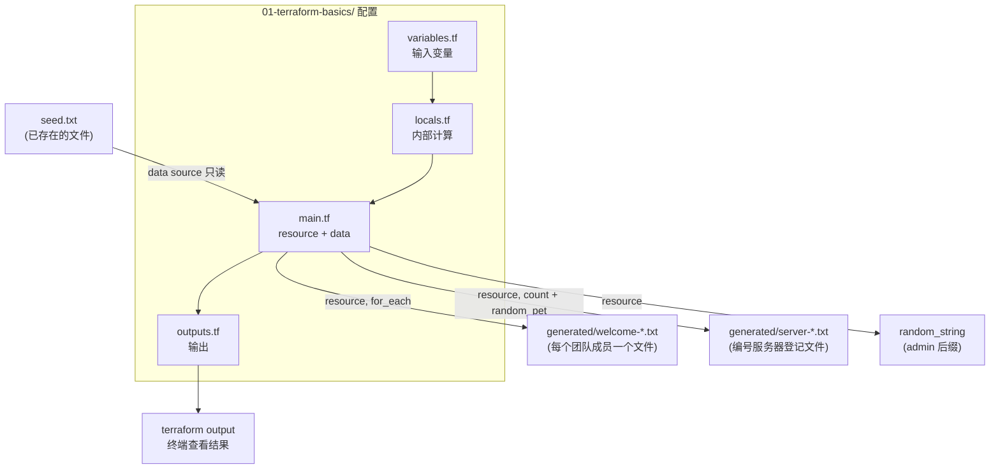

# 01 - Terraform Fundamentals（Terraform 基础）

> Stage 1 / 12 ｜ 前置章节：无（这是整个课程的起点）｜
> 概念参考：[docs/02-terraform-fundamentals.md](../docs/02-terraform-fundamentals.md)

## 一、本章目标

这一章不依赖 Docker、Kubernetes 或任何外部系统——只用 Terraform 自带的
`local` 和 `random` 两个 Provider，让你在**零外部依赖**的情况下，
完整走一遍 Terraform 的核心工作流，并亲手验证以下概念：

- `init / fmt / validate / plan / apply / destroy / show / output / console / providers / graph` 全部核心命令
- HCL 基础类型：string / number / bool / list / set / map
- `variable` / `locals` / `output` 的分工
- `count` 与 `for_each` 的区别，以及为什么后者通常更安全
- `for` 表达式与条件（三元）表达式
- `data` 数据源与 `resource` 的区别
- `lifecycle` 元参数（`create_before_destroy` / `prevent_destroy`）
- 变量的 `validation` / `sensitive` / `nullable` / `default` / `description`
- 变量赋值的优先级
- Terraform Workspace 的基本用法
- **State 里到底存了什么**，以及 `sensitive = true` 的真实作用边界

## 二、架构图



## 三、前置知识

- 完成 [docs/01-environment-setup.md](../docs/01-environment-setup.md) 的环境安装与验证；
- 建议先读完 [docs/02-terraform-fundamentals.md](../docs/02-terraform-fundamentals.md)
  建立整体概念地图（本章会大量引用其中的解释，避免重复）。

本章**不需要** Docker Desktop 已经启动——`local` 和 `random` Provider
只在你的操作系统本地文件系统和内存里工作。

## 四、核心概念

这里只做速览，完整解释见 [docs/02-terraform-fundamentals.md](../docs/02-terraform-fundamentals.md)：

- **IaC / 声明式 / 期望状态 / 幂等性**：你在 `.tf` 里描述"应该有哪些文件、
  内容是什么"，Terraform 自己判断该新建、修改还是什么都不做；
- **Provider**：`local` 和 `random` 是两个最简单的 Provider，不需要任何连接配置；
- **Resource vs Data Source**：本章 `data "local_file" "seed"` 只读，
  `resource "local_file" "welcome"` 会被 Terraform 创建和销毁；
- **State**：每次 `apply` 后，Terraform 会把这些资源的真实情况写进
  `terraform.tfstate`——这是本章"九、Terraform State 变化"要重点验证的部分。

## 五、文件结构

```text
01-terraform-basics/
├── README.md                    <- 当前文件
├── versions.tf                  <- terraform {} 元配置 + required_providers
├── variables.tf                 <- 输入变量声明（含 validation / sensitive / nullable）
├── locals.tf                    <- 内部计算量
├── main.tf                      <- 核心 resource / data
├── outputs.tf                   <- 输出值
├── seed.txt                     <- 被 data source 读取的既存文件
├── terraform.tfvars.example     <- 变量赋值示例（复制为 terraform.tfvars 后生效）
└── generated/                   <- apply 后自动生成，被 .gitignore 排除
```

## 六、Terraform 代码讲解

完整逐行注释请直接打开对应文件阅读——这里补充"跨文件的整体逻辑"：

1. **[versions.tf](versions.tf)** 锁定 Terraform CLI 版本区间和两个 Provider
   的版本约束。`required_providers` 里的 `source` 字段是 Provider 在
   Terraform Registry 上的完整地址，`version` 用 `~>`（悲观约束运算符）
   限定"允许的补丁/次版本升级范围，但不允许跳大版本"。

2. **[variables.tf](variables.tf)** 声明了 5 个变量，刻意覆盖了变量声明的
   全部常见元参数：`type`、`description`、`default`、`validation`、
   `sensitive`、`nullable`。特别看 `environment` 和 `server_count` 上的
   `validation` block——这是 Terraform 在 `plan` **之前**就能拦下的
   输入校验，比等 Provider API 报错要快得多、报错信息也更友好。

3. **[locals.tf](locals.tf)** 展示 `variable` 和 `locals` 的分工：
   `welcome_messages` 用 `for` 表达式把 `set(string)` 转成 `map(string)`，
   是后面 `for_each` 的直接输入源；`is_production` 用条件表达式演示
   "不写 if/else 也能分支计算"。

4. **[main.tf](main.tf)** 是本章的核心：
   - `data "local_file" "seed"` 只读取 `seed.txt`，不创建、不修改它；
   - `resource "local_file" "welcome"` 用 `for_each = local.welcome_messages`
     为每个团队成员生成一个文件，State 地址形如
     `local_file.welcome["alice"]`；
   - `resource "random_pet" "server"` 和 `resource "local_file" "server_registry"`
     搭配使用 `count`，因为这些"服务器"没有业务身份、只关心数量；
   - `local_file.server_registry` 里 `random_pet.server[count.index]` 这一行
     体现了**隐式依赖**：Terraform 看到这个引用，自动推断出先后顺序，
     不需要手写 `depends_on`；
   - `random_string.admin_suffix` 的 `lifecycle { prevent_destroy = false }`
     故意留了一个"动手练习"的钩子，见下面的"思考题/动手练习"。

5. **[outputs.tf](outputs.tf)** 覆盖普通 output 和 `sensitive = true` output
   两种情况，用于第九节验证 State 的真实行为。

## 七、执行步骤

```bash
cd 01-terraform-basics

# 1. 初始化：下载 random / local 两个 Provider 插件，生成 .terraform.lock.hcl
terraform init

# 2. 格式化：统一缩进和空格风格（对本章代码应该不会有任何改动，
#    因为代码已经按规范书写；养成习惯，每次改完代码先跑一次）
terraform fmt

# 3. 校验：检查语法错误和内部引用是否有效（不连接任何 Provider）
terraform validate

# 4. 查看计划：Terraform 会告诉你将要创建多少个资源
terraform plan

# 5. 执行：输入 yes 确认后，真正在磁盘上生成文件
terraform apply

# 6. 也可以用变量文件覆盖默认值再体验一次变化
Copy-Item terraform.tfvars.example terraform.tfvars
terraform plan
terraform apply
```

## 八、验证方法

```powershell
# 查看生成的文件
Get-ChildItem generated
Get-Content generated\welcome-alice.txt
Get-Content generated\server-0.txt

# 查看 Terraform 的输出值
terraform output
terraform output admin_username
terraform output -json welcome_files

# 进入交互式表达式控制台，随便试算一个表达式
terraform console
# 在里面输入，比如：
#   local.tag_summary
#   [for p in random_pet.server : p.id]
# 输入 exit 或 Ctrl+D 退出

# 查看当前用到的 Provider
terraform providers

# 导出依赖图（DOT 格式）
terraform graph
```

### 把 Terraform 依赖图转换成图片（需要 Graphviz）

`terraform graph` 输出的是 Graphviz 的 **DOT 格式文本**，它本身不是 PNG/JPG 图片。
如果想把依赖关系真正显示成图片，需要先安装 **Graphviz**。

Windows 可以直接在 PowerShell 中安装：

```powershell
winget install Graphviz.Graphviz
```

安装完成后，请关闭当前 PowerShell 窗口并重新打开，然后确认 `dot` 命令可用：

```powershell
dot -V
```

如果能看到 Graphviz 的版本信息，就可以生成依赖图。

先把 Terraform 依赖关系保存为 DOT 文件：

```powershell
terraform graph > graph.dot
```

生成 PNG 图片：

```powershell
dot -Tpng graph.dot -o graph.png
start graph.png
```

也可以生成 SVG：

```powershell
dot -Tsvg graph.dot -o graph.svg
start graph.svg
```

完整流程：

```powershell
terraform graph > graph.dot
dot -Tpng graph.dot -o graph.png
start graph.png
```

如果出现：

```text
dot : The term 'dot' is not recognized...
```

通常表示 Graphviz 尚未安装，或者已经安装但 `dot.exe` 所在目录还没有加入 `PATH`。

## 九、Terraform State 变化

`apply` 之后，运行：

```bash
terraform state list
```

你会看到类似：

```text
data.local_file.seed
local_file.welcome["alice"]
local_file.welcome["bob"]
local_file.welcome["carol"]
local_file.server_registry[0]
local_file.server_registry[1]
local_file.server_registry[2]
random_pet.server[0]
random_pet.server[1]
random_pet.server[2]
random_string.admin_suffix
```

用 `terraform state show` 查看某一个资源在 State 里保存的完整属性：

```bash
terraform state show 'random_pet.server[0]'
```

### 重要实验：验证 `sensitive = true` 不能保护 State

```powershell
# 终端里 admin_password 会显示成 (sensitive value)
terraform output admin_password

# 但直接读 State 文件，密码是明文！
Select-String -Path terraform.tfstate -Pattern "admin_password" -Context 0,2
```

你会看到 State 的 JSON 里 `admin_password` 对应的值就是明文的
`"demo-password"`（或你在 tfvars 里设置的值）。这验证了
[docs/09-vault-basics.md](../docs/09-vault-basics.md) 里的结论：
**`sensitive` 只影响 CLI 展示，不影响 State 存储**。

## 十、Destroy

```bash
terraform destroy
```

确认后，Terraform 会按依赖图的反向顺序删除所有资源
（先删依赖别人的，再删被依赖的），`generated/` 目录下的文件会被清空。
`seed.txt` 不会被删除——它从来不是由本配置创建的资源，
只是一个只读的 data source。

## 十一、常见错误

| 现象 | 原因 | 解决方法 |
|---|---|---|
| `validation` 报错 `environment 的取值必须是...` | 你在 tfvars 或 `-var` 里传了不在允许列表里的值 | 改成 `dev`/`test`/`prod` 之一 |
| `Error: Invalid count argument` | `server_count` 引用了在 `count` 求值阶段还不知道的值（比如引用了另一个 resource 的属性） | `count`/`for_each` 的表达式必须在 plan 早期就能确定，不能依赖其他资源的运行时输出 |
| 修改 `prevent_destroy = true` 后执行 `destroy` 报错 | 这是该 lifecycle 参数的设计目的：主动拒绝销毁 | 把该行改回 `false`（或删除整个 lifecycle block）后重新 `apply`，再执行 `destroy` |
| `generated/` 目录没有出现 | 忘记执行 `terraform apply`，只做了 `plan` | `plan` 从不修改任何实际状态，必须 `apply` 才会创建文件 |
| Windows 上路径报错 | 使用了反斜杠 `\` 且没有转义 | 参考 [docs/05-debugging-guide.md](../docs/05-debugging-guide.md) 第 11 条，统一用正斜杠 `/` |

## 十二、思考题

1. 为什么 `team_members` 用 `for_each` 而 `server_count` 用 `count`？
   如果反过来会有什么问题？
2. 如果你从 `team_members` 的默认值列表里删除 `"bob"`，重新 `plan`，
   Terraform 会计划销毁哪些资源？为什么不会影响 `alice` 和 `carol` 对应的文件？
3. `data "local_file" "seed"` 如果找不到 `seed.txt` 会发生什么？
   这和 `resource` 找不到对应资源时的行为有什么本质区别？
4. 把 `admin_suffix` 的 `prevent_destroy` 改成 `true` 后执行
   `terraform destroy`，会发生什么？这在生产环境里能保护什么？

## 十三、动手练习

1. 修改 `terraform.tfvars` 里的 `team_members`，加入你自己的名字，
   重新 `apply`，确认生成了对应的欢迎文件。
2. 把 `main.tf` 里 `random_string.admin_suffix` 的
   `lifecycle { prevent_destroy = false }` 改成 `true`，
   尝试 `terraform destroy`，观察报错信息，然后改回 `false` 再销毁。
3. 用 `terraform workspace` 体验环境隔离：
   ```bash
   terraform workspace new dev
   terraform apply
   terraform workspace new test
   terraform apply -var="environment=test"
   terraform workspace list
   terraform state list   # 对比两个 workspace 各自独立的 State
   terraform workspace select default
   ```
4. 用 `TF_VAR_admin_password` 环境变量覆盖 tfvars 里的值，验证
   [docs/02-terraform-fundamentals.md](../docs/02-terraform-fundamentals.md)
   第 13 节讲的变量优先级——环境变量应该"获胜"。

## 十四、进阶挑战

1. 新增一个 `variable "server_regions"`（`map(string)`，key 是 server 编号，
   value 是模拟的"地域"），改造 `server_registry` 资源，
   用 `for_each` 替换现在的 `count` 写法，体会两种写法在 State 地址、
   删除某一项时行为上的差异。
2. 给 `welcome` 资源加一个 `precondition`（Terraform 1.2+ 支持的
   `lifecycle` 子块），要求 `each.key` 的长度不超过 20 个字符，
   否则在 plan 阶段报错终止。
3. 阅读 [docs/03-terraform-state.md](../docs/03-terraform-state.md)，
   尝试对本章某个 `local_file.server_registry[N]` 资源执行
   `terraform state mv` 把它改名，观察 State 和磁盘文件的变化
   （提示：`state mv` 只改 State 记录，不会自动重命名磁盘上已生成的文件）。
