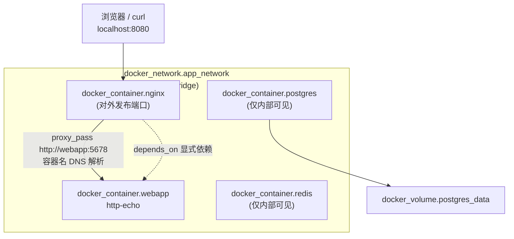

# 02 - Terraform + Docker

> Stage 2 / 12 ｜ 前置章节：[01-terraform-basics](../01-terraform-basics/README.md) ｜
> 概念参考：[docs/02-terraform-fundamentals.md](../docs/02-terraform-fundamentals.md)、
> [docs/10-private-cloud.md](../docs/10-private-cloud.md)（网络专题另见 [10-networking](../10-networking/README.md)）

## 一、本章目标

用 Terraform 的 **Docker Provider**（`kreuzwerker/docker`）声明式地管理一整套
本地容器化应用：一个用户自定义网络、四个容器（nginx / 一个简单 Web App / Redis /
PostgreSQL）、一个数据卷。走完本章你应该能：

- 理解 Terraform 如何管理 `docker network` / `docker volume` / `docker image` / `docker container`；
- 理解 Docker 的内置 DNS 服务发现（容器名当主机名）；
- 亲手用 `dynamic` block 生成端口映射；
- 理解并亲手触发一次 `depends_on` 显式依赖的必要场景；
- 用 `templatefile()` 渲染配置文件，并用 `upload` block 注入容器；
- 理解 `docker_image` 和 `docker_container`为什么是两个独立资源。

## 二、架构图



## 三、前置知识

完成第 1 章，理解 resource / variable / output / for_each / dynamic block 的基本语法。
本章需要 **Docker Desktop 已启动**（`docker version` 能正常返回）。

## 四、核心概念

- **Docker 网络模型**：容器默认可以互相 ping 通，但只有在**同一个
  user-defined 网络**里，才能用**容器名**当主机名互相访问（Docker 内置的
  嵌入式 DNS 服务器提供了这个能力）。默认的 `bridge` 网络不提供这个能力，
  这也是本章特意创建 `app_network` 而不是把容器扔进默认网络的原因。
- **镜像与容器分离**：`docker_image` 负责"这个镜像存在于本地"，
  `docker_container` 负责"用这个镜像跑一个容器实例"——一个镜像可以
  被多个容器共用（本章虽然没有演示多容器共用一个镜像，但这个设计
  为未来的扩展留了空间）。
- **`templatefile()` + `upload` block**：详见 [main.tf](main.tf) 注释，
  这是"用 Terraform 生成配置文件并注入容器"的标准手法，
  比手工维护一份 nginx.conf 再想办法复制进容器要工程化得多。

## 五、文件结构

```text
02-docker/
├── README.md
├── versions.tf                  <- docker provider 声明与配置
├── variables.tf                 <- 输入变量（含 nginx_port_mappings 供 dynamic block 使用）
├── main.tf                      <- network / volume / image / container 全部资源
├── outputs.tf
├── terraform.tfvars.example
└── templates/
    └── nginx.conf.tftpl         <- nginx 反向代理配置模板
```

## 六、Terraform 代码讲解

见 [main.tf](main.tf) 内联注释，这里补充整体逻辑：

1. 先创建 `docker_network.app_network` 和 `docker_volume.postgres_data`——
   这两个是"基础设施层"，其他所有容器都依赖它们（网络是隐式依赖，
   通过 `networks_advanced { name = docker_network.app_network.name }` 引用产生）。
2. 四个 `docker_image` 资源各自独立拉取对应镜像，`keep_locally = true`
   让 `destroy` 后镜像继续留在本地缓存。
3. `postgres` / `redis` / `webapp` 三个容器互相之间没有依赖关系，
   Terraform 会**并发**创建它们（回顾 [docs/02-terraform-fundamentals.md](../docs/02-terraform-fundamentals.md)
   第 8 节的依赖图/DAG 讲解——没有依赖关系的资源天然可以并行处理）。
4. `nginx` 容器：
   - 用 `dynamic "ports"` 循环 `var.nginx_port_mappings` 生成端口映射；
   - 用 `upload` block 把 `templatefile()` 渲染好的 nginx 配置写入容器；
   - 用 `depends_on = [docker_container.webapp]` **显式**声明依赖——
     因为配置文件内容里的 `webapp:5678` 只是一段普通字符串，
     Terraform 无法从字符串内容推断出这是对 `docker_container.webapp`
     的引用，如果不显式声明，两者创建顺序不确定。

## 七、执行步骤

```bash
cd 02-docker

# 确认 Docker Desktop 已经启动
docker version

terraform init
terraform fmt
terraform validate
terraform plan
terraform apply
```

## 八、验证方法

```powershell
docker ps
docker network ls | Select-String terraform-learning
docker volume ls | Select-String terraform-learning

# 访问 Web App（经过 nginx 反向代理）
curl http://localhost:8080
curl http://localhost:8080/nginx-health

# 直接进容器验证 Docker DNS 服务发现
docker exec nginx sh -c "wget -qO- http://webapp:5678"

# 查看 PostgreSQL 是否就绪
docker exec postgres pg_isready -U app_user

terraform output
```

## 九、Terraform State 变化

```bash
terraform state list
```

会看到四个 `docker_container.*`、四个 `docker_image.*`、一个
`docker_network.app_network`、一个 `docker_volume.postgres_data`，
以及一个 `data.docker_network.default_bridge`（data source 不算"被管理的资源"，
但同样会出现在 State 里，供下次 plan 复用其读取结果）。

用 `terraform state show docker_container.nginx` 可以看到 upload block
的内容也被记录在 State 里——这提醒我们：**如果配置文件里包含敏感信息，
同样要考虑 State 的保护问题**（参见 [docs/09-vault-basics.md](../docs/09-vault-basics.md)）。

## 十、Destroy

```bash
terraform destroy
```

Terraform 会按依赖图反向顺序销毁：先 `nginx`（依赖 `webapp`），
再并发销毁 `webapp` / `redis` / `postgres`，最后销毁网络和卷。
由于 `keep_images_locally = true`，四个镜像不会被删除。

## 十一、常见错误

| 现象 | 原因 | 解决方法 |
|---|---|---|
| `Cannot connect to the Docker daemon` | Docker Desktop 未启动 | 打开 Docker Desktop，等待状态变绿后重试；参见 [docs/05-debugging-guide.md](../docs/05-debugging-guide.md) 第 2 条 |
| `port is already allocated` | 8080 端口被占用（可能是上次没 destroy 干净的实验） | 修改 `nginx_port_mappings` 里的 external 端口，或清理占用端口的旧容器 |
| `no such host` / nginx 反代 502 | 忘记给 nginx 加 `depends_on`，或者 webapp 容器还没就绪 | 确认 [main.tf](main.tf) 里的 `depends_on` 没被删除；等待几秒后重试（nginx 的 `restart` 策略最终会自愈） |
| `Error: Error in function call ... templatefile` | 模板文件里出现了未转义的 `${` 或 `%{` 字符序列 | 需要输出字面量 `$` 时使用 `$$` 转义 |
| 修改 `nginx_port_mappings` 后 plan 显示要重建 nginx 容器 | 端口映射是容器创建时固定的参数，改动会触发替换 | 这是预期行为；如果不想中断服务，可以给 nginx 加 `lifecycle { create_before_destroy = true }` |

## 十二、思考题

1. 为什么 `postgres`、`redis`、`webapp` 三个容器之间没有互相 `depends_on`，
   但 `nginx` 需要显式依赖 `webapp`？
2. 如果把 `docker_container.redis` 也加一条 `ports { internal = 6379 external = 6379 }`，
   意味着什么？为什么本章故意不这样做？
3. `docker_image` 和 `docker_container` 分成两个资源，而不是把镜像名直接
   写在 `docker_container` 的 `image` 参数里，有什么工程上的好处？
4. 如果 PostgreSQL 容器被销毁重建，`docker_volume.postgres_data` 里的数据
   会不会丢失？为什么？

## 十三、动手练习

1. 把 `nginx_port_mappings` 改成两项（比如同时映射 8080 和 8081 到不同的
   容器内部端口），观察 `dynamic "ports"` 如何自动生成两个端口映射块。
2. 故意删掉 `nginx` 资源上的 `depends_on` 那一行，多 `destroy`/`apply`
   几次，观察是否偶尔会出现 nginx 启动时 webapp 还没就绪的情况。
3. 用 `docker exec -it postgres psql -U app_user -d app_db` 连进数据库，
   执行 `\l` 确认数据库已经按 `postgres_db` 变量创建成功。
4. 参照 [docs/02-terraform-fundamentals.md](../docs/02-terraform-fundamentals.md)
   第 8 节，执行 `terraform graph`，观察输出里 nginx 对 webapp 的依赖边
   相比其他隐式依赖边有什么不同（提示：可以对照 DOT 输出里的边来源）。

## 十四、进阶挑战

1. 给 `docker_container.postgres` 加上 `healthcheck` block
   （kreuzwerker/docker Provider 支持），并让 `webapp` 通过
   `depends_on` 依赖这个健康检查通过后的 postgres。
2. 新增一个 `variable "replica_count"`，用 `for_each` 或 `count`
   把 `webapp` 改造成多副本，nginx 配置模板相应地生成多个
   `upstream` 服务器条目实现简单的负载均衡（提示：需要在
   `templatefile()` 里传入一个列表，模板里用 `%{ for ... }` 循环语法）。
3. 把本章的四个容器重构成 [11-modules](../11-modules/README.md) 风格的
   可复用 module（比如抽出一个通用的 "docker-service" module），
   提前体验模块化思维。
