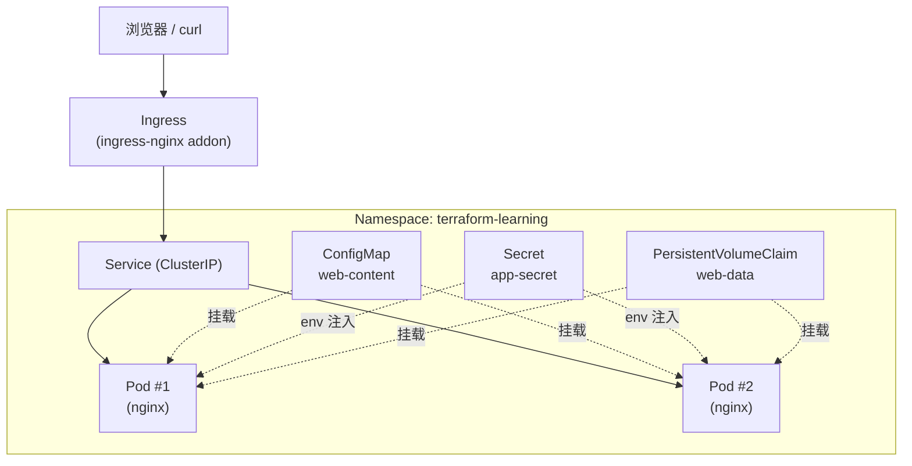

# 03 - Terraform + Minikube

> Stage 3 / 12 ｜ 前置章节：[02-docker](../02-docker/README.md) ｜
> 概念参考：[docs/06-kubernetes-basics.md](../docs/06-kubernetes-basics.md)

## 一、本章目标

第一次用 Terraform 管理**真正的 Kubernetes 集群**（Minikube 提供的单节点集群）。
本章会创建一个完整可访问的小应用，并额外创建一组专门用于 Kubernetes Dashboard 学习的资源。
除了 Namespace / ConfigMap / Secret / PVC / Deployment / Service / Ingress 之外，
还会覆盖 Pod / StatefulSet / DaemonSet / Job / CronJob / NodePort / ServiceAccount /
Role / RoleBinding / ClusterRole / ClusterRoleBinding / ResourceQuota / LimitRange /
NetworkPolicy / PodDisruptionBudget / HorizontalPodAutoscaler 等常见对象。

另外，ReplicaSet / EndpointSlice / PersistentVolume / ControllerRevision 等对象会由
Kubernetes Controller 或 Minikube 自动派生出来，因此不需要全部手工写成 Terraform 资源。
这样可以同时学习“Terraform 直接管理的对象”和“Kubernetes 根据控制器关系自动生成的对象”。

## 二、架构图



## 三、前置知识

完成第 1-2 章；读过 [docs/06-kubernetes-basics.md](../docs/06-kubernetes-basics.md)
了解 Pod / Deployment / Service / Ingress 的基本概念。

**环境要求**：Minikube 已安装。本章不假设集群已启动——请先运行下面的初始化脚本。

## 四、核心概念

概念详解全部在 [docs/06-kubernetes-basics.md](../docs/06-kubernetes-basics.md)，
这里补充"Terraform 特有"的部分：

- **`kubernetes_*` 资源和 `kubectl apply -f xxx.yaml` 的关系**：
  两者最终都是对 Kubernetes API Server 发起同样的 REST 请求，
  区别在于 Terraform 会先计算 diff、维护 State、能感知"这个资源
  是不是被我创建的、现在该不该删除"，而裸 `kubectl apply` 没有
  这一层状态管理（虽然 `kubectl apply` 也有自己的一套
  "last-applied-configuration" 注解机制，但表达能力和 Terraform
  的 plan/state 机制不是一回事）。
- **`wait_until_bound` / Kubernetes Provider 的"等待"语义**：
  见 [main.tf](main.tf) 中 PVC 资源的注释——Terraform 的 apply
  不是"提交请求就算完成"，而是会等到资源达到某种"就绪"状态。

## 五、文件结构

```text
03-minikube/
├── README.md
├── versions.tf              <- kubernetes provider 配置（含 config_context 讲解）
├── variables.tf
├── main.tf                  <- Web 应用主线：Namespace/ConfigMap/Secret/PVC/Deployment/Service/Ingress
├── dashboard-resources.tf   <- Dashboard 学习资源：Pod/StatefulSet/DaemonSet/Job/CronJob/RBAC/HPA 等
├── outputs.tf
├── terraform.tfvars.example
└── scripts/
    ├── start-minikube.ps1   <- 独立于 Terraform 的集群启动脚本
    └── open-dashboard.ps1   <- 打开 Minikube / Kubernetes Web Dashboard
```

## 六、Terraform 代码讲解

见 [main.tf](main.tf) 内联注释。核心设计决策：

- 所有资源的 `metadata.namespace` 都引用
  `kubernetes_namespace.this.metadata[0].name` 而不是直接写
  `var.namespace_name` 字符串——这是为了让 Terraform 建立
  **资源对 Namespace 的隐式依赖**（回顾
  [docs/02-terraform-fundamentals.md](../docs/02-terraform-fundamentals.md) 第 8 节）。
- Secret 通过 `env { value_from { secret_key_ref {...} } }` 注入容器，
  而不是把值直接写进 `env { value = ... }`——这是 Kubernetes 原生的
  "从 Secret 取值"机制。
- Liveness / Readiness Probe 的区别在 [main.tf](main.tf) 里有详细对比注释，
  完整专题见 [05-kubernetes/13-probes-resources](../05-kubernetes/13-probes-resources/README.md)。

## 七、执行步骤

```powershell
# 1. 启动 Minikube 集群 + 启用 ingress addon（独立于 Terraform 的一次性准备工作）
cd 03-minikube
.\scripts\start-minikube.ps1

# 2. 正式进入 Terraform 工作流
terraform init
terraform fmt
terraform validate
terraform plan
terraform apply
```

## 八、验证方法

```powershell
kubectl get all -n terraform-learning
kubectl get configmap,secret,pvc -n terraform-learning
kubectl describe pvc web-data -n terraform-learning   # 确认 STATUS 是 Bound

# 方式一：端口转发（最简单、总是可行）
terraform output port_forward_command
# 复制输出的命令在另一个终端运行，然后：
curl http://localhost:8080

# 方式二：通过 Ingress 访问（需要 ingress addon 已启用）
terraform output curl_via_ingress_command
# 复制输出的命令直接运行
# 如果 docker 驱动下直接访问不通，尝试在另一个终端运行 `minikube tunnel`
# 后重试——这是 Windows + docker 驱动下 LoadBalancer/Ingress 网络转发的
# 已知限制，端口转发方式（方式一）不受此影响，请优先使用它验证。
```

## 九、Dashboard 资源覆盖范围

本章现在专门增加了 `dashboard-resources.tf`，用于尽量覆盖 Dashboard 中常见的 Kubernetes 对象。
官方文档说明 Dashboard 会显示“most Kubernetes object kinds”，具体可见菜单会随 Kubernetes /
Dashboard 版本、RBAC 权限和启用的 addon 改变，因此这里采用“覆盖常见内建对象 + 展示自动派生对象”的方式。

| 分类 | 本章可观察资源 | 创建方式 |
|---|---|---|
| Cluster / Admin | Namespace | Terraform |
| Cluster / Admin | Node | Minikube 自动提供 |
| Storage | StorageClass `standard` | Minikube addon |
| Storage | PersistentVolumeClaim | Terraform |
| Storage | PersistentVolume | PVC 动态供给后自动生成 |
| Workloads | Deployment | Terraform |
| Workloads | ReplicaSet | Deployment 自动生成 |
| Workloads | Pod | Deployment / StatefulSet / DaemonSet / Job 自动生成，另有 standalone Pod |
| Workloads | StatefulSet | Terraform |
| Workloads | DaemonSet | Terraform |
| Workloads | Job | Terraform |
| Workloads | CronJob | Terraform |
| Workloads | ControllerRevision | StatefulSet / DaemonSet 自动生成 |
| Services | ClusterIP Service | Terraform |
| Services | NodePort Service | Terraform |
| Services | Headless Service | Terraform |
| Services | Ingress | Terraform |
| Services | EndpointSlice | Service 自动生成 |
| Config | ConfigMap | Terraform |
| Config | Secret | Terraform |
| Access Control | ServiceAccount | Terraform |
| Access Control | Role / RoleBinding | Terraform |
| Access Control | ClusterRole / ClusterRoleBinding | Terraform |
| Policy | ResourceQuota | Terraform |
| Policy | LimitRange | Terraform |
| Policy | NetworkPolicy | Terraform |
| Availability | PodDisruptionBudget | Terraform |
| Autoscaling | HorizontalPodAutoscaler v2 | Terraform；指标需要 metrics-server |
| Events / Logs | Events、Pod Logs | Kubernetes 自动产生 / Dashboard 查看 |

可以用下面的命令一次性确认大部分资源：

```powershell
kubectl get all -n terraform-learning
kubectl get configmap,secret,pvc,resourcequota,limitrange,serviceaccount -n terraform-learning
kubectl get role,rolebinding,networkpolicy,poddisruptionbudget,hpa -n terraform-learning
kubectl get statefulset,daemonset,job,cronjob -n terraform-learning
kubectl get ingress,endpointslice -n terraform-learning
kubectl get clusterrole,clusterrolebinding | Select-String terraform-learning
kubectl get pv,storageclass
```

> 注意：并不是所有 Kubernetes API 资源都适合在这一章手工创建。例如 Node 由 Minikube 提供，
> ReplicaSet/EndpointSlice/ControllerRevision 是控制器派生对象，PersistentVolume 通常由
> StorageClass + PVC 动态供给。强行手工创建这些对象反而会掩盖 Kubernetes Controller 的工作机制。

## 十、Minikube Dashboard（Web UI）

Minikube 内置了 Kubernetes Dashboard。除了使用 `kubectl get ...` 查看资源，
也可以直接在浏览器里用图形界面观察本章创建的 Kubernetes 资源及其状态。

最简单的启动方式：

```powershell
minikube dashboard
```

该命令会启动 Dashboard 的本地代理，并自动打开默认浏览器。
使用 Dashboard 期间请保持这个 PowerShell 窗口运行；结束时按 `Ctrl+C`
即可停止本地代理（不会停止 Minikube 集群）。

本仓库也提供了辅助脚本：

```powershell
.\scripts\open-dashboard.ps1
```

为了让 HPA 和 Dashboard 更完整地显示 CPU / 内存指标，推荐本章直接使用：

```powershell
.\scripts\open-dashboard.ps1 -EnableMetrics
```

打开 Dashboard 后，在界面中把 Namespace 切换为：

```text
terraform-learning
```

然后可以查看本章创建的主要资源：

- **Workloads / Deployments**：查看 `web` Deployment、副本数、滚动更新状态；
- **Pods**：查看两个 nginx Pod 是否为 Running，以及重启次数和事件；
- **Services**：查看 `web` ClusterIP Service、端口与 selector；
- **ConfigMaps**：查看 `web-content`；
- **Secrets**：查看 `app-secret` 的对象状态（敏感值不会直接作为普通明文展示）；
- **PersistentVolumeClaims**：查看 `web-data` 是否为 Bound；
- **Ingresses**：查看 `web` Ingress、Host 和后端 Service；
- **Events**：排查 Pending、CrashLoopBackOff、镜像拉取失败、探针失败等问题。

如果不希望自动打开浏览器，只想取得 Dashboard URL：

```powershell
minikube dashboard --url
```

如果还想在 Dashboard 中辅助观察 CPU / 内存指标，可以启用
`metrics-server` addon：

```powershell
minikube addons enable metrics-server
```

或者直接使用本仓库脚本：

```powershell
.\scripts\open-dashboard.ps1 -EnableMetrics
```

> Dashboard 是观察和排障工具，不会替代 Terraform State。建议同时对照
> `terraform state list`、`kubectl get ...` 和 Dashboard，理解
> Terraform、Kubernetes API 与实际运行资源之间的关系。

## 十一、Terraform State 变化

```bash
terraform state list
terraform state show kubernetes_deployment.web
```

观察 `kubernetes_deployment.web` 的 State 里记录了完整的 Pod 模板 spec——
这也是为什么"仅仅修改镜像 tag"这种小改动，`plan` 也能精确计算出
"只需要更新这一个字段"，而不是把整个资源标记为需要重建。

## 十二、Destroy

```bash
terraform destroy
```

这只会清理 Terraform 管理的 7 类资源，**不会删除 Minikube 集群本身**——
集群的生命周期由 `scripts/start-minikube.ps1` 独立管理（如果你想连集群
一起清理，运行 `minikube delete`，但这会影响其他章节共用的同一个集群，
请谨慎操作）。

## 十三、常见错误

| 现象 | 原因 | 解决方法 |
|---|---|---|
| `Error: Post ".../namespaces": dial tcp ... connection refused` | Minikube 没有启动，或 kubeconfig 端口信息过期 | 运行 `scripts/start-minikube.ps1`，或手动 `minikube status` + `minikube update-context` |
| PVC 一直 `Pending`，`terraform apply` 卡住不动 | `storage-provisioner` addon 未启用，或 StorageClass 名字不对 | `minikube addons list` 确认 `storage-provisioner` 是 enabled；`kubectl get storageclass` 确认存在名为 `standard` 的 StorageClass |
| Ingress 规则创建成功，但 curl 不通 | ingress addon 未启用，或 Windows + docker 驱动下网络转发限制 | 确认 `minikube addons list` 里 `ingress` 已启用；优先用"验证方法"里的端口转发方式排除网络转发因素 |
| `nginx.ingress.kubernetes.io/rewrite-target` 相关报错 | ingress-nginx Controller 还没就绪，Ingress 资源和 IngressClass 不匹配 | `kubectl get pods -n ingress-nginx`，确认 Controller Pod 是 Running |
| kubectl 显示的 context 不是 minikube | 系统里同时存在其他集群 context（比如 Kind） | `kubectl config use-context minikube`，或直接依赖本章 provider 配置里显式指定的 `config_context`（Terraform 自身不受 kubectl 当前 context 影响） |

## 十四、思考题

1. 为什么 Secret 用 `secret_key_ref` 注入，而不是直接在 Deployment 里
   写 `env { value = var.api_key }`？两者在 State 里的敏感性有区别吗？
2. 如果把 `replica_count` 从 2 改成 4，`kubectl get pods` 会发生什么？
   Terraform 的 State 会怎么变化？
3. Readiness Probe 失败和 Liveness Probe 失败，分别会导致什么？
   如果两者都设置成一样的检测逻辑，有什么潜在问题？
4. Ingress 和 Service 都能"路由流量"，为什么不能只用 Service 的
   `NodePort` 类型对外暴露，而要额外引入 Ingress？

## 十五、动手练习

1. 修改 `welcome_message` 变量，重新 `apply`，用端口转发验证页面内容变化。
2. 故意把 `storage_class` 改成一个不存在的名字（比如 `"does-not-exist"`），
   观察 `terraform apply` 卡住/超时的行为，然后改回 `"standard"`。
3. 用 `kubectl exec` 进入某个 Pod，执行
   `echo "hello" >> /var/log/nginx/test.log`，然后删除这个 Pod
   （`kubectl delete pod ...`），观察 Deployment 自动重建新 Pod 后，
   `/var/log/nginx/test.log` 里的内容是否还在——用来验证 PVC 数据的持久性。
4. 把 Deployment 的 `resources.limits.memory` 改小（比如 `"8Mi"`，
   小到不够 nginx 启动），观察 Pod 进入 `OOMKilled` / `CrashLoopBackOff`
   状态，然后改回合理值。

## 十六、进阶挑战

1. 把 `ingress_host` 改造成支持多个域名/路径规则的列表，
   用 `dynamic "rule"` 生成多条 Ingress 规则。
2. 给 Deployment 加上 `lifecycle { create_before_destroy = true }`，
   对比默认行为，观察副本数变化时 Pod 替换顺序的差异。
3. 提前浏览 [05-kubernetes](../05-kubernetes/README.md)，
   尝试自己给本章的 Deployment 增加一个 `startup_probe`
   （启动探针），用来处理"应用启动特别慢"的场景。
