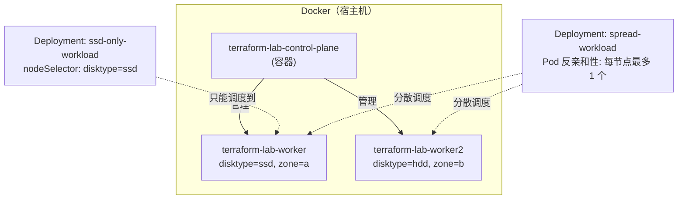

# 04 - Terraform + Kind（多节点 Kubernetes）

> Stage 4 / 12 ｜ 前置章节：[03-minikube](../03-minikube/README.md) ｜
> 概念参考：[docs/06-kubernetes-basics.md](../docs/06-kubernetes-basics.md)

## 一、本章目标

Minikube 让你体验了"有一个 Kubernetes 集群"，但没有回答一个关键问题：
**多节点集群里，Pod 到底会被调度到哪个节点，为什么？** 本章用 Kind
（Kubernetes IN Docker）拉起一个 1 control-plane + 2 worker 的集群，
专门演示 `nodeSelector` 和 Pod 反亲和性（anti-affinity）这两种调度控制手段。

## 二、架构图



## 三、前置知识

完成第 3 章；理解 Namespace / Deployment / Pod 的基本概念。
**环境要求**：`kind` CLI 已安装。

## 四、核心概念

- **Minikube 和 Kind 的区别**：详见
  [docs/06-kubernetes-basics.md](../docs/06-kubernetes-basics.md) 第 8 节。
  简单说：Minikube 通常是"一个看起来完整的单节点集群"，
  Kind 天然支持"每个节点是一个独立 Docker 容器"的多节点拓扑。
- **`nodeSelector` vs `affinity`**：`nodeSelector` 只支持"标签完全匹配"的
  简单场景；`affinity`（本章用到 `podAntiAffinity`）支持更复杂的表达式
  （`In` / `NotIn` / `Exists` 等操作符）、支持"软性偏好"（preferred）
  而不仅是"硬性要求"（required），也支持基于**其他 Pod 的标签**
  （而不仅是节点标签）做调度决策——这正是 `podAntiAffinity` 的应用场景。
- **Taint 与 control-plane 节点**：Kind/kubeadm 默认会给
  control-plane 节点打上一个污点（taint），阻止业务 Pod 被调度上去
  ——这也是为什么本章两个 Deployment 的 Pod 永远不会跑到
  `terraform-lab-control-plane` 上，即使我们完全没有写任何
  排除它的规则。

## 五、文件结构

```text
04-kind/
├── README.md
├── kind-config.yaml          <- 集群拓扑：1 control-plane + 2 worker（带标签）
├── scripts/
│   ├── create-cluster.ps1    <- 创建集群（独立于 Terraform）
│   └── delete-cluster.ps1    <- 删除集群
├── versions.tf               <- provider 配置，注意 config_context 命名规则
├── variables.tf
├── main.tf                   <- nodeSelector 与 podAntiAffinity 两个实验
└── outputs.tf
```

## 六、Terraform 代码讲解

见 [main.tf](main.tf) 内联注释。两个 Deployment 的核心差异：

| | `ssd_only` | `spread` |
|---|---|---|
| 调度机制 | `node_selector` | `affinity.pod_anti_affinity` |
| 约束依据 | 节点标签（`disktype=ssd`） | 其他 Pod 的标签（`app=spread-workload`） |
| 表达能力 | 只能"等于"，多个条件是 AND | 支持 `In`/`NotIn`/`Exists`，支持 required/preferred |
| 典型用途 | "这个工作负载必须用高性能磁盘节点" | "同一个应用的多个副本不要挤在同一台机器上" |

## 七、执行步骤

```powershell
cd 04-kind

# 1. 创建 Kind 多节点集群（独立于 Terraform 的一次性准备工作）
.\scripts\create-cluster.ps1

terraform init
terraform fmt
terraform validate
terraform plan
terraform apply
```

## 八、验证方法

```powershell
# 查看节点及其标签
kubectl --context kind-terraform-lab get nodes --show-labels

# 验证 nodeSelector：全部 Pod 的 NODE 列都应该是同一个 worker（打了 disktype=ssd 的那个）
terraform output -raw check_ssd_scheduling_command | Invoke-Expression

# 验证 podAntiAffinity：两个 Pod 的 NODE 列应该是不同的节点
terraform output -raw check_spread_scheduling_command | Invoke-Expression

# 确认 control-plane 节点上没有任何业务 Pod
kubectl get pods -A -o wide | Select-String "control-plane"
```

## 九、Terraform State 变化

```bash
terraform state list
terraform state show kubernetes_deployment.spread
```

State 里会完整记录 `affinity` block 的内容——如果之后修改
`topology_key` 或匹配表达式，`plan` 能精确定位到这一个字段的变化。

## 十、Destroy

```bash
terraform destroy
```

同样只清理 Deployment/Namespace，不影响 Kind 集群本身。如果要连集群
一起清理：

```powershell
.\scripts\delete-cluster.ps1
```

## 十一、常见错误

| 现象 | 原因 | 解决方法 |
|---|---|---|
| `ssd-only-workload` 的 Pod 一直 `Pending` | 没有任何节点带有 `disktype=ssd` 标签，或集群未按 `kind-config.yaml` 创建 | `kubectl get nodes --show-labels` 确认标签存在；如果集群是之前用别的配置创建的，先 `.\scripts\delete-cluster.ps1` 再重新创建 |
| `kubectl` 报错找不到 context `kind-terraform-lab` | 集群还没创建，或使用了不同的集群名 | 先运行 `create-cluster.ps1`；`kind get clusters` 确认名字 |
| `spread-workload` 只有一个 Pod 是 `Running`，另一个 `Pending` | 副本数超过了满足反亲和条件的可用节点数（比如 3 副本但只有 2 个 worker） | 减少 `spread_workload_replicas`，或增加 worker 节点数（修改 `kind-config.yaml` 后重新创建集群） |
| Terraform 报错连接被拒绝 | Docker Desktop 未启动，或 Kind 容器没有正常运行 | `docker ps` 确认三个 `terraform-lab-*` 容器都在运行 |

## 十二、思考题

1. 如果把 `ssd_only` 的 `node_selector` 改成同时要求
   `disktype = "ssd"` 和 `zone = "b"`，会发生什么？为什么？
2. `podAntiAffinity` 和 `nodeSelector` 可以同时用在同一个 Deployment 上吗？
   两者的约束关系是"AND"还是"OR"？
3. 为什么 control-plane 节点默认不跑业务 Pod？如果去掉这个限制会有什么风险？
4. `preferred_during_scheduling_ignored_during_execution`
   （本章没有使用）和 `required_during_scheduling_ignored_during_execution`
   的核心区别是什么？什么场景应该用前者？

## 十三、动手练习

1. 把 `ssd_workload_replicas` 从 2 改成 5（超过单个 worker 节点的合理容量），
   观察是否所有 Pod 都能被调度成功。
2. 修改 `kind-config.yaml`，给 worker 节点加一个新标签，重新创建集群
   （需要先 delete-cluster），并新增一个用这个新标签做 `node_selector`
   的 Deployment。
3. 把 `spread` 的 `topology_key` 从 `"kubernetes.io/hostname"` 改成
   `"topology.kubernetes.io/zone"`（配合 `kind-config.yaml` 里的 `zone`
   标签，需要先用 `kubectl label node` 手动补上这个 topology 标签，
   因为 Kind 默认不会自动生成它），观察调度行为的变化。

## 十四、进阶挑战

1. 给 `ssd_only` Deployment 增加 `tolerations`，让它能够容忍
   control-plane 节点的污点，观察 Pod 是否真的被调度上去了
   （提示：容忍污点只是"允许"调度，不代表"一定会"调度上去，
   还要看 `node_selector`/`affinity` 是否也匹配 control-plane 节点）。
2. 结合 [05-kubernetes/08-daemonset](../05-kubernetes/08-daemonset/README.md)，
   理解为什么 DaemonSet 天然适合"每个节点跑一个"的场景，
   对比它和本章手工用 `podAntiAffinity` 实现"打散"的差异
   （提示：DaemonSet 不需要你指定副本数，它自动等于符合条件的节点数）。
