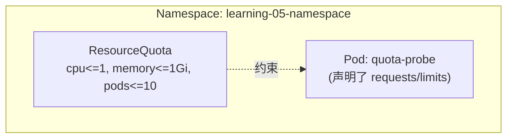

# 05-01 - Namespace + ResourceQuota

## 本章目标

理解 Namespace 作为隔离边界的作用，并亲手用 ResourceQuota 体验
"没有声明 resources 的 Pod 会被拒绝"这一强制约束。

## 架构图



## 前置知识

[docs/06-kubernetes-basics.md](../../docs/06-kubernetes-basics.md) 第 4 节。

## 核心概念

见 [main.tf](main.tf) 注释。核心结论：**一旦某个 Namespace 设置了
`requests`/`limits` 相关的 ResourceQuota，这个 Namespace 里之后创建的
每一个容器都必须显式声明对应的 resources 字段，否则会被 API Server
直接拒绝**——这是 Kubernetes 强制资源治理的常见手段。

## 文件结构

```text
01-namespace/
├── README.md
├── versions.tf
└── main.tf   <- Namespace + ResourceQuota + 一个用于验证的 Pod
```

## 执行步骤

```bash
cd 05-kubernetes/01-namespace
terraform init
terraform plan
terraform apply
```

## 验证方法

```bash
kubectl get namespace learning-05-namespace
kubectl describe resourcequota learning-quota -n learning-05-namespace
kubectl get pod quota-probe -n learning-05-namespace
```

## Terraform State 变化

`terraform state list` 会看到 `kubernetes_namespace.this`、
`kubernetes_resource_quota.this`、`kubernetes_pod.probe` 三个资源。

## Destroy

```bash
terraform destroy
```

## 常见错误

| 现象 | 原因 | 解决方法 |
|---|---|---|
| `Error ... exceeded quota` | 尝试创建的 Pod 资源请求超过了 Quota 剩余额度 | 减少副本数或降低 resources 声明 |
| `must specify limits.cpu,limits.memory` | Namespace 有 Quota 但 Pod 没有声明 limits | 给容器补上 `resources.limits` |

## 思考题

1. 如果删除 `kubernetes_pod.probe` 里的 `resources` 块，`apply` 会发生什么？
2. ResourceQuota 和 04-kind 章节的调度约束（nodeSelector/affinity）解决的是同一类问题吗？

## 动手练习

把 `hard.pods` 改成 `"1"`，再尝试用 `kubectl run` 手工在这个 Namespace
里创建第二个 Pod，观察被拒绝的报错信息。

## 进阶挑战

给这个 Namespace 增加一个 `LimitRange` 资源
（`kubernetes_limit_range`），为没有显式声明 resources 的容器提供默认值，
对比它和 ResourceQuota"直接拒绝"的行为差异。
