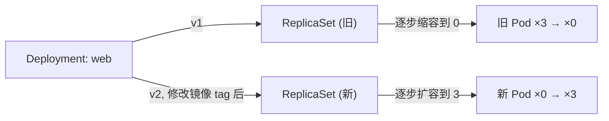

# 05-02 - Deployment / ReplicaSet 滚动升级

## 本章目标

亲手触发一次滚动升级，观察 Deployment 如何通过创建新 ReplicaSet、
逐步替换旧 Pod 来实现"不中断服务的版本更新"。

## 架构图



## 核心概念

`max_surge=1, max_unavailable=0` 意味着升级过程中：任何时刻可用 Pod
数不能少于 3（`max_unavailable=0`），但允许短暂出现第 4 个 Pod
（`max_surge=1`）——也就是"先加一个新的，确认它 Ready 了，
再减一个旧的"，如此循环直到全部替换完成。完整概念见
[docs/06-kubernetes-basics.md](../../docs/06-kubernetes-basics.md) 第 5 节。

## 执行步骤与验证

```bash
cd 05-kubernetes/02-deployment
terraform init
terraform apply    # 用默认 nginx_version 创建 3 副本

kubectl get replicasets -n learning-05-deployment
kubectl rollout status deployment/web -n learning-05-deployment

# 触发滚动升级
terraform apply -var="nginx_version=1.25-alpine"

# 观察：旧 ReplicaSet 副本数逐步降到 0，新 ReplicaSet 逐步升到 3，
# 期间用 `kubectl get pods -n learning-05-deployment -w` 能看到过程
kubectl get replicasets -n learning-05-deployment
kubectl rollout history deployment/web -n learning-05-deployment
```

## Terraform State 变化

注意：`kubernetes_deployment.web` 在 State 里只有**一份**记录
（Terraform 管理的是 Deployment 这个对象本身），但 Kubernetes 集群里
实际会有两个 ReplicaSet（新旧各一个，旧的保留用于回滚）——
**Terraform 不直接管理 ReplicaSet**，这是 Kubernetes 内部自己创建和
清理的下层对象，这一点是 Terraform 声明式管理和 Kubernetes 自身
声明式控制循环"分层"的一个典型体现。

## Destroy

```bash
terraform destroy
```

## 常见错误

| 现象 | 原因 | 解决方法 |
|---|---|---|
| 升级过程中 Pod 数量始终是 3，从未变成 4 | `max_surge` 生效需要集群有额外资源可调度；也可能因为镜像下载慢 | 耐心等待，或 `kubectl describe` 查看具体 Pod 事件 |
| `rollout status` 一直不返回 | 新版本 Pod 一直不 Ready（比如 readiness probe 失败） | 检查新镜像 tag 是否存在、探针路径是否正确 |

## 思考题

1. 如果把 `max_unavailable` 改成 1、`max_surge` 改成 0，升级节奏会有什么不同？
2. 为什么 Kubernetes 要保留旧的 ReplicaSet 而不是升级完直接删除？

## 动手练习

把 `nginx_version` 改成一个不存在的 tag（比如 `"does-not-exist"`），
观察升级"卡住"的现象（旧 Pod 会一直保留，因为新 Pod 永远起不来），
然后改回正确的版本号完成回滚。

## 进阶挑战

用 `kubectl rollout undo deployment/web -n learning-05-deployment`
手工回滚一次，然后思考：如果之后你再执行 `terraform apply`
（配置文件里的 `nginx_version` 没有变），Terraform 会把它"改回去"吗？
为什么？（提示：这是一个关于 Terraform 如何判断 drift 的思考题）。
