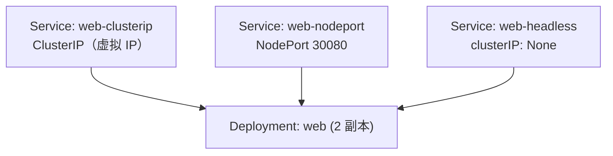

# 05-03 - Service：ClusterIP / NodePort / Headless 对比

## 本章目标

同一个 Deployment，同时创建三种类型的 Service，用实际的 DNS 查询和
访问结果，直观对比它们的行为差异。

## 架构图



## 核心概念

见 [main.tf](main.tf) 注释；三者核心区别一览：

| 类型 | ClusterIP | NodePort | Headless |
|---|---|---|---|
| 是否分配虚拟 IP | 是 | 是（同时开 Node 端口） | 否 |
| 集群外能否直接访问 | 否 | 能（任意 Node IP + 端口） | 否 |
| DNS 查询返回什么 | 一个虚拟 IP | 一个虚拟 IP | **所有 Pod 的真实 IP 列表** |
| 典型用途 | 内部服务间通信 | 无 LB 环境下临时对外暴露 | StatefulSet 等需要直接感知 Pod 身份的场景 |

## 执行步骤

```bash
cd 05-kubernetes/03-service
terraform init
terraform apply
```

## 验证方法

```bash
kubectl get svc -n learning-05-service

# ClusterIP：进集群内任意 Pod 验证（或用一个临时调试 Pod）
kubectl run -it --rm debug --image=busybox:1.36 --restart=Never -n learning-05-service -- \
  sh -c "nslookup web-clusterip; nslookup web-headless"

# 对比两条 nslookup 结果：
#   web-clusterip 只返回一个 IP（Service 自己的虚拟 IP）
#   web-headless  返回两个 IP（两个 Pod 各自的真实 IP）

# NodePort：从 Windows 宿主机直接访问（Kind 需要在 kind-config 里做端口映射
# 才能从宿主机直接访问 NodePort；本实验里更简单的验证方式是进容器内访问）
kubectl get nodes -o wide
```

## Terraform State 变化

三个 `kubernetes_service` 资源在 State 里都有独立地址；观察
`kubernetes_service.headless` 的 `spec[0].cluster_ip` 属性值固定是
字符串 `"None"`，而不是一个真实 IP——这是它在 API 层面被识别为
Headless Service 的依据。

## Destroy

```bash
terraform destroy
```

## 常见错误

| 现象 | 原因 | 解决方法 |
|---|---|---|
| `node_port` 相关报错 `provided port is not in the valid range` | NodePort 必须落在 30000-32767 范围 | 调整 main.tf 里的 `node_port` 值 |
| `nslookup web-headless` 只返回一个 IP | Pod 还没就绪，或副本数是 1 | 确认两个 Pod 都 Running：`kubectl get pods -n learning-05-service` |

## 思考题

1. 为什么 Headless Service 适合 StatefulSet，而不适合无状态的 Deployment？
2. NodePort 本质上是不是也依赖 ClusterIP？（提示：`kubectl describe svc web-nodeport`）

## 动手练习

把 `web-clusterip` 的 `port.target_port` 改成一个和容器实际监听端口
不一致的值（比如 8080），观察 Service 虽然创建成功，
但请求实际上无法到达 Pod 的现象——这是初学者最常见的 Service
配置错误之一。

## 进阶挑战

新增一个 `ExternalName` 类型的 Service（`type = "ExternalName"`，
`external_name = "example.com"`），理解它和前三种类型的本质区别：
它甚至不做流量转发，只是给一个外部域名做一层 DNS 别名。
