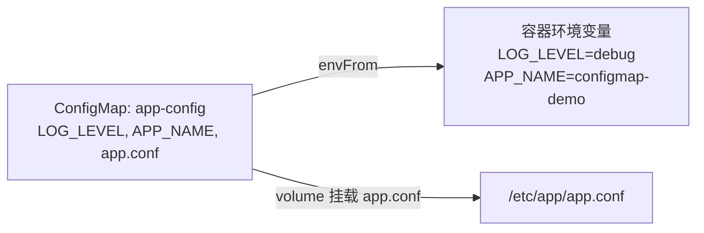

# 05-04 - ConfigMap：环境变量 vs 文件挂载

## 本章目标

同一个 ConfigMap，用两种方式消费：整体转成环境变量（`envFrom`）、
以及把某个 key 挂载成容器内的一个文件——理解两者的适用场景与关键差异
（尤其是"能否热更新"）。

## 架构图



## 执行步骤与验证

```bash
cd 05-kubernetes/04-configmap
terraform init
terraform apply

kubectl exec -n learning-05-configmap configmap-demo -- env | grep -E "LOG_LEVEL|APP_NAME"
kubectl exec -n learning-05-configmap configmap-demo -- cat /etc/app/app.conf
```

## Destroy

```bash
terraform destroy
```

## 常见错误

| 现象 | 原因 | 解决方法 |
|---|---|---|
| 容器里读不到环境变量 | `env_from` 拼写错误或引用的 ConfigMap 名字不对 | 检查 `kubernetes_config_map.app_config.metadata[0].name` 是否正确渲染 |
| `/etc/app/app.conf` 不存在 | `volume.config_map.items` 里的 `key` 和 ConfigMap 实际的 key 不一致 | 确认两边字符串完全一致（区分大小写） |

## 思考题

1. 如果修改 `data.LOG_LEVEL` 的值并 `terraform apply`，已经在运行的
   Pod 里 `env | grep LOG_LEVEL` 的输出会变化吗？为什么？
2. 如果同样修改后是文件挂载消费方式，`/etc/app/app.conf` 的内容
   多久之后会同步（提示：这个 Pod 例子和 Deployment 场景下 kubelet
   的同步机制有什么区别）？

## 动手练习

修改 `app_config` 里 `app.conf` 的内容，重新 `apply`，然后等待
1 分钟左右再 `kubectl exec` 查看文件内容是否已经更新（注意：本实验用
的是裸 Pod 而不是 Deployment，裸 Pod 场景下这个热更新行为可能有所不同，
建议同时对比 02-deployment 场景下的表现）。

## 进阶挑战

把 `app_config` 改造成从一个本地文件用
`data = { "app.conf" = file("${path.module}/app.conf") }` 的方式加载内容，
而不是用行内 heredoc 字符串——这在真实项目里更常见，配置文件本身
可以单独被其他工具（比如 lint 工具）校验。
