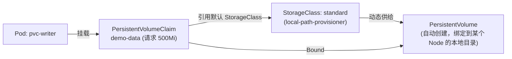

# 05-06 - PersistentVolumeClaim：动态供给全过程

## 本章目标

亲眼看到 PVC 从"申请"到"被自动绑定到一块真实存储"的完整过程，
并验证删除 Pod、重新创建后数据依然还在。

## 架构图



## 核心概念

**动态供给（Dynamic Provisioning）**：PVC 创建后，Kubernetes 里的
一个 Controller（这里是 `local-path-provisioner`）会监听到这个未绑定的
PVC，根据它引用的 StorageClass 自动创建一个匹配的 PersistentVolume，
再把两者绑定——全程不需要管理员预先手工创建 PV，这是"云原生存储"
相比早期 Kubernetes 手工管理 PV 的重大简化。

**`VolumeBindingMode: WaitForFirstConsumer`（重要，本实验亲手踩过这个坑）**：
`kubectl get storageclass` 能看到 Kind 默认的 `standard` StorageClass
这一列是 `WaitForFirstConsumer`——意思是"这个 PVC 在有 Pod 真正要用它
之前，不会被绑定"，因为 `local-path-provisioner` 要等 Pod 被调度到
某个具体 Node 后，才能在那个 Node 本地创建对应的存储目录（PV
的位置和 Pod 的调度结果是绑定的）。这和另一种模式
`Immediate`（PVC 一创建就立刻尝试绑定，不管有没有 Pod 在用它，
第 3 章 Minikube 默认的 StorageClass 用的就是这种模式）形成对比。

这直接影响了 [main.tf](main.tf) 里 `wait_until_bound` 必须设为
`false` ——见该文件内的详细注释，这是本项目在实际测试中真实踩到、
并不是编出来的坑。

## Terraform State 变化

`terraform state show kubernetes_persistent_volume_claim.data` 里，
apply 刚完成时 `spec[0].volume_name` 会是空的（因为此时 PVC 还是
Pending，等 Pod 被调度后才会变成 Bound）——这是"State 记录的是
apply 那一刻的快照，不代表之后不会自然继续变化"的一个具体例子。

## 执行步骤与验证

```bash
cd 05-kubernetes/06-pvc
terraform init
terraform apply

kubectl get pvc -n learning-05-pvc
kubectl get pv | grep learning-05-pvc
kubectl exec -n learning-05-pvc pvc-writer -- cat /data/log.txt

# 删除 Pod（PVC 不会被删除，因为它是独立资源）
kubectl delete pod pvc-writer -n learning-05-pvc
terraform apply    # Terraform 会发现 Pod 缺失，重新创建它

# 验证数据依然存在（新 Pod 挂载的是同一个 PVC/PV）
kubectl exec -n learning-05-pvc pvc-writer -- cat /data/log.txt
# 应该能看到两条 "written at ..." 记录
```

## Destroy

```bash
terraform destroy
kubectl get pv | grep learning-05-pvc   # 确认对应的 PV 也被联动回收
```

## 常见错误

| 现象 | 原因 | 解决方法 |
|---|---|---|
| `terraform apply` 卡住 4-5 分钟后报 `client rate limiter Wait returned an error: context deadline exceeded` | `wait_until_bound` 被设成了 `true`，而 StorageClass 是 `WaitForFirstConsumer` 模式，PVC 在消费它的 Pod 创建之前永远不会 Bound，导致死锁 | 确认 [main.tf](main.tf) 里 `wait_until_bound = false`（这正是本项目实测踩过的坑，见上方核心概念） |
| PVC 一直 Pending（且没有报错、Pod 也创建失败） | 集群没有默认 StorageClass，或 provisioner 组件异常 | `kubectl get storageclass` 确认存在标记为 `(default)` 的条目；`kubectl get pods -n local-path-storage` 检查 provisioner 状态 |
| 第二次 `terraform apply` 后数据丢失 | Pod 被删除的同时 PVC 也被删除了（比如 destroy 后重新 apply，PVC 被重建成了新的） | 只删除 Pod，不要删除 PVC，就能验证数据持久性 |

## 思考题

1. 为什么 `WaitForFirstConsumer` 模式下，`wait_until_bound = true`
   会导致死锁，而 `07-statefulset` 里用 `volume_claim_template`
   自动生成的 PVC 却不会遇到同样的问题？（提示：两者背后"谁负责
   创建 PVC、什么时候创建"的时序完全不同）
2. PV 的回收策略（Reclaim Policy）有哪些选项？`local-path-provisioner`
   创建的 PV 默认是哪一种？这对本实验的"删除 PVC 后数据会怎样"有什么影响？

## 动手练习

先 `kubectl delete pvc demo-data -n learning-05-pvc`（而不是删除 Pod），
观察绑定的 PV 发生了什么变化（`kubectl get pv`），
理解"删除 PVC"和"删除 Pod"对底层存储生命周期的不同影响。

## 进阶挑战

阅读 [11-modules](../../11-modules/README.md) 后，尝试把
"PVC + 写入 Pod"这个组合抽象成一个可复用的 module，
输入参数化存储大小和挂载路径。
