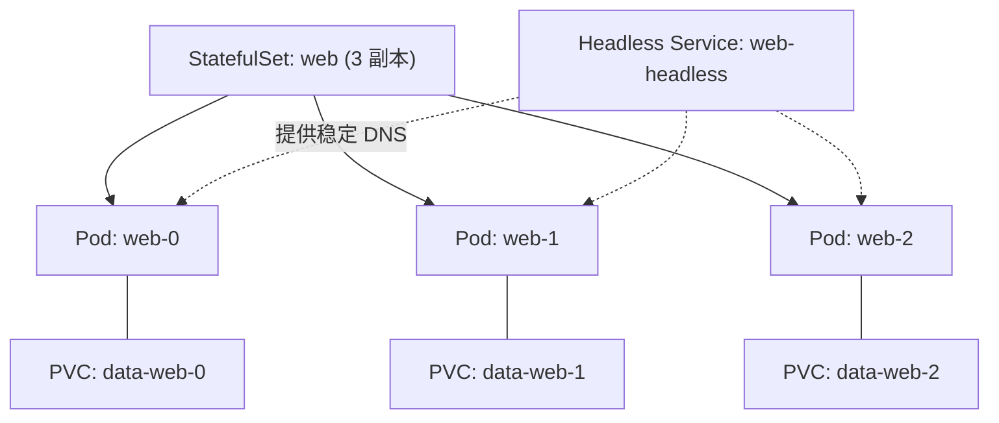

# 05-07 - StatefulSet：有序编号 Pod 与稳定网络标识

## 本章目标

对比 StatefulSet 和 Deployment：理解为什么数据库这类"每个副本都有
独立身份和独立数据"的应用，通常用 StatefulSet 而不是 Deployment 部署。

## 架构图



## 核心概念

和 Deployment 的三个关键区别：

1. **有序、可预测的命名**：`web-0`、`web-1`、`web-2`，而不是像
   Deployment 那样带随机后缀（`web-dd445f8c4-67skr`）；
2. **有序的创建/删除**：默认按 0→1→2 顺序创建，删除时按 2→1→0
   逆序进行，每一步都等前一个 Pod 就绪/完全终止后才继续；
3. **独享的持久化存储**：见 [main.tf](main.tf) 里
   `volume_claim_template` 的注释——每个副本拿到自己独立的 PVC，
   重建 Pod 后仍然拿回同一个 PVC（按序号匹配），而不是随机分配。

## 执行步骤与验证

```bash
cd 05-kubernetes/07-statefulset
terraform init
terraform apply

kubectl get pods -n learning-05-statefulset -w   # 观察 web-0 → web-1 → web-2 依次创建
kubectl get pvc -n learning-05-statefulset        # 每个 Pod 一个独立 PVC

# 验证稳定 DNS 名字
kubectl run -it --rm debug --image=busybox:1.36 --restart=Never -n learning-05-statefulset -- \
  nslookup web-0.web-headless.learning-05-statefulset.svc.cluster.local
```

## Destroy

```bash
terraform destroy
```

删除时观察 Pod 是否按 `web-2 → web-1 → web-0` 的逆序终止。
注意：`volume_claim_template` 创建的 PVC **不会**随 StatefulSet 一起
自动删除（这是有意设计——防止误删 StatefulSet 时连带丢失所有数据），
需要额外手工清理：

```bash
kubectl delete pvc -n learning-05-statefulset -l app=web-sts
```

## 常见错误

| 现象 | 原因 | 解决方法 |
|---|---|---|
| `web-1` 一直不创建 | `web-0` 还没进入 Ready 状态（StatefulSet 默认是顺序创建策略） | 检查 `web-0` 的日志/探针配置 |
| destroy 后再次 apply，Pod 名字重复但内容"似乎"还在 | 旧的 PVC 没有被清理，新 Pod 复用了同名 PVC | 这其实是预期行为，正体现了 StatefulSet + PVC 组合的持久性设计 |

## 思考题

1. 为什么 StatefulSet 需要一个 Headless Service，而 Deployment 不需要？
2. 如果把 `replicas` 从 3 减少到 1，Kubernetes 会先删除哪个 Pod？为什么？

## 动手练习

进入 `web-1`，写一个测试文件到 `/usr/share/nginx/html/test.txt`，
删除这个 Pod（`kubectl delete pod web-1`），等待 StatefulSet 自动重建，
验证新的 `web-1` 里这个文件是否还在。

## 进阶挑战

给 StatefulSet 加上 `update_strategy` 的 `partition` 参数，
实现"金丝雀发布"式的分阶段滚动升级（只升级序号 >= partition 的副本），
对比 Deployment 的 `max_surge`/`max_unavailable` 策略。
