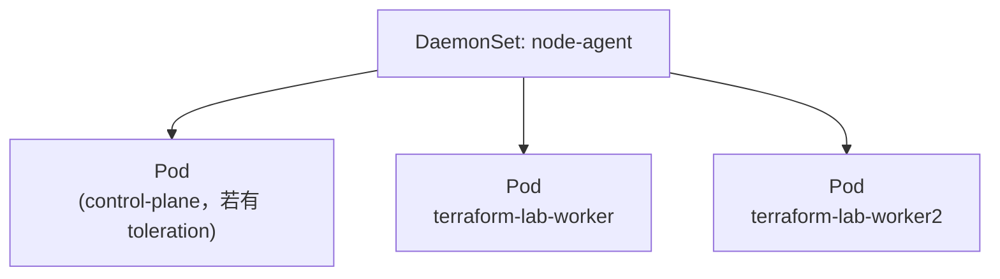

# 05-08 - DaemonSet：每节点一份

## 本章目标

对比 04-kind 章节里"手工用 podAntiAffinity 实现打散"和 DaemonSet
"原生支持每节点一份"这两种思路的差异，理解 DaemonSet 的专属定位。

## 架构图



## 执行步骤与验证

```bash
cd 05-kubernetes/08-daemonset
terraform init
terraform apply

kubectl get daemonset -n learning-05-daemonset
kubectl get pods -n learning-05-daemonset -o wide
# DESIRED / CURRENT / READY 应该等于集群里可调度节点的数量（2 个 worker）
```

## Destroy

```bash
terraform destroy
```

## 常见错误

| 现象 | 原因 | 解决方法 |
|---|---|---|
| DESIRED 数量是 0 | 集群没有 Ready 的可调度节点 | `kubectl get nodes` 确认节点状态 |
| Pod 没有出现在 control-plane 节点 | control-plane 默认带污点，DaemonSet 没有配置容忍 | 这是预期行为；见"进阶挑战" |

## 思考题

1. 如果集群新增一个 worker 节点，DaemonSet 会自动在新节点上创建 Pod 吗？
   需不需要重新 `terraform apply`？
2. 如果要用普通 Deployment + podAntiAffinity 模拟出"每节点恰好一个"的效果，
   需要额外做什么（提示：副本数需要手动等于节点数，且节点数变化时不会自动感知）？

## 动手练习

用 `kubectl scale`（或者直接修改集群节点数：往 `04-kind/kind-config.yaml`
加一个 worker 节点后重建集群）观察 DaemonSet 的 Pod 数量是否自动跟随变化，
而不需要修改任何 Terraform 配置。

## 进阶挑战

给 DaemonSet 加上：

```hcl
toleration {
  key      = "node-role.kubernetes.io/control-plane"
  operator = "Exists"
  effect   = "NoSchedule"
}
```

使其也能调度到 control-plane 节点，验证"容忍污点"和"04-kind
里的调度约束"之间的关系——这正是真实集群里 CNI 插件、
日志采集 Agent 这类"必须覆盖所有节点，包括 control-plane"的
DaemonSet 常见的配置方式。
