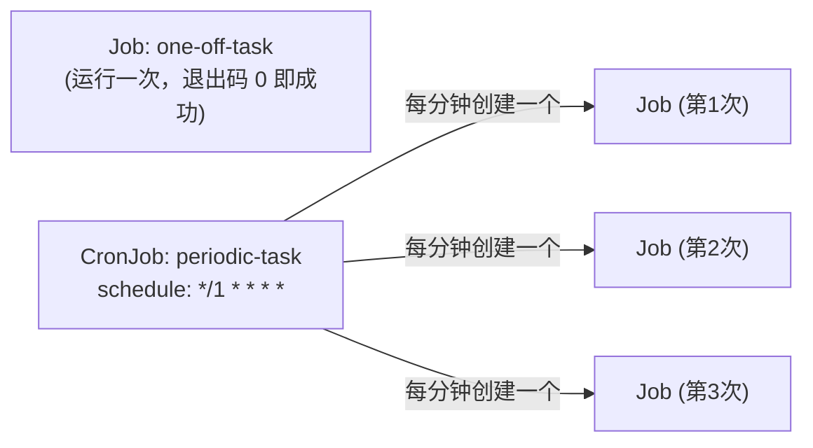

# 05-09 - Job / CronJob：一次性任务与定时任务

## 本章目标

理解 Job 和 Deployment 在"容器退出即成功"这个假设上的本质区别，
并观察 CronJob 如何按周期自动创建新的 Job。

## 架构图



## 核心概念

见 [main.tf](main.tf) 注释。关键点：`restart_policy` 必须是
`Never` 或 `OnFailure`（不能是 `Always`）——这是 Job 类资源和
Deployment/StatefulSet/DaemonSet 在 Pod 模板层面唯一的语法差异，
但背后体现的是完全不同的设计假设。

## 执行步骤与验证

```bash
cd 05-kubernetes/09-job-cronjob
terraform init
terraform apply
# apply 会等待 one-off-task 这个 Job 真正跑完（wait_for_completion = true）
# 才继续，这也是"声明式"思想的体现——Terraform 帮你确认了任务确实成功。

kubectl get jobs -n learning-05-job
kubectl logs job/one-off-task -n learning-05-job

# 等待 2-3 分钟后查看 CronJob 的执行历史
kubectl get cronjob -n learning-05-job
kubectl get jobs -n learning-05-job -l app=periodic-task
kubectl logs -n learning-05-job -l app=periodic-task --tail=5
```

## Terraform State 变化

`kubernetes_job.one_off` 的 State 里会记录 `status`（比如
succeeded 次数）——这是少数几个"State 里记录了运行时产生的结果数据"
的资源类型之一，而不仅仅是配置本身。

## Destroy

```bash
terraform destroy
```

destroy 会删除 CronJob（之后不再创建新 Job）以及已经存在的 Job 记录。

## 常见错误

| 现象 | 原因 | 解决方法 |
|---|---|---|
| `apply` 卡住不返回 | Job 的容器一直没有以 exit 0 退出（比如命令写错、无限循环） | 检查 `command`，必要时 Ctrl+C 中断后修复配置 |
| CronJob 从不创建新 Job | cron 表达式写错，或 CronJob 被 suspend | 用 `crontab.guru` 这类工具验证表达式；`kubectl get cronjob -o yaml` 检查 `spec.suspend` |

## 思考题

1. 如果 `one-off-task` 的命令执行失败（exit 非 0），Kubernetes 会怎么处理？
   `backoff_limit = 3` 在这个过程中起什么作用？
2. `successful_jobs_history_limit` 设置得太大会有什么问题？

## 动手练习

把 `one-off-task` 的 command 改成一个必然失败的命令（比如 `exit 1`），
观察 `backoff_limit` 生效的重试过程（`kubectl get pods -n learning-05-job -w`）。

## 进阶挑战

给 CronJob 加上 `concurrency_policy = "Forbid"`，理解它如何防止
"上一次周期的 Job 还没跑完，下一次周期又触发了新 Job"这种并发冲突场景
——这在"任务本身不是幂等/不支持并发"时非常重要。
