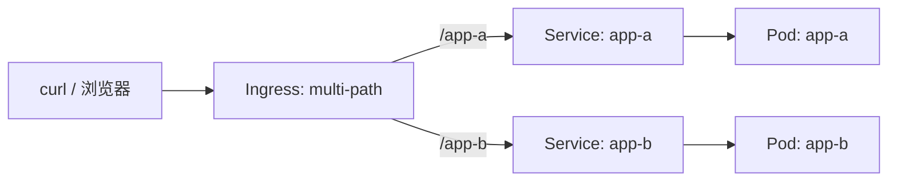

# 05-10 - Ingress：多路径路由

## 本章目标

一个 Ingress 资源、一个入口，把 `/app-a` 和 `/app-b` 两个路径分别
路由到两个完全独立的后端 Service，直观体会 Ingress 的核心价值。

## 架构图



## 前置条件

本实验需要集群里已经装好 ingress-nginx Controller：

```powershell
cd 05-kubernetes/10-ingress
.\scripts\install-ingress-nginx.ps1
```

（如果你已经在 [06-helm](../../06-helm/README.md) 里通过 Helm 装过
ingress-nginx，这一步可以跳过，两者只需要有一个即可。）

## 执行步骤

```bash
terraform init
terraform apply
```

## 验证方法

Kind 集群默认没有把 Ingress Controller 的 80/443 端口映射到宿主机，
最简单的验证方式是端口转发到 Controller 本身：

```bash
kubectl port-forward -n ingress-nginx svc/ingress-nginx-controller 8080:80
```

另开一个终端：

```bash
curl http://localhost:8080/app-a
curl http://localhost:8080/app-b
```

应该分别看到 `response from app-a` 和 `response from app-b`。

## Destroy

```bash
terraform destroy
```

（ingress-nginx Controller 本身不受这里管理，如需卸载：
`kubectl delete -f https://raw.githubusercontent.com/kubernetes/ingress-nginx/main/deploy/static/provider/kind/deploy.yaml`）

## 常见错误

| 现象 | 原因 | 解决方法 |
|---|---|---|
| curl 返回 404 | ingress-nginx 还没就绪，或 `ingress_class_name` 不匹配 | 确认 `install-ingress-nginx.ps1` 输出了 "就绪"；`kubectl get ingressclass` |
| `/app-a` 返回 `app-b` 的内容（或反之） | 路径匹配顺序/`path_type` 配置有误 | 检查两条 `path` 规则的先后顺序和 `path_type` 是否都是 `Prefix` |

## 思考题

1. 如果去掉 `rewrite-target` 注解，访问 `/app-a` 时，
   http-echo 容器实际收到的请求路径是什么？这对某些对路径敏感的
   后端应用意味着什么？
2. `path_type` 除了 `Prefix`，还有 `Exact` 和 `ImplementationSpecific`，
   它们的匹配语义有什么不同？

## 动手练习

新增第三个 `app-c` 服务和对应路径规则，不用修改任何已有代码，
只新增资源块即可——体会 Ingress 规则组合的可扩展性。

## 进阶挑战

改造成基于**域名**而不是路径区分（`rule.host = "a.local"` /
`rule.host = "b.local"`），并用 `curl --resolve` 验证
（做法参考 [03-minikube](../../03-minikube/README.md) 里 Ingress 验证方式）。
