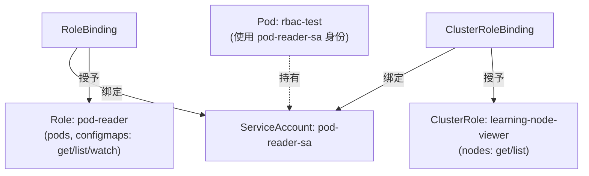

# 05-11 - RBAC：最小权限模型

## 本章目标

创建一个只有"只读 Pod/ConfigMap"权限的 ServiceAccount，
用一个真实的 Pod 亲手验证："能读被授权的资源" + "不能读未被授权的资源
（比如 Secret）" + "能读集群级别被单独授权的资源（Node）"。

## 架构图



## 核心概念

见 [main.tf](main.tf) 注释。RBAC 的四个对象分两组，结构完全对称：

| 命名空间级别 | 集群级别 |
|---|---|
| Role（定义权限） | ClusterRole（定义权限） |
| RoleBinding（绑定权限给 Subject） | ClusterRoleBinding（绑定权限给 Subject） |

## 执行步骤

```bash
cd 05-kubernetes/11-rbac
terraform init
terraform apply
```

## 验证方法

```bash
# 能读 Pod（Role 授权了的）
kubectl exec -n learning-05-rbac rbac-test -- \
  kubectl get pods -n learning-05-rbac

# 不能读 Secret（Role 没有授权）—— 应该看到 Forbidden
kubectl exec -n learning-05-rbac rbac-test -- \
  kubectl get secrets -n learning-05-rbac

# 能读 Node（ClusterRole 授权了的集群级资源）
kubectl exec -n learning-05-rbac rbac-test -- \
  kubectl get nodes

# 不能读其他 Namespace 的 Pod（Role 只在自己所在 Namespace 生效）
kubectl exec -n learning-05-rbac rbac-test -- \
  kubectl get pods -n kube-system
```

## Destroy

```bash
terraform destroy
```

## 常见错误

| 现象 | 原因 | 解决方法 |
|---|---|---|
| 所有命令都返回 Forbidden，包括应该被允许的 | RoleBinding 的 `subject` 里 `namespace` 填错，导致没有真正绑定到这个 Pod 使用的 ServiceAccount | 确认 `subject.namespace` 和 ServiceAccount 实际所在 Namespace 一致 |
| 读 Secret 意外成功了 | 集群里可能存在其他更宽泛的 RoleBinding（比如意外绑定了 `cluster-admin`） | `kubectl get clusterrolebinding -o wide \| grep pod-reader-sa` 排查 |

## 思考题

1. 为什么 Kubernetes 要把"定义权限"（Role）和"绑定给谁"（RoleBinding）
   拆成两个对象，而不是合并成一个？
2. `rbac.authorization.k8s.io` 这个 `api_group` 字符串出现在
   `role_ref` 里，它本身和 `rule.api_groups` 里的 `""`（core group）
   是同一回事吗？

## 动手练习

尝试给 `pod_reader` Role 的 `verbs` 加上 `"delete"`，重新 apply，
验证现在这个 ServiceAccount 是否真的能删除 Pod
（**建议只删除测试用的 Pod，不要影响其他实验**）。

## 进阶挑战

结合 [05-secret](../05-secret/README.md)，给 `pod_reader` Role
单独加一条只针对**某一个具名 Secret**（而不是所有 Secret）的读权限
（`resource_names` 参数），体会 RBAC 支持"精确到具体资源实例"级别的授权粒度。
