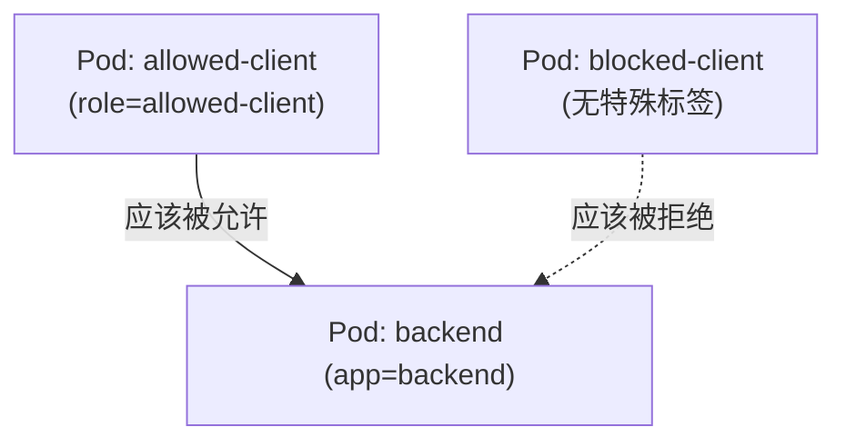

# 05-12 - NetworkPolicy：默认全通 vs 显式白名单隔离

## ⚠️ 关于 CNI 支持（请务必先读这一节）

Kubernetes 的 NetworkPolicy 只是一份"规则声明"，**真正的流量拦截
由集群的 CNI（容器网络插件）负责实现**——如果 CNI 不支持
NetworkPolicy，这些规则会被 API Server 正常接受、正常存储，
但**实际网络行为不会有任何变化**。

Kind 集群默认使用的 **kindnet** CNI **不支持**强制执行 NetworkPolicy。
也就是说，跑完本实验后，即使 `blocked-client` 理论上应该被拒绝，
实际测试很可能会发现它**依然能连通** `backend`——这不是配置错误，
而是这个学习环境本身的已知限制。真正验证隔离效果，需要按下面
"进阶挑战"换用支持 NetworkPolicy 的 CNI（比如 Calico）。

**这个限制本身就是重要的知识点**：在真实项目里，选择云托管 Kubernetes
时必须确认其默认 CNI 是否支持 NetworkPolicy（比如 AWS EKS 默认的
VPC CNI 需要额外配置或换用 Calico 才能支持；Azure AKS/GCP GKE
的情况也需要分别确认），不能想当然地认为"写了 NetworkPolicy
就一定生效"。

## 本章目标

理解 NetworkPolicy 的"白名单"语义——一旦某个 Pod 被任何
NetworkPolicy 的 `pod_selector` 选中，它就从"默认全通"变成
"默认全拒，只放行被显式允许的流量"。

## 架构图



## 执行步骤

```bash
cd 05-kubernetes/12-networkpolicy
terraform init
terraform apply
```

## 验证方法

```bash
kubectl exec -n learning-05-networkpolicy allowed-client -- \
  wget -qO- --timeout=3 http://backend
# 期望：能正常返回 nginx 欢迎页

kubectl exec -n learning-05-networkpolicy blocked-client -- \
  wget -qO- --timeout=3 http://backend
# 在支持 NetworkPolicy 的 CNI 上，期望：连接超时/被拒绝
# 在 Kind 默认 kindnet CNI 上：很可能仍然会连通（见上方警告）
```

## Destroy

```bash
terraform destroy
```

## 常见错误

| 现象 | 原因 | 解决方法 |
|---|---|---|
| `blocked-client` 依然能访问 backend | Kind 默认 CNI 不强制执行 NetworkPolicy（预期现象，非配置错误） | 参考"进阶挑战"安装 Calico 后重新验证 |
| `allowed-client` 也无法访问 backend | `ingress.from.pod_selector` 的 `match_labels` 和客户端 Pod 实际标签不一致 | 核对 `kubernetes_pod.allowed_client` 的 labels 和 policy 里的 selector |

## 思考题

1. 如果一个 Pod 没有被任何 NetworkPolicy 的 `pod_selector` 选中，
   它的入站流量策略是什么？
2. `default_deny` 和 `allow_from_client` 这两个 NetworkPolicy
   同时作用于 `backend` Pod，它们的效果是"取交集"还是"取并集"？

## 动手练习

新增一条 `egress` 方向的 NetworkPolicy，限制 `backend` Pod
只能访问集群内的 DNS（`kube-system` 里的 CoreDNS），阻止它访问
其他任意地址——体会 `policy_types = ["Egress"]` 和 `["Ingress"]`
的对称结构。

## 进阶挑战

在一个支持 NetworkPolicy 的环境验证真实隔离效果，例如：
用 `kind create cluster` 时通过
`networking.disableDefaultCNI: true` 关闭 kindnet，
改为手工安装 [Calico](https://docs.tigera.io/calico/latest/getting-started/kubernetes/kind)。
这会是一个独立于本项目主线的、有一定难度的环境搭建练习，
建议在完全理解本实验的"预期行为"之后再挑战。
