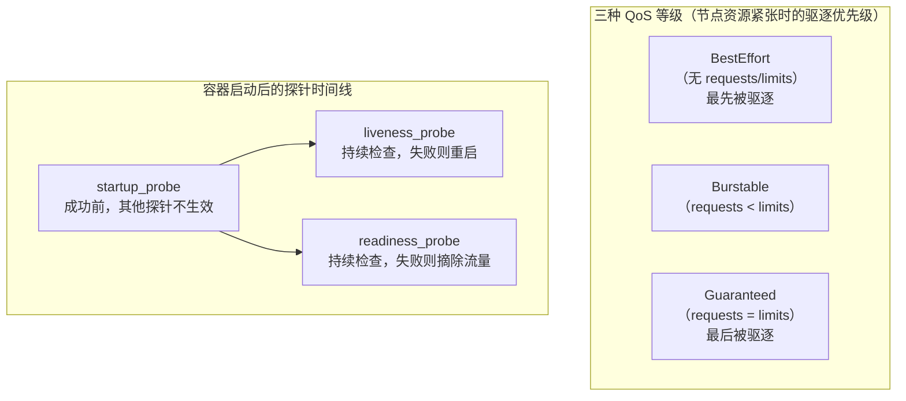

# 05-13 - Resource Request/Limit 与三种 Probe

## 本章目标

理解 `requests`/`limits` 如何决定 Pod 的 QoS（服务质量）等级，
以及 Startup / Liveness / Readiness 三种探针各自解决什么问题、
彼此如何配合。

## 架构图



## 核心概念

见 [main.tf](main.tf) 注释。QoS 等级的判定规则（由 Kubernetes 自动计算，
不能手工指定）：

| 等级 | 判定条件 |
|---|---|
| Guaranteed | Pod 内**每个**容器的 requests 和 limits 对**每种**资源（cpu、memory）都相等 |
| Burstable | 至少有一个容器设置了 requests 或 limits，但不满足 Guaranteed 条件 |
| BestEffort | 所有容器都完全没有设置 requests/limits |

## 执行步骤与验证

```bash
cd 05-kubernetes/13-probes-resources
terraform init
terraform apply

kubectl get pod qos-guaranteed qos-burstable qos-besteffort -n learning-05-probes \
  -o custom-columns=NAME:.metadata.name,QOS:.status.qosClass

kubectl describe pod probes-demo -n learning-05-probes | Select-String -Pattern "Liveness|Readiness|Startup"
```

## Destroy

```bash
terraform destroy
```

## 常见错误

| 现象 | 原因 | 解决方法 |
|---|---|---|
| `qosClass` 不是预期的等级 | requests/limits 设置不满足对应判定条件（比如只设了 cpu 没设 memory） | 对照上面的判定表逐项检查 |
| `probes-demo` 一直没进入 Ready | readiness_probe 的路径/端口配置错误 | `kubectl logs` 查看应用是否真的监听在该端口 |

## 思考题

1. 为什么 `readiness_probe` 的 `failure_threshold` 设置得比
   `liveness_probe` 更敏感（更小）在很多真实场景下是合理的？
2. 如果 `startup_probe` 一直不成功，Pod 最终会发生什么？

## 动手练习

把 `probes_demo` 的 `liveness_probe.http_get.path` 改成一个 nginx
不存在的路径（比如 `/does-not-exist`，会返回 404），观察容器是否会被
反复重启（`kubectl get pod probes-demo -n learning-05-probes -w`，
注意 RESTARTS 列的变化）。

## 进阶挑战

给 `qos-besteffort` 补上 `resources.limits`（但不设置 `requests`），
观察它的 QoS 等级如何变化（提示：只设置了 limits 时，
Kubernetes 会自动把 requests 补齐为和 limits 相同的值——
这本身也是一个值得记住的隐藏规则）。
