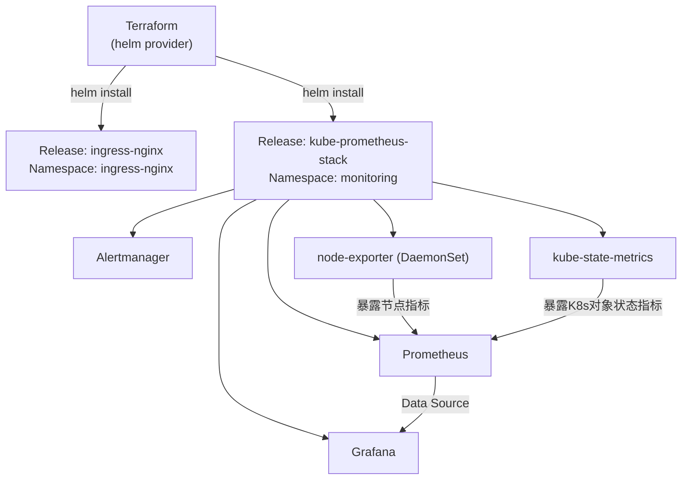

# 06 - Terraform + Helm

> Stage 6 / 12 ｜ 前置章节：[04-kind](../04-kind/README.md) ｜
> 概念参考：[docs/08-monitoring-basics.md](../docs/08-monitoring-basics.md)

## 一、本章目标

用 Terraform 的 **Helm Provider** 部署两个真实的社区 Chart：
`ingress-nginx`（Ingress 控制器）和 `kube-prometheus-stack`
（Prometheus + Grafana + Alertmanager + node-exporter + kube-state-metrics
的一站式监控栈）。理解 Helm 的核心概念，以及 Terraform Kubernetes
Provider 和 Helm Provider 的分工差异。

## 二、架构图



## 三、前置知识

完成第 4 章（Kind 集群）；理解 Helm 的基本定位——它是 Kubernetes
的"包管理器"，类似 apt/npm，但管理的是一组 Kubernetes manifest 的模板化打包。

## 四、核心概念

- **Chart / Release / Repository**：
  - Chart：一个 Helm 包，包含模板化的 Kubernetes manifest + 默认 values；
  - Release：一次具体的 Chart 安装实例（同一个 Chart 可以在同一个集群
    里以不同名字安装多次，成为多个独立 Release）；
  - Repository：托管 Chart 的仓库（本章用到官方
    `ingress-nginx` 和 `prometheus-community` 两个仓库）。
- **`values.yaml`**：每个 Chart 自带一份默认配置，用户通过覆盖
  values 来定制安装行为，而不需要直接修改 Chart 内部的模板——
  这是 Helm 相比"裸 YAML manifest"最大的价值：**同一份 Chart
  代码，靠不同的 values 组合出不同环境的部署效果**。
- **Terraform Kubernetes Provider vs Helm Provider**：前者管理
  "单个具体的 Kubernetes 对象"（一个 Deployment、一个 Service），
  你需要自己写清楚每一个字段；后者管理"一整个 Chart 的安装"，
  内部到底创建了多少个、什么样的 Kubernetes 对象，由 Chart 作者
  决定，Terraform 只负责"这个 Release 该不该存在、用什么 values"。
  两者不是互斥的——真实项目里经常同时使用：基础设施性质的组件
  （Ingress Controller、监控栈）用 Helm 安装，业务应用用
  Kubernetes Provider 精细管理。

## 五、文件结构

```text
06-helm/
├── README.md
├── versions.tf                             <- helm + kubernetes provider 配置
├── variables.tf
├── main.tf                                 <- 两个 helm_release 资源
├── outputs.tf
└── values/
    ├── ingress-nginx-values.yaml
    └── kube-prometheus-stack-values.yaml
```

## 六、Terraform 代码讲解

见 [main.tf](main.tf) 内联注释。两个关键设计点：

1. `helm_release.ingress_nginx` 用 `count = var.install_ingress_nginx ? 1 : 0`
   做成"可开关"的资源——如果你已经在
   [05-kubernetes/10-ingress](../05-kubernetes/10-ingress/README.md)
   用 kubectl 装过一份 ingress-nginx，应该把 `install_ingress_nginx`
   设为 `false`，避免同一个 Namespace 里出现两套控制器冲突。
2. Grafana 的管理员密码用 `set_sensitive` 而不是写进 values 文件——
   但请注意这**只影响 CLI 展示**，Helm 依然会把最终渲染出的 Secret
   明文存进集群（`kubectl get secret -n monitoring kube-prometheus-stack-grafana`），
   这和 [09-vault-basics.md](../docs/09-vault-basics.md) 里反复强调的
   结论完全一致——`sensitive`/`set_sensitive` 从来都不是"加密"。

## 七、执行步骤

```bash
cd 06-helm
terraform init
terraform fmt
terraform validate
terraform plan
terraform apply   # kube-prometheus-stack 组件较多，可能需要几分钟
```

## 八、验证方法

```bash
kubectl get pods -n ingress-nginx
kubectl get pods -n monitoring

# Grafana
terraform output -raw grafana_port_forward_command | Invoke-Expression
# 浏览器打开 http://localhost:3000，用户名 admin，密码是 variables.tf 里
# grafana_admin_password 的值（默认 demo-password）

# Prometheus
terraform output -raw prometheus_port_forward_command | Invoke-Expression
# 浏览器打开 http://localhost:9090，在 Status -> Targets 里
# 确认 node-exporter / kube-state-metrics 都是 UP 状态
```

## 九、Terraform State 变化

```bash
terraform state list
terraform state show helm_release.kube_prometheus_stack
```

注意 State 里记录的是**这个 Release 本身**（名字、chart、version、
values 的哈希等元信息），**不会**逐个列出它内部创建的几十个
Kubernetes 对象——这些对象由 Helm 自己在集群里维护记录
（存成一个特殊的 Secret，`kubectl get secret -n monitoring -l owner=helm`
能看到），Terraform 只关心"这个 Release 整体"。

## 十、Destroy

```bash
terraform destroy
```

这会执行 `helm uninstall`，删除 Release 关联的全部 Kubernetes 对象。
**注意**：kube-prometheus-stack 创建的部分 CRD（Custom Resource
Definition，比如 Prometheus/Alertmanager 自定义的告警规则类型）
默认不会被自动删除（这是 Helm 对 CRD 的保守策略，防止误删导致
其他还在使用这些 CRD 的资源丢失定义）。如需彻底清理：

```bash
kubectl get crd | Select-String "monitoring.coreos.com" | ForEach-Object { kubectl delete crd $_.ToString().Split(" ")[0] }
```

## 十一、常见错误

| 现象 | 原因 | 解决方法 |
|---|---|---|
| `Error: INSTALLATION FAILED: ... already exists` | 同名 Release 或同名 Namespace 资源已存在（比如重复安装 ingress-nginx） | 把 `install_ingress_nginx` 设为 `false`，或先卸载冲突的旧安装 |
| `apply` 超过默认超时报错 | 本地资源紧张，镜像拉取慢 | 调大 [main.tf](main.tf) 里的 `timeout` 参数 |
| Grafana 登录失败 | 密码变量和实际部署时使用的值不一致（比如中途改过变量但没有重新 apply） | 确认 `terraform apply` 已应用最新的 `grafana_admin_password` |
| Prometheus Targets 里 node-exporter 是 DOWN | node-exporter Pod 没有调度成功，或 NetworkPolicy 类实验遗留的隔离规则仍在生效 | `kubectl get pods -n monitoring -o wide`；确认没有遗留的 05-kubernetes/12-networkpolicy 资源还没清理 |

## 十二、思考题

1. 为什么 Helm Chart 的默认 values 往往不能直接用于生产环境
   （提示：想想副本数、资源限制、持久化存储这些字段的"通用默认值"
   往往偏保守或偏宽松）？
2. `helm_release` 的 State 记录和 `kubernetes_deployment` 这类资源的
   State 记录，在"信息颗粒度"上有什么本质区别？这对
   `terraform plan` 计算 diff 的方式有什么影响？

## 十三、动手练习

1. 修改 `kube-prometheus-stack-values.yaml` 里 `prometheus.prometheusSpec.retention`，
   重新 apply，用 Prometheus UI 确认新的保留时间配置生效。
2. 把 `ingress_nginx_chart_version` 改成一个旧版本（比如 `4.14.5`），
   重新 apply，观察 Helm 如何执行一次"版本降级"操作。
3. 用 `helm list -n monitoring`（原生 Helm CLI）确认能看到 Terraform
   创建的这个 Release——这验证了 Terraform Helm Provider 和原生
   `helm` 命令操作的是同一套底层机制，可以互相配合排查问题。

## 十四、进阶挑战

1. 结合 [08-monitoring](../08-monitoring/README.md)，在本章部署好的
   Prometheus/Grafana 基础上，用 Terraform Grafana Provider
   （不同于 Helm Provider）以代码方式管理 Dashboard 和 Alert Rule。
2. 把 `install_ingress_nginx` 相关的"可选资源"模式抽象成一个通用的
   Module 参数模式，应用到 [11-modules](../11-modules/README.md)
   里你自己设计的 module 上。
