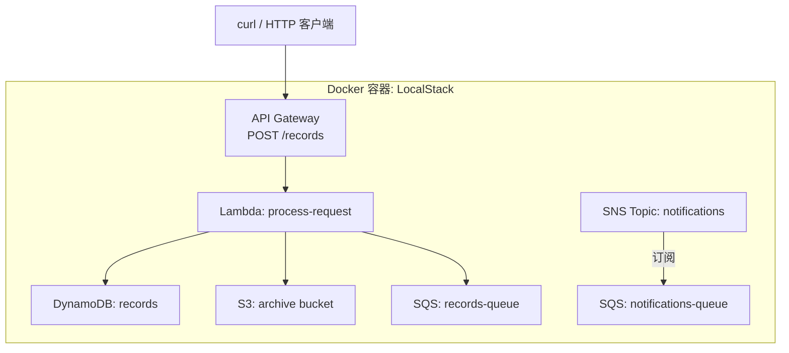

# 07 - Terraform + LocalStack（本地 AWS）

> Stage 7 / 12 ｜ 前置章节：[02-docker](../02-docker/README.md) ｜
> 概念参考：[docs/07-localstack-basics.md](../docs/07-localstack-basics.md)

> **LocalStack 适合学习，但不能完全替代真实 AWS。**
> 完整边界说明见 [docs/07-localstack-basics.md](../docs/07-localstack-basics.md) 第 5 节。

## 一、本章目标

用 Terraform 的 **AWS Provider**（不是什么"LocalStack 专用 Provider"，
就是官方 `hashicorp/aws`，只是把 endpoint 指向本地）搭建一个完整的
Serverless 架构，并跑通 SNS 到 SQS 的扇出订阅：

```text
HTTP 请求 -> API Gateway -> Lambda -> DynamoDB / S3 / SQS
SNS Topic -> SQS Queue（扇出订阅）
```

## 二、架构图



## 三、前置知识

完成第 2 章（Docker Provider 用法）；读过
[docs/07-localstack-basics.md](../docs/07-localstack-basics.md)。

## 四、核心概念

- **同一个 Provider，换一个 endpoint**：本章 `versions.tf` 里的
  `provider "aws"` 和你将来连接真实 AWS 用的完全是同一个
  Provider、同一套资源类型（`aws_s3_bucket`、`aws_lambda_function`……），
  唯一区别是 `endpoints` block 把请求重定向到本地——这是
  LocalStack 学习价值的核心。
- **LocalStack 本身也是被 Terraform 管理的资源**：见
  [localstack.tf](localstack.tf)，我们用第 2 章学过的 Docker
  Provider 启动 LocalStack 容器本身，做到"从 LocalStack 到里面
  跑的 AWS 资源，全部由同一份 Terraform 配置统一编排"。
- **"启动完成"不等于"服务就绪"**：`docker_container` 创建成功
  只代表容器进程起来了，LocalStack 内部各服务模块的初始化还需要
  几秒钟。[localstack.tf](localstack.tf) 里的 `null_resource.wait_for_localstack`
  专门处理这个问题——这是一个通用模式，任何"启动较慢的外部依赖"
  都可以用类似手法处理。
- **resource-based policy 容易被遗漏**：`messaging.tf` 里 SNS
  订阅 SQS 需要额外的 `aws_sqs_queue_policy`，`serverless.tf` 里
  API Gateway 调用 Lambda 需要额外的 `aws_lambda_permission`——
  这两处都是真实 AWS 项目里最容易被忽略、导致"配置了但不生效"的地方。

## 五、文件结构

```text
07-localstack/
├── README.md
├── versions.tf         <- docker + aws(指向本地) + archive + time provider
├── variables.tf
├── localstack.tf        <- 启动 LocalStack 容器 + 健康检查等待
├── storage.tf            <- S3 + DynamoDB
├── messaging.tf          <- SQS + SNS + SNS->SQS 扇出
├── serverless.tf         <- IAM Role + Lambda + API Gateway
├── outputs.tf
└── lambda/
    └── handler.py         <- Lambda 源码（Python）
```

## 六、Terraform 代码讲解

见各 `.tf` 文件内联注释，核心数据流已在架构图中标出。特别关注
[serverless.tf](serverless.tf) 里 `data "archive_file"` 如何在
`apply` 时自动把 `handler.py` 打包成 zip，以及 `source_code_hash`
如何让 Terraform 精确感知代码变化。

## 七、执行步骤

```bash
cd 07-localstack
terraform init
terraform fmt
terraform validate
terraform plan
terraform apply
```

`apply` 全程可能需要 1-2 分钟（等待 LocalStack 就绪 + 创建十几个资源）。

## 八、验证方法

```bash
# 完整链路：HTTP -> API Gateway -> Lambda -> DynamoDB/S3/SQS
terraform output -raw curl_example | Invoke-Expression

# 确认 DynamoDB 里出现了新记录
aws dynamodb scan --table-name $(terraform output -raw dynamodb_table_name) --endpoint-url http://127.0.0.1:4566

# 确认 S3 里出现了归档文件
aws s3 ls s3://$(terraform output -raw s3_bucket_name)/requests/ --endpoint-url http://127.0.0.1:4566

# 确认 SQS 收到了消息
aws sqs receive-message --queue-url $(terraform output -raw sqs_queue_url) --endpoint-url http://127.0.0.1:4566

# 验证 SNS -> SQS 扇出
aws sns publish --topic-arn $(terraform output -raw sns_topic_arn) --message "hello sns" --endpoint-url http://127.0.0.1:4566
aws sqs receive-message --queue-url $(terraform output -raw notifications_queue_url) --endpoint-url http://127.0.0.1:4566
```

> 以上 `aws` CLI 命令需要安装 [AWS CLI](https://aws.amazon.com/cli/)；
> 没有 AWS CLI 也可以用 `curl_example` 验证核心链路是否打通。

## 九、Terraform State 变化

```bash
terraform state list
```

会看到 docker\_\* 资源（LocalStack 本身）和十几个 aws\_\* 资源
并存在同一份 State 里——这是本章"统一编排"设计的直接体现。

## 十、Destroy

```bash
terraform destroy
```

这会先删除所有 aws\_\* 资源（在 LocalStack 内部"清空"），
最后销毁 LocalStack 容器本身。由于 `PERSISTENCE=0`，
容器销毁后不会留下任何数据。

## 十一、常见错误

| 现象 | 原因 | 解决方法 |
|---|---|---|
| `null_resource.wait_for_localstack` 报错 "did not become ready in time" | LocalStack 容器启动失败，或端口 4566 被占用 | `docker logs localstack-learning-lab`；确认没有其他程序占用 4566 端口 |
| Lambda 调用报错，`docker ps` 看不到 Lambda 执行容器 | Docker socket 没有正确挂载进 LocalStack 容器 | 确认 [localstack.tf](localstack.tf) 里 `host_path` 写的是双斜杠 `//var/run/docker.sock`（Windows 特有写法，见文件内注释） |
| API Gateway 返回 500 | Lambda 内部报错（比如权限不足） | `docker logs localstack-learning-lab \| Select-String -Pattern "ERROR"` 查看具体报错；检查 `aws_iam_role_policy` 是否覆盖了所有用到的 Action |
| SNS 发布成功，但 SQS 收不到消息 | 缺少 `aws_sqs_queue_policy` 授权，或订阅创建顺序在策略之前 | 确认 [messaging.tf](messaging.tf) 里 `aws_sns_topic_subscription` 的 `depends_on` 指向 `aws_sqs_queue_policy.allow_sns` |

## 十二、思考题

1. 为什么 `aws_api_gateway_deployment` 需要一个人工构造的
   `triggers` 才能在配置变化时重新部署？这反映了 AWS API Gateway
   本身的什么设计特点？
2. 如果把 `LAMBDA_EXECUTOR` 换成非 `docker` 模式，本章的
   Docker socket 挂载还有必要吗？

## 十三、动手练习

1. 修改 `handler.py`，让它同时把请求的 `message` 转成大写再写入
   DynamoDB，重新 `apply`（观察 `source_code_hash` 触发的重新部署），
   再次调用验证。
2. 用 `aws dynamodb scan` 多调用几次接口，观察 DynamoDB 里记录数量的增长。
3. 尝试故意让 `aws_iam_role_policy` 漏掉 `s3:PutObject` 权限，
   重新 apply 并调用接口，观察 Lambda 报错信息里体现的权限拒绝细节。

## 十四、进阶挑战

1. 新增一个 EventBridge 规则（`aws_cloudwatch_event_rule` +
   `aws_cloudwatch_event_target`），让 DynamoDB 里每条新记录
   同时触发一条定时/事件驱动的下游处理（LocalStack 社区版对
   EventBridge 的支持有一定限制，建议先查阅当前 LocalStack 版本的
   Service Feature Coverage 文档确认支持程度）。
2. 参考 [docs/09-vault-basics.md](../docs/09-vault-basics.md)，
   把 `handler.py` 里目前"没有任何密钥"的简单逻辑，改造成从
   `aws_secretsmanager_secret` 读取一个模拟的第三方 API Key，
   体会 Lambda 运行时读取 Secrets Manager 的标准模式。
3. 把本章跑通的架构和 [14-full-local-cloud](../14-full-local-cloud/README.md)
   的整体编排对照，思考如何把 LocalStack 也纳入毕业实验的统一部署。
