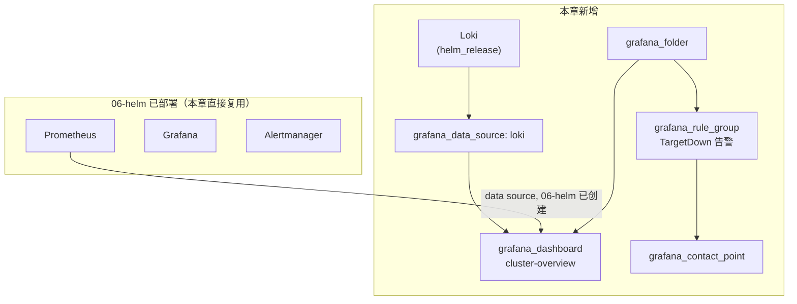

# 08 - 本地监控系统

> Stage 8 / 12 ｜ 前置章节：[06-helm](../06-helm/README.md)（必须先完成，本章复用它部署的 Prometheus/Grafana）｜
> 概念参考：[docs/08-monitoring-basics.md](../docs/08-monitoring-basics.md)

## 一、本章目标

在第 6 章已经用 Helm 部署好的 Prometheus + Grafana 基础上：

1. 用 Helm 追加部署 **Loki**（日志系统），补齐 Metrics/Logs/Alerts 三大支柱里
   本项目此前缺失的"Logs"部分；
2. 用 **Terraform Grafana Provider** 以代码方式管理 Grafana 的
   Data Source、Folder、Dashboard、Alert Rule、Contact Point——
   这是本章真正的学习重点：**仪表盘和告警规则本身也是 Infrastructure as Code**。

## 二、架构图



## 三、前置知识

**必须先完成 [06-helm](../06-helm/README.md)**——本章假设
`monitoring` Namespace、Prometheus、Grafana 已经存在。

## 四、核心概念

见 [docs/08-monitoring-basics.md](../docs/08-monitoring-basics.md)。
本章特别要强调：

- **为什么用 `data "grafana_data_source"` 而不是重新创建 Prometheus 数据源**：
  06-helm 部署的 kube-prometheus-stack 已经自动帮 Grafana 接好了
  Prometheus 数据源，本章只需要"读取"它的 UID 供 Dashboard/Alert 引用，
  重复创建反而会导致冲突。
- **Grafana Provider 需要一条能到达 Grafana API 的路径**：
  Grafana 跑在 Kind 集群里，Terraform 在 Windows 宿主机上运行，
  两者之间需要一条网络路径——本章用手工保持运行的
  `kubectl port-forward` 搭这条路径（见执行步骤）。真实生产环境
  通常是 Terraform 和 Grafana 在同一个可路由的网络里，不需要这一步。

## 五、文件结构

```text
08-monitoring/
├── README.md
├── versions.tf              <- helm provider + grafana provider
├── variables.tf
├── loki.tf                  <- helm_release 部署 Loki（SingleBinary 模式）
├── loki-values.yaml
├── grafana.tf                <- data source / folder / dashboard / alert / contact point
├── dashboards/
│   └── cluster-overview.json.tftpl
└── outputs.tf
```

## 六、Terraform 代码讲解

见 [grafana.tf](grafana.tf) 内联注释，重点看：
`data "grafana_data_source" "prometheus"`（只读复用）vs
`resource "grafana_data_source" "loki"`（本章新建）的对比；
以及 `grafana_rule_group` 里 `data` 块 A（查询）和 C（阈值判断）
分离的设计。

## 七、执行步骤

```powershell
# 前置：保持这个端口转发在另一个终端运行，不要关闭
kubectl port-forward -n monitoring svc/kube-prometheus-stack-grafana 3000:80

# 另开一个终端
cd 08-monitoring
terraform init
terraform fmt
terraform validate
terraform plan
terraform apply
```

## 八、验证方法

```bash
terraform output grafana_dashboard_url
# 浏览器打开这个地址（先用 06-helm 里的账号密码登录），
# 应该能看到"Learning Lab - Cluster Overview" Dashboard，
# 包含两个 Prometheus 面板和一个 Loki 日志面板。

# 推送一条测试日志，然后回到 Dashboard 的日志面板刷新查看
terraform output -raw loki_push_example | Invoke-Expression

# 在 Grafana 里查看 Alerting -> Alert rules，确认能看到 TargetDown 规则
# 在 Grafana 里查看 Alerting -> Contact points，确认能看到 learning-lab-demo-contact
```

## 九、Terraform State 变化

```bash
terraform state list
```

注意 `helm_release.loki` 和 `grafana_dashboard.cluster_overview`
这类资源在 State 里的记录方式完全不同——前者是"一个 Release 整体"，
后者是"一份具体的 JSON 配置内容"，这呼应了 06-helm 章节
"第九节"里讨论过的、不同 Provider 在 State 记录颗粒度上的差异。

## 十、Destroy

```bash
terraform destroy
```

只清理本章创建的资源（Loki + Grafana 里的 Folder/Dashboard/Alert/
Contact Point/Data Source），不影响 06-helm 部署的 Prometheus/Grafana 本身。

## 十一、常见错误

| 现象 | 原因 | 解决方法 |
|---|---|---|
| `provider "grafana"`: connection refused | 忘记保持 `kubectl port-forward` 运行 | 确认端口转发命令在另一个终端持续运行 |
| `data "grafana_data_source" "prometheus"` 报找不到 | 06-helm 里 Grafana 自动创建的数据源名字和这里假设的 "Prometheus" 不一致 | 浏览器登录 Grafana，Connections -> Data sources 里核对真实名字，据此修改 `grafana.tf` |
| Dashboard 打开后面板显示 "No data" | Data Source UID 没有正确注入模板，或 Prometheus 里确实还没有对应指标 | 检查 [dashboards/cluster-overview.json.tftpl](dashboards/cluster-overview.json.tftpl) 渲染结果；用 Prometheus UI 直接跑一遍面板里的 PromQL 确认有数据 |
| Grafana 首次部署后一直重启，READY 长期 2/3 | 见 [06-helm/README.md](../06-helm/README.md) 常见错误——这是本项目实测踩过的探针超时坑，已经在 06-helm 的 values 里修复 | 确认使用的是修复后的 `kube-prometheus-stack-values.yaml` |

## 十二、思考题

1. 为什么 Dashboard 的 JSON 定义里，Data Source 用 UID 引用而不是名字？
   如果直接把数据源名字硬编码进 Dashboard JSON，会有什么潜在问题？
2. `grafana_rule_group` 的 `data` 块 A 和 C 为什么要分开，
   不能直接在 PromQL 里写完整的阈值判断吗（提示：想想如果告警判断逻辑
   需要用非 Prometheus 的方式表达，比如"过去 5 次里有 3 次超过阈值"）？

## 十三、动手练习

1. 修改 [dashboards/cluster-overview.json.tftpl](dashboards/cluster-overview.json.tftpl)，
   新增一个显示 Pod 数量的面板，重新 apply。
2. 把 `grafana_rule_group` 里的阈值从 `0` 改成别的条件，
   重新 apply，在 Grafana UI 里观察规则定义的变化。
3. 尝试故意让 `grafana_data_source.loki` 的 `url` 写错
   （比如端口写成 3200），重新 apply 并在 Dashboard 里验证
   日志面板报错的具体表现。

## 十四、进阶挑战

1. 给 Loki 补上真正的日志采集（Promtail 或 Grafana Alloy 的
   DaemonSet），让集群里所有 Pod 的日志自动被收集，
   而不是手工 curl 推送测试日志。
2. 结合 [09-vault](../09-vault/README.md)，把
   `grafana_admin_password` 改造成从 Vault 读取，
   而不是像现在这样在两个章节的 `variables.tf` 里各自维护一份默认值。
3. 把本章和 [14-full-local-cloud](../14-full-local-cloud/README.md)
   对照，思考监控栈应该在毕业实验的整体编排里处于什么位置
   （提示：通常是"最后部署，但要能观测到所有其他组件"）。
