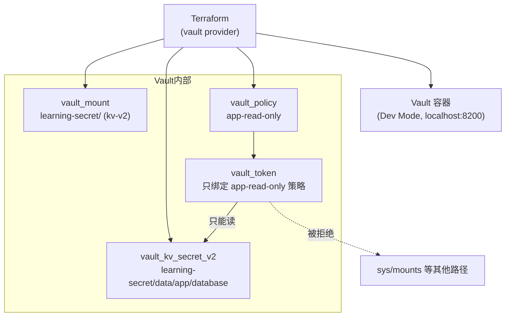

# 09 - Terraform + Vault

> Stage 9 / 12 ｜ 前置章节：[02-docker](../02-docker/README.md) ｜
> 概念参考：[docs/09-vault-basics.md](../docs/09-vault-basics.md)

## 一、本章目标

本地跑一个 HashiCorp Vault（Dev 模式），用 Terraform Vault Provider
管理 Secret Engine、Policy、Secret 本身，并签发一个权限受限的 Token
模拟"应用程序拿到的凭证"。**核心目标不是"学会用 Vault"，
而是亲手验证一个容易被忽视的结论：即使用了 Vault，如果密码是通过
Terraform 资源写入的，它依然会出现在 Terraform State 里。**

## 二、架构图



## 三、前置知识

完成第 2 章（Docker Provider）；读过
[docs/09-vault-basics.md](../docs/09-vault-basics.md)。

## 四、核心概念

见 [main.tf](main.tf) 内联注释，这里强调三个本章特有的真实坑
（均为本项目实测踩过、而不是凭空列举）：

1. **Vault Dev 模式已经自带一个 `secret/` 挂载**：如果本章的
   `vault_mount` 也用 `"secret"` 作为路径会直接冲突报错，
   所以这里改用 `"learning-secret"`。
2. **Windows + Docker Desktop 上 `localhost` 有时解析成 IPv6 `::1`
   导致连接被拒绝**：本章 Provider 地址统一写 `127.0.0.1`，
   详见 [docs/05-debugging-guide.md](../docs/05-debugging-guide.md) 第 12 条。
3. **Docker capability 名称必须带 `CAP_` 前缀**：写 `"IPC_LOCK"`
   而不是 `"CAP_IPC_LOCK"` 会导致每次 `plan` 都显示要销毁重建容器
   （一种"永久性 drift"），因为 Docker 内部会把它规范化成带前缀的形式。

## 五、文件结构

```text
09-vault/
├── README.md
├── versions.tf     <- docker + vault + time provider
├── variables.tf
├── main.tf          <- Vault 容器 + mount/policy/secret/token
└── outputs.tf
```

## 六、Terraform 代码讲解

见 [main.tf](main.tf)。特别关注 `null_resource.wait_for_vault` 的
`triggers` 字段——它确保当 `docker_container.vault` 因为任何原因被
替换（比如镜像更新）时，所有依赖它的 Vault 配置资源也会重新创建，
避免"容器是全新的、但 Terraform 以为里面的 mount/secret 还在"这种
状态不一致（这是本项目实测踩过的另一个坑，详见文件内注释）。

## 七、执行步骤

```bash
cd 09-vault
terraform init
terraform fmt
terraform validate
terraform plan
terraform apply
```

## 八、验证方法

```bash
# 用受限 Token 读取它被授权的 Secret（应该成功）
curl -s -H "X-Vault-Token: $(terraform output -raw app_token)" \
  http://127.0.0.1:8200/v1/learning-secret/data/app/database

# 用同一个 Token 尝试访问它没被授权的路径（应该 permission denied）
curl -s -H "X-Vault-Token: $(terraform output -raw app_token)" \
  http://127.0.0.1:8200/v1/sys/mounts
```

## 九、Terraform State 变化 —— 本章最重要的一步

```bash
terraform state list
```

然后亲手验证"Vault 帮你集中管理密码"这件事，**并不能阻止密码
出现在 Terraform State 里**：

```powershell
Select-String -Path terraform.tfstate -Pattern "demo-password"
```

你会看到至少两处命中：一次是 `var.db_password` 这个输入变量本身，
一次是 `vault_kv_secret_v2.db_credentials` 资源的 `data_json` 字段——
**只要密码是通过 Terraform 资源写入 Vault 的，它就会被记录在 State 里，
不管你用没用 Vault、不管变量有没有标记 `sensitive = true`**。

这不是 Vault 的缺陷，而是提醒我们：Terraform 更适合用来管理
"Secret Engine 和 Policy 这类结构"，而不是"真实密码本身"。
真实项目里更推荐的做法见 [main.tf](main.tf) 里
`vault_kv_secret_v2` 资源上方的详细注释。

## 十、Destroy

```bash
terraform destroy
```

Vault 是 Dev 模式（内存存储），容器销毁后所有数据自动清空，
不需要额外清理任何持久化数据。

## 十一、常见错误

| 现象 | 原因 | 解决方法 |
|---|---|---|
| `path is already in use at secret/` | 使用了和 Vault Dev 模式自带挂载同名的路径 | 使用 `"secret"` 以外的路径名（本章用 `"learning-secret"`） |
| `dial tcp [::1]:8200: connectex: ...` | Windows 上 `localhost` 解析成 IPv6 导致连接被拒绝 | Provider 地址改用 `127.0.0.1`（本章已采用） |
| `terraform plan` 每次都显示要重建 `docker_container.vault` | `capabilities.add` 里的 capability 名称没有带 `CAP_` 前缀，和 Docker 规范化后的真实值对不上 | 改成 `"CAP_IPC_LOCK"`（本章已采用） |
| `failed to lookup token` / `EOF` | 某个 `vault_*` 资源没有显式 `depends_on` 健康检查资源，在容器还没就绪时就抢先发起了请求 | 确认所有直接调用 Vault API 的资源都正确设置了 `depends_on`（或通过参数引用间接依赖） |

## 十二、思考题

1. 为什么 `vault_kv_secret_v2` 资源没有像 `variable` 那样的
   `sensitive` 参数可以"保护"它的值不出现在 State 里？
2. 如果把 Secret 的写入从 Terraform 资源改成"apply 完成后，
   用一个 CI/CD 步骤手工调用 Vault API 写入"，State 里还会有
   密码明文吗？这样做失去了什么（提示：想想"这个 Secret 现在
   是什么值"这件事，Terraform 还能不能通过 `plan` 感知到）？

## 十三、动手练习

1. 修改 `db_password` 变量的值，重新 `apply`，用
   `vault kv get`（或本章的 curl 方式）确认 Vault 里的值确实更新了，
   同时确认 State 里的值也同步更新了。
2. 尝试用 root token 访问 `sys/mounts`（对比受限 Token 被拒绝），
   验证 root token 权限不受任何 Policy 限制。

## 十四、进阶挑战

1. 把 `vault_kv_secret_v2` 资源整个删掉，改成 README 里建议的
   "只用 Terraform 管理结构，密码由外部写入"模式：手工用
   `curl -H "X-Vault-Token: root-token-demo" -X POST ... /v1/learning-secret/data/app/database`
   写入密码，验证 Terraform 配置里完全不再包含这个密码字符串。
2. 结合 [08-monitoring](../08-monitoring/README.md)，把
   `grafana_admin_password` 也改造成从这里的 Vault 读取
   （需要额外的应用层逻辑去读取 Vault，Terraform 本身不负责这一步）。
