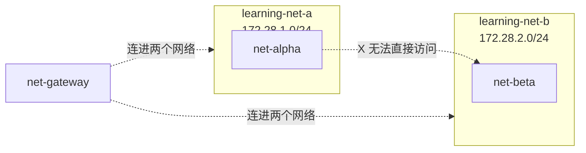

# 10-01 - Docker 网络隔离实验

## 本章目标

用两个显式指定 CIDR 的独立 Docker 网络，亲手验证"网络隔离"的边界
到底在哪里：不同网络之间默认互不相通，即使有一个第三方容器同时
加入两个网络，那两个网络本身依然不互通。

## 架构图



## 执行步骤

```bash
cd 10-networking/01-docker-network-isolation
terraform init
terraform apply
```

## 验证方法

```bash
docker network inspect learning-net-a --format '{{(index .IPAM.Config 0).Subnet}} gw={{(index .IPAM.Config 0).Gateway}}'

BETA_IP=$(docker inspect net-beta --format '{{range .NetworkSettings.Networks}}{{.IPAddress}}{{end}}')

# 预期失败：alpha 和 beta 不在同一个网络
docker exec net-alpha ping -c1 -W2 $BETA_IP

# 预期成功：gateway 同时在两个网络里
docker exec net-gateway ping -c1 -W2 net-alpha
docker exec net-gateway ping -c1 -W2 net-beta
```

## Destroy

```bash
terraform destroy
```

## 思考题

1. 为什么 `gateway` 容器能连到 `alpha` 和 `beta`，但 `alpha` 依然连不到 `beta`？
   这和现实世界里"一台电脑插了两张网卡，分别接入两个不同的局域网"
   是不是同一个道理？
2. 如果要让 `alpha` 能访问 `beta`，除了把它们放进同一个网络，
   还有其他办法吗（提示：想想真实网络里"路由"和"转发"的概念，
   `gateway` 容器要具备什么额外能力才能真正转发流量）？

## 动手练习

给 `alpha` 也加入 `net_b`（用第二个 `networks_advanced` block），
重新 apply，验证它现在能不能直接 ping 通 `beta`。
