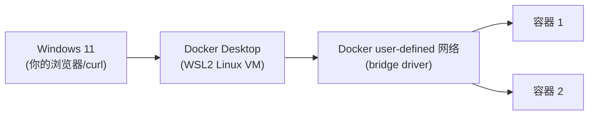
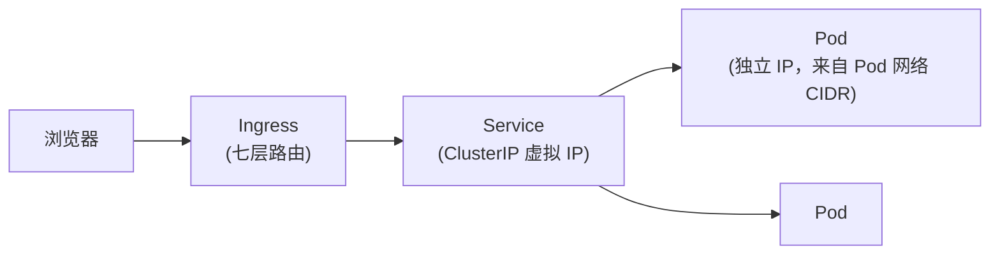

# 10 - Networking 专题

> 建议在完成 [04-kind](../04-kind/README.md) 之后阅读 ｜
> 前置章节：[02-docker](../02-docker/README.md)、[05-kubernetes/03-service](../05-kubernetes/03-service/README.md)

## 本章目标

把散落在前面章节里的网络相关知识点串成一张完整的地图：
IP / Subnet / CIDR / Gateway / DNS / Port / NAT / Bridge Network /
Kubernetes Service Network / Pod Network / Ingress。

## 基础概念速记

| 术语 | 解释 |
|---|---|
| IP 地址 | 网络中一台设备（这里是容器/Pod）的数字身份 |
| Subnet（子网） | 一段连续的 IP 地址范围，用 CIDR 表示法描述 |
| CIDR | 例如 `172.28.1.0/24`——`/24` 表示前 24 位是网络位，剩下 8 位（256 个地址）可分配给设备 |
| Gateway（网关） | 子网内设备访问子网外部网络时的"出口"地址 |
| Port（端口） | 同一个 IP 上区分不同服务的数字编号 |
| NAT（网络地址转换） | 把内部私有 IP 转换成外部可路由 IP 的机制，Docker 的端口映射本质就是一种 NAT |
| DNS | 把便于记忆的名字翻译成 IP 地址的系统 |

## 一、Windows 到容器的网络路径

对应 [02-docker](../02-docker/README.md) 里 `docker_network.app_network`
的角色——容器发布端口（`ports { internal = 80, external = 8080 }`）
本质上就是在 Docker Desktop 的 Linux VM 上做了一次 NAT/端口转发。

## 二、Docker 网络隔离实验

见 [01-docker-network-isolation](01-docker-network-isolation/README.md)：
用两个显式指定 CIDR 的独立网络，证明"不同网络之间默认互不相通，
即使有一个第三方容器同时加入两个网络，那两个网络本身依然不互通"。

## 三、浏览器到 Kubernetes Pod 的网络路径

- **Pod 网络**：每个 Pod 都有自己独立的 IP（不同于 Docker 默认那种
  "容器共享宿主机端口"的模式），这些 IP 来自集群规划的一段 CIDR
  （Kind 集群默认是 `10.244.0.0/16`，可以用
  `kubectl cluster-info dump | Select-String cluster-cidr` 查看）；
- **Service 网络**：Service 的虚拟 IP 来自另一段独立的 CIDR
  （ClusterIP range，Kind 默认 `10.96.0.0/12`），和 Pod 网络是两个
  完全不同的地址空间；
- 完整的 Service 类型对比见
  [05-kubernetes/03-service](../05-kubernetes/03-service/README.md)。

## 四、CoreDNS：Kubernetes 为什么严重依赖 DNS

见 [02-coredns](02-coredns/README.md)。Kubernetes 里几乎所有服务发现
都建立在 DNS 之上——Pod 里 `/etc/resolv.conf` 默认指向集群内部的
CoreDNS Service（`10.96.0.10`，也就是 `kube-dns` Service 的虚拟 IP），
任何 `<service>.<namespace>.svc.cluster.local` 格式的名字都会被解析：

- 普通 ClusterIP/Headless Service → **A 记录**（或多条 A 记录）；
- ExternalName Service → **CNAME 记录**，指向配置的外部域名；
- 如果 CoreDNS 本身故障，集群里几乎所有"服务之间互相寻找"的机制
  都会失效——这也是为什么 CoreDNS 本身通常以 Deployment
  （而不是单个 Pod）运行、并配有多个副本，保证高可用。

## 五、动手练习

1. 完成 [01-docker-network-isolation](01-docker-network-isolation/README.md)
   和 [02-coredns](02-coredns/README.md) 两个子实验。
2. 用 `kubectl exec` 进任意 Pod，查看 `/etc/resolv.conf`，
   确认 `nameserver` 指向的正是 CoreDNS 的 Service IP。
3. 对照本章的 CIDR 讲解，用 `docker network inspect` 和
   `kubectl cluster-info dump` 分别找出 Docker 网络和 Kubernetes
   Pod/Service 网络当前实际使用的 CIDR 段。

## 六、进阶挑战

结合 [05-kubernetes/12-networkpolicy](../05-kubernetes/12-networkpolicy/README.md)，
思考 NetworkPolicy 是在哪一层网络（Pod 网络还是 Service 网络）
生效的，这对设计"哪些流量应该被限制"有什么影响。
