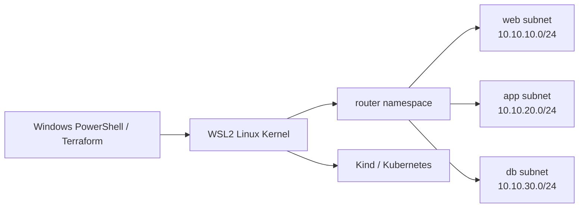

# 10 - Networking 专题：Local Network Engineering Lab

> 建议完成 02-docker 与 04-kind 后进入本专题。这里的重点从“云 API 模拟”转向真实 Linux 数据面。

## 本章目标

把 IP / CIDR / Gateway / Route / DNS / NAT / Firewall / Load Balancer / VPN / Dynamic Routing / Kubernetes Networking 串成完整路径。

核心原则：

> 能用 `ip route`、`nft`、`tcpdump` 观察到真实数据包的实验，优先于只返回模拟 API 的实验。

## 实验目录

| Lab | 内容 | 关键技术 |
|---|---|---|
| 01 | Docker Network Isolation | bridge、CIDR、网络隔离 |
| 02 | CoreDNS | DNS、Service Discovery |
| 03 | Linux Routing | network namespace、veth、route、ip_forward |
| 04 | Firewall / NAT | nftables、stateful filtering、SNAT 思维 |
| 05 | Load Balancer | L4/L7、HAProxy/nginx、health check |
| 06 | VPN / Tunnel | WireGuard、peer、AllowedIPs、route |
| 07 | Containerlab + FRRouting | OSPF、BGP、动态路由、收敛 |
| 08 | Troubleshooting | ping、trace、dig、ss、tcpdump、nft trace |

## 从 Windows 到真实数据包



## 云概念映射

| 本地实验 | 云上对应心智模型 |
|---|---|
| CIDR + namespace | VPC/VNet 内地址空间 |
| veth / virtual NIC | ENI / NIC |
| `ip route` | Route Table |
| router namespace | 虚拟路由器 / Transit routing |
| nftables | Security Group / NACL 的底层类比 |
| masquerade/SNAT | NAT Gateway |
| CoreDNS | Private DNS / Service Discovery |
| HAProxy/nginx | ALB/NLB |
| WireGuard | Site-to-Site VPN |
| FRR OSPF/BGP | 动态路由 / BGP-based connectivity |
| Kubernetes NetworkPolicy | Pod-level traffic policy |

这些是“概念映射”，不是 1:1 产品等价；真实云服务还包含控制面、HA、托管运维和厂商特定语义。

## 推荐顺序

```text
01 Docker isolation
  -> 02 DNS
  -> 03 real Linux routing
  -> 04 firewall/NAT
  -> 05 load balancing
  -> 06 VPN
  -> 08 troubleshooting
  -> 07 Containerlab/FRR (advanced)
  -> Kubernetes NetworkPolicy/CNI
```

## 最重要的排障链

遇到“访问不了”时按层检查：

```text
Link -> IP/CIDR -> Route -> Neighbor -> Firewall/NAT
     -> DNS -> TCP/UDP -> TLS/HTTP -> Application
```

不要从应用层开始随机修改配置。网络实验的真正目标，是形成可重复的定位方法。

## 关于 LocalStack

`07-localstack/` 保留为**可选的 AWS API 模拟专题**。它适合学习 Terraform AWS Provider 与部分 AWS API 交互，但不再承担本项目网络主线或毕业实验的基础设施角色。
