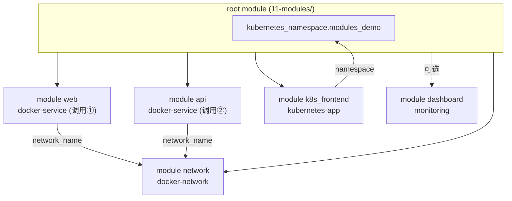

# 11 - Terraform Module 设计与复用

> Stage 10 / 12 ｜ 前置章节：[02-docker](../02-docker/README.md)、[03-minikube](../03-minikube/README.md) ｜
> 概念参考：[docs/04-terraform-modules.md](../docs/04-terraform-modules.md)

## 一、本章目标

把前面章节手写的资源重构成可复用的 module：`docker-network`、
`docker-service`、`kubernetes-app`、`monitoring`。走完本章你应该能：

- 理解 root module 和 child module 的关系；
- 亲手验证"同一个 module 被调用两次，产生两个完全独立的资源实例"；
- 理解 module 之间如何通过 output/input 组合（Composition）；
- 掌握一个容易被忽视的坑：**child module 必须自己声明
  `required_providers`**，即使它不配置 provider 本身。

## 二、架构图



## 三、前置知识

完成第 2、3 章；读过 [docs/04-terraform-modules.md](../docs/04-terraform-modules.md)。

## 四、核心概念

- **Module 边界怎么划**：`kubernetes-app` module 故意不创建
  Namespace（由 root module 负责），因为 Namespace 的生命周期通常
  比单个应用更"上层"——这是一个具体的"module 应该管什么、
  不应该管什么"的设计示范，详见
  [modules/kubernetes-app/main.tf](modules/kubernetes-app/main.tf) 注释。
- **同一个 module 多次调用**：`module "web"` 和 `module "api"`
  用的是同一份 `modules/docker-service` 代码，但产出两个完全独立的
  容器，State 地址分别是 `module.web.docker_container.this` 和
  `module.api.docker_container.this`——这就是"复用"的具体体现。
- **child module 的 provider 声明陷阱**：见
  [modules/docker-network/versions.tf](modules/docker-network/versions.tf)
  的详细注释——这是本项目实测踩过的坑，`terraform init` 一开始
  报 `Failed to query available provider packages`，原因是
  child module 没有声明它用到的 `docker`/`grafana` Provider 分别
  来自 `kreuzwerker/docker`/`grafana/grafana`，Terraform 默认假设
  所有 Provider 都在 `hashicorp/` 命名空间下，猜错了来源。

## 五、文件结构

```text
11-modules/
├── README.md
├── versions.tf
├── variables.tf
├── main.tf                       <- 组合调用四个 module
├── outputs.tf
└── modules/
    ├── docker-network/
    ├── docker-service/
    ├── kubernetes-app/
    └── monitoring/
```

## 六、Terraform 代码讲解

见各 `modules/*/main.tf` 内联注释；[main.tf](main.tf) 里
`module "api"` 特意不设置 `port_mappings`（默认空列表），
演示同一个 module 通过"不同的输入组合"表达出"对外暴露端口"和
"仅内部可见"两种完全不同的部署形态，而不需要修改 module 代码本身。

## 七、执行步骤

```bash
cd 11-modules
terraform init
terraform fmt
terraform validate
terraform plan
terraform apply
```

## 八、验证方法

```bash
curl http://localhost:8090                      # web module 实例（对外发布了端口）
docker exec modules-demo-web wget -qO- http://modules-demo-api:5678  # api module 实例（仅网络内部可见，用 Docker DNS 访问）
kubectl get deploy,svc -n learning-11-modules    # kubernetes-app module 实例
```

## 九、Terraform State 变化

```bash
terraform state list
```

会看到形如 `module.web.docker_container.this`、
`module.api.docker_container.this` 的地址——**module 名字本身
成为了资源地址的一部分**，这也是为什么同一份 module 代码调用
多次不会冲突：只要调用时用的本地名称（`web`/`api`）不同，
它们在 State 里就是完全独立的两条记录。

## 十、Destroy

```bash
terraform destroy
```

## 十一、常见错误

| 现象 | 原因 | 解决方法 |
|---|---|---|
| `terraform init` 报 `Failed to query available provider packages` | child module 缺少 `required_providers` 声明 | 在每个用到非 `hashicorp/` 命名空间 Provider 的 module 目录里都加上对应声明（本章已修复，见各 `versions.tf`） |
| `module.dashboard` 相关的 grafana 报错 | `enable_monitoring_module = true` 但没有先完成 06-helm/08-monitoring，或忘记启动 port-forward | 确认前置章节已完成且 `kubectl port-forward -n monitoring svc/kube-prometheus-stack-grafana 3000:80` 正在运行，或者干脆保持默认的 `false` |
| 修改某个 module 内部代码后，另一个调用它的 module 实例"意外"也发生了变化 | 这是预期行为——同一份 module 源码被多处调用，修改源码会同时影响所有调用点 | 如果只想让某一个调用点变化，应该通过传入不同的 **变量** 实现，而不是修改 module 源码本身 |

## 十二、思考题

1. 为什么 `docker-network` module 的 `main.tf` 里完全没有出现
   `provider "docker" {}` 配置块，但资源却能正常创建？
2. 如果把 `kubernetes-app` module 改成自己创建 Namespace（而不是
   由调用方传入），会带来什么问题（提示：如果 `module "k8s_frontend"`
   和以后可能新增的 `module "k8s_backend"` 都各自创建"同名"
   Namespace 会发生什么）？

## 十三、动手练习

1. 再调用一次 `docker-service` module，命名为 `cache`，镜像用
   `redis:7-alpine`，不设置 `port_mappings`，加入同一个 `network`。
2. 把 `enable_monitoring_module` 设为 `true`（前提是已按提示启动
   port-forward），验证 `monitoring` module 创建的 Dashboard。

## 十四、进阶挑战

1. 给 `docker-service` module 增加一个 `variable "replica_count"`，
   用 `for_each` 或 `count` 支持"一次调用创建多个同配置副本"
   （提示：需要同步修改 `docker_container` 资源本身的寻址方式，
   并相应调整 `outputs.tf` 让它能返回一个列表/map）。
2. 把这四个 module 提炼出一份"module 设计规范"文档（哪些必须有
   `versions.tf`、变量命名风格、output 应该暴露到什么颗粒度），
   应用到你自己以后新写的 module 上。
