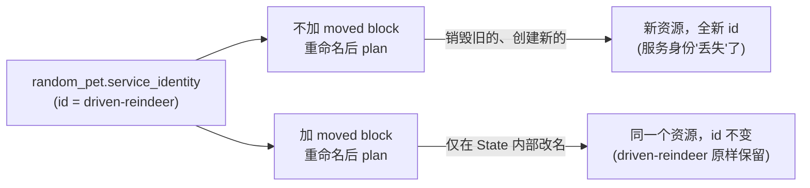

# 12-02 - `moved` Block：重构时避免销毁重建

## 本章目标

亲手对比"重命名一个资源"这件事，在有没有 `moved` block 的情况下，
`terraform plan` 给出的计划有什么天壤之别。

## 架构图



## 执行步骤（完整重现本项目的实测过程）

```bash
cd 12-state-management/02-moved-block
terraform init

# 步骤 1：模拟"重构之前"——先用旧名字创建资源
cat > main.tf << 'EOF'
resource "random_pet" "service_identity" {
  length = 2
}
EOF
terraform apply -auto-approve
# 记下这里生成的 id（比如 "driven-reindeer"）

# 步骤 2：模拟"重构、但忘了写 moved block"——观察坏的一面
cat > main.tf << 'EOF'
resource "random_pet" "app_identity" {
  length = 2
}
EOF
terraform plan
# 会看到 "Plan: 1 to add, 0 to change, 1 to destroy"——
# Terraform 认为这是"删掉一个、新建一个完全不同的资源"

# 步骤 3：补上 moved block —— 观察好的一面
cat > main.tf << 'EOF'
resource "random_pet" "app_identity" {
  length = 2
}

moved {
  from = random_pet.service_identity
  to   = random_pet.app_identity
}
EOF
terraform plan
# 会看到 "random_pet.service_identity has moved to random_pet.app_identity"
# 以及 "Plan: 0 to add, 0 to change, 0 to destroy"

terraform apply -auto-approve
terraform state list
# 只有 random_pet.app_identity，且 id 和步骤 1 记下的完全一样
```

## 核心概念

`moved` block 的效果等价于手动执行一次
`terraform state mv random_pet.service_identity random_pet.app_identity`，
但好处是**它写在代码里、可以提交到 Git、team 里所有人下次
apply 时都会自动生效**，而 `state mv` 是一次性的本地命令，
不会留下任何记录——如果同事没跑过这条命令，他们的下一次
`apply` 依然会尝试销毁重建。

## Destroy

```bash
terraform destroy
```

## 常见错误

| 现象 | 原因 | 解决方法 |
|---|---|---|
| 加了 `moved` block，`plan` 依然显示要销毁重建 | `from`/`to` 里的资源地址写错（拼写、大小写、`for_each`/`count` 的 key/index 不对） | 用 `terraform state list` 核对 State 里资源的真实地址 |
| `moved` block 指向的 `from` 地址在 State 里根本不存在 | 这种情况下 `moved` block 会被静默忽略（不会报错），容易让人误以为生效了 | 在真正加 `moved` block 之前，先用 `terraform state list` 确认旧地址确实存在 |

## 思考题

1. `moved` block 会不会影响 `terraform destroy`？如果目标资源已经
   被移动过，`destroy` 时应该以 `from` 还是 `to` 的名字为准？
2. 如果一个资源经历了两次重命名（A → B → C），`moved` block
   应该怎么写？是写 `A → C` 一条，还是 `A → B` 和 `B → C` 两条？

## 动手练习

把这个资源"移动"进一个 module 里（比如 `module.identity.random_pet.app_identity`），
体会 `moved` block 同样能处理"资源从 root module 移进 child module"
这种更复杂的重构场景。

## 进阶挑战

结合 [11-modules](../../11-modules/README.md)，对 11 章某个 module
调用做一次真实重命名（比如把 `module.web` 改名成
`module.frontend`），实践一次带 `moved` block 的安全重构。
