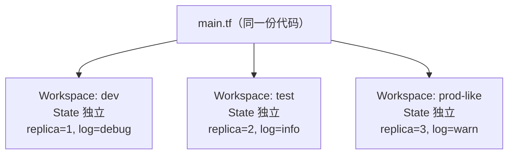

# 12-03 - Workspace：轻量级多环境隔离

## 本章目标

用同一份 `.tf` 代码，通过 `terraform.workspace` 内置引用查表，
让 `dev`/`test`/`prod-like` 三个 Workspace 自动表现出不同的
"规格"（副本数、日志级别），并理解每个 Workspace 拥有独立 State
意味着什么。

## 架构图



## 核心概念

见 [main.tf](main.tf) 里 `local.env_configs` 查表 + `lookup()` 兜底值
的写法。这是"用 Workspace 驱动多环境差异化配置"的标准手法——
比逐个 Workspace 单独维护一份 tfvars 更集中、更容易一眼看出
"各环境之间到底差在哪"。

**每个 Workspace 拥有独立 State**：即使 `.tf` 代码完全相同，
`terraform workspace select dev` 和
`terraform workspace select test` 下执行 `terraform state list`
看到的是两份完全独立的资源记录——这是 Workspace 实现隔离的机制。

## 执行步骤

```bash
cd 12-state-management/03-workspace
terraform init

terraform workspace new dev
terraform apply -auto-approve

terraform workspace new test
terraform apply -auto-approve

terraform workspace new prod-like
terraform apply -auto-approve

terraform workspace list
```

## 验证方法

```bash
cat generated/dev-summary.txt
cat generated/test-summary.txt
cat generated/prod-like-summary.txt
# 三个文件里的 replica_count / log_level 应该各不相同

terraform workspace select dev
terraform state list    # 只看到 dev 这个 Workspace 自己的资源
```

## Destroy

依次切到每个 Workspace 分别 destroy，最后删除 Workspace 本身：

```bash
terraform workspace select dev
terraform destroy -auto-approve
terraform workspace select test
terraform destroy -auto-approve
terraform workspace select prod-like
terraform destroy -auto-approve

terraform workspace select default
terraform workspace delete dev
terraform workspace delete test
terraform workspace delete prod-like
```

## 常见错误

| 现象 | 原因 | 解决方法 |
|---|---|---|
| `Workspace "xxx" does not exist` | Workspace 名字打错，或者忘记先 `new` 就直接 `select` | `terraform workspace list` 核对名字 |
| `terraform workspace delete` 报错 Workspace 不为空 | 该 Workspace 下还有资源没有 destroy | 先切到该 Workspace `destroy` 干净，再删除 |
| 意外在错误的 Workspace 上 apply 了不该有的变更 | 忘记确认当前所在 Workspace | 每次 apply 前先跑 `terraform workspace show` 养成习惯 |

## 思考题

1. 如果给 `env_configs` 加一个 `"qa"` 环境的条目，但从来没有创建
   过叫 `"qa"` 的 Workspace，会发生什么？
2. 什么样的差异适合用 Workspace 表达（本章的副本数/日志级别），
   什么样的差异不适合（提示：回顾
   [docs/03-terraform-state.md](../../docs/03-terraform-state.md)
   第 6 节"Workspace 不适合什么场景"）？

## 动手练习

新增一个 `"staging"` 环境配置，创建对应 Workspace 并验证。

## 进阶挑战

把本章的"环境配置表"模式应用到
[02-docker](../../02-docker/README.md) 章节——让同一份 Docker
Compose 风格的配置，在不同 Workspace 下拉起不同数量的 `webapp`
副本（提示：需要把 `docker_container.webapp` 改造成用 `count`
或 `for_each` 驱动的形式）。
