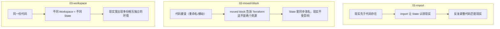

# 12 - Terraform State 管理进阶

> Stage 11 / 12 ｜ 前置章节：[01-terraform-basics](../01-terraform-basics/README.md) ｜
> 概念参考：[docs/03-terraform-state.md](../docs/03-terraform-state.md)

## 本章目标

State 是 Terraform 里最容易被低估、却在真实项目里迟早会碰到的一层。
本章通过三个独立的动手实验，覆盖 State 管理最重要的三种场景：

| 子实验 | 场景 |
|---|---|
| [01-import](01-import/README.md) | "这个资源已经存在，我想让 Terraform 接管它，但不能重建" |
| [02-moved-block](02-moved-block/README.md) | "我想重构代码（改名字/挪位置），但不想销毁重建真实资源" |
| [03-workspace](03-workspace/README.md) | "我想用同一份代码，跑出多个相互隔离的环境" |

## 三个实验的共同主线

它们表面上互不相关，但都在回答同一个问题：
**"当代码和现实之间出现偏差/需要调整时，Terraform 怎么在不引入
不必要的销毁重建的前提下，把两者重新对齐？"**

## 学习建议

三个子实验相互独立，可以按任意顺序完成，但建议先做
[01-import](01-import/README.md)——它最直观地展示了"State 到底
在记录什么"，为理解后面两个实验打基础。

## 常见错误速查

见每个子实验各自的"常见错误"小节；跨实验的共性提醒：
**任何直接操作 State 的命令（`import`/`state mv`/`state rm`）
执行前，建议先 `terraform state list` 或 `terraform show` 确认
当前状态，避免在错误的资源/错误的 Workspace 上操作。**
