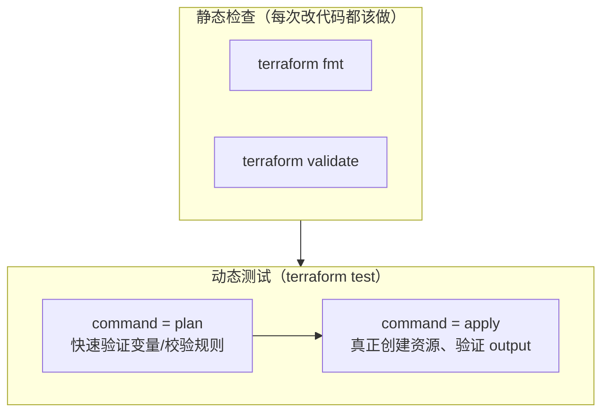

# 13 - Terraform Testing

> 建议在完成 [11-modules](../11-modules/README.md) 之后阅读 ｜
> 前置章节：[01-terraform-basics](../01-terraform-basics/README.md)

## 一、本章目标

理解"为什么 IaC 也需要测试"，并用 Terraform 原生的
`terraform test` 框架，为一份简单配置编写四个真实通过的测试用例，
覆盖 `validation`、`postcondition`、`check` 三种断言机制的实际用法。

## 二、架构图



## 三、为什么 IaC 也需要测试

Terraform 配置本质上也是代码，会随着时间被反复修改——加一个变量、
调整一个默认值、重构一个 module。没有测试的情况下，这些修改的
"副作用"往往要等到真正 `apply` 到生产环境才会暴露。
`terraform test` 让你能在提交代码之前，用可重复执行的方式验证：

- 变量的 `validation` 规则是否真的能拦截非法输入；
- 资源创建后的实际结果（`postcondition`）是否符合预期；
- 关键 output 的值是否正确。

## 四、核心概念

- **`terraform fmt` / `validate` / `plan`**：本项目从第 1 章开始
  每章都在用的静态检查三件套，回顾
  [docs/terraform-cheatsheet.md](../docs/terraform-cheatsheet.md)。
- **`precondition` / `postcondition`**（写在资源的 `lifecycle` 块里）：
  `precondition` 在资源创建/更新**之前**检查前提条件是否满足；
  `postcondition` 在**之后**检查 Provider 返回的实际结果，
  见 [main.tf](main.tf) 里 `random_pet.servers` 的例子。
- **`check` block**（写在顶层，不属于任何具体资源）：独立的、
  每次 `plan`/`apply` 都会重新求值的断言，适合表达"整个配置层面
  的健康检查"，见 [outputs.tf](outputs.tf)。
- **`terraform test`**：读取 `tests/*.tftest.hcl` 文件，每个
  `run` block 可以是 `plan`（只验证不创建，快）或 `apply`
  （真正创建资源，测试结束自动销毁，慢但更真实），配合 `assert`
  验证结果，配合 `expect_failures` 验证"某个变量的校验规则
  确实会拒绝非法输入"。

## 五、文件结构

```text
13-testing/
├── README.md
├── versions.tf
├── variables.tf          <- 两个变量，各带一条 validation 规则
├── main.tf                <- random_pet 资源 + postcondition
├── outputs.tf             <- 两个 output + 一个 check block
└── tests/
    └── basic.tftest.hcl   <- 4 个测试用例
```

## 六、Terraform 代码讲解

见 [tests/basic.tftest.hcl](tests/basic.tftest.hcl) 内联注释，
四个测试用例分别验证：变量正确传递、非法 `replica_count` 被拒绝、
非法 `name_prefix` 被拒绝、`apply` 后 output 符合预期。

## 七、执行步骤

```bash
cd 13-testing
terraform init
terraform fmt
terraform validate
terraform test
```

## 八、验证方法

```text
预期输出：
tests\basic.tftest.hcl... in progress
  run "valid_replica_count_passes_plan"... pass
  run "replica_count_out_of_range_is_rejected"... pass
  run "empty_name_prefix_is_rejected"... pass
  run "apply_creates_expected_server_count"... pass
tests\basic.tftest.hcl... tearing down
tests\basic.tftest.hcl... pass

Success! 4 passed, 0 failed.
```

## 九、Terraform State 变化

`command = apply` 的 run block 会创建真实的 State（在
`terraform test` 自己管理的临时工作目录里），测试结束后自动
`destroy` 并清理——你不需要、也不应该在测试跑完后看到任何残留资源。

## 十、Destroy

```bash
terraform destroy
```

（如果你手动跑过 `terraform apply` 而不是只用 `terraform test`，
记得清理；`terraform test` 本身不需要额外的 destroy 步骤。）

## 十一、常见错误

| 现象 | 原因 | 解决方法 |
|---|---|---|
| `Error: Missing resource instance key` | `postcondition` 里用 `self` 引用某个属性时，资源用了 `count`/`for_each` 但引用方式不对 | `self` 在 `count`/`for_each` 资源里代表"当前正在处理的这一个实例"，不需要额外加索引 |
| `expect_failures` 声明的测试反而失败了 | 变量的 `validation` 规则本身没有正确拦截该输入 | 检查 `variables.tf` 里对应的 `condition` 表达式 |
| `terraform test` 报告 "no test files found" | 测试文件没放在 `tests/` 目录，或后缀不是 `.tftest.hcl` | 确认文件路径和后缀 |

## 十二、思考题

1. `validation` block（写在 variable 上）和 `precondition`
   （写在 resource 的 lifecycle 上）都能"提前拦截错误"，
   两者的检查时机和适用场景有什么区别？
2. 为什么 `expect_failures` 类型的测试应该用 `command = plan`
   而不是 `command = apply`？

## 十三、动手练习

1. 给 [main.tf](main.tf) 的 `random_pet.servers` 加一个
   `precondition`，要求 `var.replica_count` 是偶数，
   并在 `tests/basic.tftest.hcl` 里新增一个验证它生效的测试用例。
2. 故意把某个测试的 `assert.condition` 改错，运行
   `terraform test`，观察失败时的报错信息长什么样。

## 十四、进阶挑战

把 [11-modules](../11-modules/README.md) 里的 `docker-service`
module 也配上一套 `tests/*.tftest.hcl`，用 `run` block 的
`module` 参数指向该 module 目录进行测试（而不是像本章一样测试
root module 自身）。
