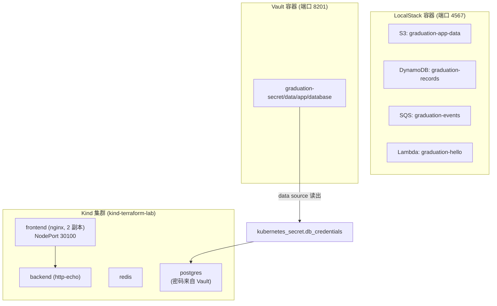

# 14 - 毕业实验：Full Local Cloud

> Stage 12 / 12（毕业实验）｜ 前置章节：全部前面 11 个 Stage，
> 尤其是 [03/04](../03-minikube/README.md)（Kubernetes）、
> [07-localstack](../07-localstack/README.md)、[09-vault](../09-vault/README.md)

## 一、本章目标

用**一份 Terraform 配置**，同时编排四个此前分别学习过的领域：

- Kubernetes（Kind 集群）：frontend / backend / redis / postgres
- LocalStack（本地 AWS）：S3 / DynamoDB / SQS / Lambda
- Vault：集中管理数据库密码
- （可选）Monitoring：见"进阶挑战"，引导你自己把 06-helm/08-monitoring 接进来

真正的教学重点不是"这四样东西分别怎么用"（前面章节已经讲过），
而是**它们如何被同一次 `terraform apply`/`destroy` 统一管理，
以及 Vault 的密码如何通过 Terraform 桥接进 Kubernetes Secret**。

## 二、架构图



## 三、前置知识

完成第 3/4 章（需要 `kind-terraform-lab` 集群已存在）、
第 7 章（理解 LocalStack 工作原理）、第 9 章（理解 Vault 工作原理）。

## 四、核心概念

**跨领域编排的价值不在于"技术上必须这样做"，而在于"这样做之后，
一次 `apply` 能看到完整的依赖关系、一次 `destroy` 能干净地
全部清理"**——这是 IaC 相比"分别用不同工具、不同脚本管理不同
部分"最大的优势。本章 [vault.tf](vault.tf) 里
`data "vault_kv_secret_v2" "db_credentials"` 读取 Vault 密码、
再喂给 [k8s-app.tf](k8s-app.tf) 里的 `kubernetes_secret`，
就是这种"统一编排"的具体体现：Terraform 在这里承担了
"把 Vault 和 Kubernetes 这两个原本互不认识的系统连起来"的角色。

## 五、文件结构

```text
14-full-local-cloud/
├── README.md
├── versions.tf       <- kubernetes + docker + aws + vault + time + archive
├── variables.tf
├── vault.tf            <- Vault 容器 + mount/secret + data source 读取
├── localstack.tf       <- LocalStack 容器 + S3/DynamoDB/SQS/Lambda
├── k8s-app.tf           <- frontend/backend/redis/postgres
├── outputs.tf
└── lambda/
    └── handler.py
```

## 六、Terraform 代码讲解

见各 `.tf` 文件内联注释。重点回顾三个此前章节里实测踩过、
本章同样需要注意的坑（全部已经在代码里修复）：

1. **端口冲突**：本章 Vault 用 8201、LocalStack 用 4567，
   刻意避开 09-vault（8200）和 07-localstack（4566）的默认端口，
   让本章可以独立于那两章运行。
2. **PVC 的 WaitForFirstConsumer 死锁**（见
   [05-kubernetes/06-pvc](../05-kubernetes/06-pvc/README.md)）：
   `kubernetes_persistent_volume_claim.postgres_data` 已设置
   `wait_until_bound = false`。
3. **Docker capability 前缀**（见
   [09-vault](../09-vault/README.md)）：Vault 容器的
   `capabilities.add` 用的是 `"CAP_IPC_LOCK"`。

## 七、执行步骤

```powershell
# 前置：确认 Kind 集群存在
cd ..\04-kind
.\scripts\create-cluster.ps1
cd ..\14-full-local-cloud

terraform init
terraform fmt
terraform validate
terraform plan
terraform apply
```

首次 `apply` 预计需要 2-4 分钟（LocalStack/Vault 镜像拉取 +
健康检查等待 + Lambda 打包）。

## 八、验证方法

```bash
# Kubernetes 应用层
kubectl get pods,svc -n graduation-project
terraform output -raw frontend_port_forward_command | Invoke-Expression
curl http://localhost:8100    # 应该看到 backend 的欢迎文本（经过 frontend 反代）

# 验证 Vault -> Kubernetes Secret 的密码确实一致
kubectl get secret db-credentials -n graduation-project -o jsonpath="{.data.password}" | base64 -d
curl -s -H "X-Vault-Token: root-token-graduation" http://127.0.0.1:8201/v1/graduation-secret/data/app/database

# LocalStack 资源
aws s3 ls --endpoint-url http://127.0.0.1:4567
aws dynamodb list-tables --endpoint-url http://127.0.0.1:4567
aws lambda list-functions --endpoint-url http://127.0.0.1:4567 --query "Functions[].FunctionName"
```

## 九、Terraform State 变化

```bash
terraform state list
```

会看到 `kubernetes_*`、`docker_*`、`aws_*`、`vault_*` 四类资源
**并存在同一份 State 里**——这是本章"统一编排"最直接的证据。

## 十、Destroy

```bash
terraform destroy
```

这一条命令会依次清理 Kubernetes 应用、LocalStack 容器及其内部资源、
Vault 容器及其配置——**不会**销毁 Kind 集群本身（集群生命周期由
[04-kind](../04-kind/README.md) 的脚本独立管理）。

## 十一、常见错误

| 现象 | 原因 | 解决方法 |
|---|---|---|
| `connection refused`（kubernetes provider） | Kind 集群不存在或未运行 | 先执行 `04-kind/scripts/create-cluster.ps1` |
| 端口 8201/4567 已被占用 | 上次实验没有 destroy 干净 | `docker ps` 确认没有残留的 `vault-graduation`/`localstack-graduation` 容器 |
| postgres 容器一直 CrashLoopBackOff | 忘记加 `sub_path`，导致 PostgreSQL 在卷根目录发现意外文件拒绝启动 | 确认 [k8s-app.tf](k8s-app.tf) 里 `volume_mount.sub_path = "pgdata"` 没有被删除 |

## 十二、思考题

1. 本章把"Vault 读取"和"Kubernetes Secret 写入"放在同一次
   `terraform apply` 里完成，这意味着什么时候"密码轮换"（改了
   Vault 里的值）才会真正同步到 Kubernetes？（提示：Kubernetes
   Secret 不会自动感知 Vault 里值的变化，除非重新 apply）
2. 如果生产环境要做到"Vault 密码更新后，Pod 能自动感知"，
   通常需要引入什么额外组件（提示：搜索 Vault Agent Injector /
   Vault CSI Provider）？

## 十三、动手练习

1. 修改 `db_password` 变量，重新 `apply`，验证 Kubernetes Secret
   和 Vault 里的值同步更新（但注意：postgres 容器本身不会自动
   感知这个变化，需要重启才能用上新密码——这也是上一题思考的延伸）。
2. 用 `aws lambda invoke` 调用 `graduation-hello` 这个 Lambda，
   验证它能正常返回。

## 十四、进阶挑战

1. 把 [06-helm](../06-helm/README.md) 和 [08-monitoring](../08-monitoring/README.md)
   的内容也整合进本章——加一个 `enable_monitoring` 变量（参考
   06-helm 里 `install_ingress_nginx` 的开关写法），用
   `helm_release` + `grafana_*` 资源把 Prometheus/Grafana/Loki
   也纳入这次统一编排，实现完整的
   `Kind + LocalStack + Vault + Monitoring` 架构。
2. 给 backend 换成一个真正会连接 redis/postgres 的应用镜像
   （而不是 http-echo），让"frontend → backend → redis/postgres"
   这条链路名副其实。
3. 回顾整个课程（[docs/00-learning-roadmap.md](../docs/00-learning-roadmap.md)），
   写一份你自己的"从本地学习到真实云"迁移笔记：本章每一个组件，
   在 AWS/Azure/GCP 上分别对应什么托管服务？
