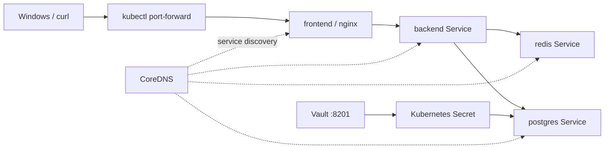

# 14 - 毕业实验：Full Local Cloud

> 主线毕业实验。LocalStack 不再是前置条件；AWS API 模拟请单独学习 [07-localstack](../07-localstack/README.md)。

## 一、本章目标

用一份 Terraform 配置统一编排：

- Kind/Kubernetes：frontend、backend、redis、postgres
- Vault：保存数据库凭据
- Kubernetes Secret：消费 Vault 中的凭据
- Kubernetes Service/DNS：完成服务发现与网络访问

毕业实验的重点从“模拟很多云产品”调整为：

> Terraform + Kubernetes + Secret + DNS + Service + Network + Troubleshooting

这些能力可以直接迁移到真实 AWS/Azure/GCP 环境。

## 二、架构



## 三、为什么移除 LocalStack

LocalStack 仍然保留在 `07-localstack/`，用于学习 AWS Provider 和部分 AWS API。

但是毕业实验不应该因为某个云模拟器的免费服务范围变化而失效。因此主线现在只依赖开源、本地可运行的 Kubernetes、Docker 与 Vault。

## 四、文件结构

```text
14-full-local-cloud/
├── README.md
├── versions.tf
├── variables.tf
├── vault.tf
├── k8s-app.tf
└── outputs.tf
```

## 五、前置条件

1. Docker Desktop 正常运行。
2. `kind-terraform-lab` 集群存在。
3. kubectl 当前可以访问该集群。

PowerShell：

```powershell
cd ..\04-kind
.\scripts\create-cluster.ps1
cd ..\14-full-local-cloud
```

## 六、执行

```powershell
terraform init -upgrade
terraform fmt
terraform validate
terraform plan
terraform apply
```

> 因为 required providers 已调整，第一次升级后 `.terraform.lock.hcl` 可能发生变化，这是正常的。

## 七、验证

### 1. Kubernetes 资源

```powershell
kubectl get pods,svc,endpoints -n graduation-project
```

### 2. frontend → backend

```powershell
kubectl port-forward -n graduation-project svc/frontend 8100:80
```

另开一个终端：

```powershell
curl.exe http://127.0.0.1:8100
```

应看到 backend 返回文本。

### 3. DNS

```powershell
kubectl exec -n graduation-project deploy/frontend -- cat /etc/resolv.conf
kubectl exec -n graduation-project deploy/frontend -- getent hosts backend
```

### 4. Vault → Kubernetes Secret

```powershell
kubectl get secret db-credentials -n graduation-project -o jsonpath="{.data.username}"
curl.exe -H "X-Vault-Token: root-token-graduation" http://127.0.0.1:8201/v1/graduation-secret/data/app/database
```

## 八、State

```powershell
terraform state list
```

重点观察三类资源：

- `docker_*`：Vault 容器
- `vault_*`：Secret 配置
- `kubernetes_*`：应用与网络对象

这依然体现了 Terraform 跨 provider 统一编排的价值。

## 九、故障实验

毕业实验至少完成下面四个故障：

1. 把 frontend 的 backend Service 名写错，使用 DNS/Endpoints 定位。
2. 临时缩容 backend 到 0，观察 Service 仍存在但 Endpoints 消失。
3. 修改 PostgreSQL Service port，使用 `ss` / Service/Endpoints 对照定位。
4. 创建 NetworkPolicy 并观察资源配置；如果仍使用 Kind 默认 kindnet，请不要把“blocked client 仍可访问”判定为失败——真正验证流量隔离需要换成支持 NetworkPolicy enforcement 的 CNI（如 Calico）。

排查顺序统一使用：

```text
Pod -> IP -> Route -> DNS -> Service -> Endpoints -> Port -> Application
```

## 十、Destroy

```powershell
terraform destroy
```

Kind 集群本身不由本章销毁。

## 十一、LocalStack 去哪里了？

没有删除学习内容。完整 AWS API 模拟实验继续保留在：

```text
07-localstack/
```

这样你可以按需要单独学习，而不会让 LocalStack 的商业版本边界影响整个本地云课程。

## 十二、下一步

完成毕业实验后进入 [10-networking](../10-networking/README.md) 的高级部分：

- Linux namespaces / routing
- nftables
- load balancing
- VPN
- Containerlab + FRRouting
- network troubleshooting

最终目标不是记住某个云控制台的位置，而是能够解释“一条请求从客户端到后端到底经过了什么”。
