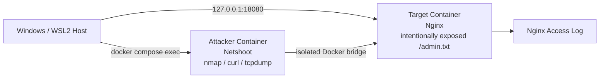

# 17 - Local Security Lab：本地网络攻防与防御验证

> 建议完成 [10-networking](../10-networking/README.md)、[15-protocol-stack](../15-protocol-stack/README.md) 和 [16-network-commands](../16-network-commands/README.md) 后进入本章。

## 一、本章目标

这一章不是面向互联网目标的渗透教程，而是一个**完全本地、可重复、可销毁的安全实验室**。

你会学习一条完整闭环：

```text
搭建隔离网络
  -> 资产发现
  -> 端口/服务枚举
  -> 验证错误暴露
  -> 查看服务日志
  -> 抓包理解流量
  -> 应用加固
  -> 再次攻击验证防御
  -> 清理实验环境
```

重点不是“记住某个攻击命令”，而是理解：

- 攻击者最先能看到什么；
- 为什么某个服务会暴露；
- 一次访问在 TCP/HTTP 层发生了什么；
- 日志里如何留下证据；
- 如何通过最小暴露、访问控制和网络隔离降低风险；
- 防御完成后如何重新验证。

---

## 二、安全边界

本章所有命令只针对本仓库自己创建的容器：

- `local-security-attacker`
- `local-security-target`

实验网络使用 Docker internal bridge：

```yaml
internal: true
```

这意味着实验容器不会把该网络当成通往互联网的普通出口。

目标服务只映射到本机回环地址：

```text
127.0.0.1:18080
```

不要把这些实验命令替换成公司、学校、公共网站、云主机或任何没有明确授权的目标。

---

## 三、架构图



攻击面非常小，便于第一次学习时把注意力集中在：

```text
IP -> Port -> Service -> HTTP Resource -> Log -> Defense
```

---

## 四、目录结构

```text
17-security-lab/
├── README.md
├── docker-compose.yml
└── target/
    ├── Dockerfile
    ├── vulnerable.conf
    ├── hardened.conf
    └── html/
        ├── index.html
        └── admin.txt
```

其中：

- `vulnerable.conf`：故意允许远程读取 `/admin.txt`
- `hardened.conf`：将该路径改为 `403 Forbidden`
- `admin.txt`：只包含本地教学用字符串 `LOCAL-LAB-SECRET`

---

## 五、启动实验室

在仓库根目录执行：

```powershell
cd 17-security-lab
docker compose up -d --build
docker compose ps
```

预期看到：

```text
local-security-target
local-security-attacker
```

先从 Windows 主机确认目标服务：

```powershell
curl.exe http://127.0.0.1:18080/
```

浏览器也可以打开：

```text
http://127.0.0.1:18080/
```

---

## 六、Lab 1：资产发现与端口枚举

先进入攻击者容器：

```powershell
docker compose exec attacker sh
```

确认自己的接口和路由：

```bash
ip addr
ip route
```

然后只扫描本实验的目标容器：

```bash
nmap -sT -Pn target
```

你应该能发现类似：

```text
80/tcp open http
```

### 这一阶段在学习什么

攻击者通常不会一开始就“入侵”。

第一步往往只是回答：

```text
目标在哪里？
哪些端口开放？
开放的端口是什么服务？
```

对应防御思想就是：

> 不需要开放的端口，不要开放。

---

## 七、Lab 2：服务识别

继续在 attacker 中执行：

```bash
curl -I http://target/
curl -v http://target/
```

观察：

- TCP 连接；
- HTTP Request；
- HTTP Response；
- Server Header；
- Status Code。

也可以使用：

```bash
nmap -sV -p 80 target
```

比较 `nmap` 和 `curl` 得到的信息有什么区别。

---

## 八、Lab 3：验证错误的信息暴露

这个实验故意把一个不应该公开的资源暴露出来。

执行：

```bash
curl http://target/admin.txt
```

预期得到：

```text
LOCAL-LAB-SECRET
```

这就代表一次“攻击验证成功”。

这里没有使用恶意软件或真实漏洞利用，而是模拟现实中非常常见的一类问题：

- 管理页面错误暴露；
- 调试接口未关闭；
- 内部文件被 Web Server 发布；
- 不该公开的路径缺少访问控制。

### 攻击链

```text
发现目标
 -> 发现 80/TCP
 -> 判断为 HTTP
 -> 请求敏感路径
 -> 获得本不应该获得的信息
```

---

## 九、Lab 4：从防守方查看日志

打开另一个 PowerShell：

```powershell
docker compose exec target sh
```

查看 Nginx 日志：

```sh
tail -f /var/log/nginx/access.log
```

然后再次从 attacker 请求：

```bash
curl http://target/admin.txt
```

你应该可以在日志里看到：

- 来源 IP；
- 请求路径；
- HTTP 方法；
- 状态码；
- User-Agent。

这就是最基本的安全事件证据。

---

## 十、Lab 5：抓包观察一次“攻击”

在 attacker 中执行：

```bash
tcpdump -i any -nn host target
```

另开一个终端执行：

```powershell
docker compose exec attacker curl http://target/admin.txt
```

观察：

```text
TCP SYN
TCP SYN/ACK
TCP ACK
HTTP request
HTTP response
TCP teardown
```

如果想进一步分析，可以结合前面的协议章节，用 Wireshark/tshark 观察相同流量。

---

## 十一、Lab 6：防御——关闭敏感路径

现在把目标从 vulnerable 状态切换到 hardened 状态。

在 `17-security-lab` 目录执行：

```powershell
docker cp .\target\hardened.conf local-security-target:/etc/nginx/conf.d/default.conf
docker exec local-security-target nginx -t
docker exec local-security-target nginx -s reload
```

首先确认首页仍正常：

```powershell
curl.exe http://127.0.0.1:18080/
```

然后再次攻击：

```powershell
docker compose exec attacker curl -i http://target/admin.txt
```

预期：

```text
HTTP/1.1 403 Forbidden
```

现在重新看日志：

```powershell
docker compose exec target tail -n 20 /var/log/nginx/access.log
```

你会看到同一个路径从原来的：

```text
200
```

变成：

```text
403
```

这就是安全工程里很重要的闭环：

```text
Attack
 -> Detect
 -> Harden
 -> Re-test
```

---

## 十二、Lab 7：理解“端口存在”和“权限允许”不是一回事

加固后重新执行：

```powershell
docker compose exec attacker nmap -sT -Pn target
```

你仍然会看到：

```text
80/tcp open
```

但是：

```powershell
docker compose exec attacker curl -i http://target/admin.txt
```

得到：

```text
403
```

因此必须区分：

| 层次 | 问题 |
|---|---|
| Network | 主机是否可达 |
| Transport | TCP 端口是否开放 |
| Application | HTTP 服务是否存在 |
| Authorization | 当前用户是否有权访问资源 |

“端口开放”不等于“系统已经被攻破”。

---

## 十三、Lab 8：攻击面与网络隔离

查看 Docker 网络：

```powershell
docker network ls
docker network inspect 17-security-lab_security_lab
```

重点观察：

- Subnet；
- Gateway；
- Container IP；
- `Internal: true`。

然后理解两种入口：

```text
Host -> 127.0.0.1:18080 -> target:80
attacker -> internal bridge -> target:80
```

因为端口绑定为：

```text
127.0.0.1:18080:80
```

它没有直接绑定到所有主机接口。

这是非常重要的最小暴露原则。

---

## 十四、常见攻击阶段与本仓库可以怎样安全学习

| 攻击阶段 | 本地实验方式 | 防御重点 |
|---|---|---|
| Recon | `ip`, `nmap` | 减少可见资产 |
| Service Discovery | `nmap -sV`, `curl` | 关闭无用服务 |
| Misconfiguration | 读取故意暴露的 `admin.txt` | Access Control |
| Traffic Analysis | `tcpdump` | TLS / Network Segmentation |
| Evidence | Nginx access log | Central Logging |
| Hardening | 403 / 最小暴露 | Least Privilege |
| Validation | 再次扫描和请求 | Continuous Verification |

---

## 十五、下一步可以继续扩展的安全实验

完成这一章后，可以继续逐步增加：

1. **Firewall Lab**
   - nftables allow/deny
   - 默认拒绝
   - 只允许指定源网段

2. **Authentication Lab**
   - 无认证页面
   - Basic Auth
   - Token
   - 错误权限与正确权限对比

3. **TLS Lab**
   - HTTP 明文抓包
   - HTTPS 加密后再抓包
   - 证书验证

4. **Kubernetes Security Lab**
   - NetworkPolicy
   - ServiceAccount
   - Secret
   - RBAC
   - Pod Security Context

5. **Detection Lab**
   - Nginx Log
   - Loki
   - Grafana
   - 简单告警规则

6. **Container Security Lab**
   - 非 root
   - read-only filesystem
   - capabilities
   - image scanning

7. **Terraform Security Lab**
   - 错误开放端口
   - 安全变量校验
   - IaC Policy / static scan
   - 自动测试安全配置

推荐顺序：

```text
Recon
 -> Misconfiguration
 -> Firewall
 -> Authentication
 -> TLS
 -> Kubernetes Security
 -> Logging / Detection
 -> IaC Security
```

---

## 十六、思考题

1. 为什么攻击者发现端口开放以后，还不能说明“攻击成功”？
2. 为什么 `127.0.0.1:18080:80` 通常比 `0.0.0.0:18080:80` 更安全？
3. 为什么修复以后还必须再次运行原来的攻击验证？
4. 200、401、403、404 在安全排障时分别能告诉你什么？
5. 如果有 20 个服务，怎样判断哪些端口是“不必要暴露”？
6. 如果访问日志里突然出现大量不存在路径的请求，可能意味着什么？

---

## 十七、清理实验环境

退出 attacker shell：

```bash
exit
```

然后：

```powershell
docker compose down --remove-orphans
```

如需同时清理构建出的本地 target image：

```powershell
docker image prune
```

---

## 十八、本章完成标准

完成本章后，你应该能够独立解释：

```text
攻击者
  如何发现服务
  如何验证暴露
  如何观察响应

防守者
  如何从日志找到证据
  如何修改访问控制
  如何重新验证修复

网络工程师
  如何区分 IP / Port / HTTP / Authorization 问题
```

真正需要形成的能力不是“会运行黑客命令”，而是：

> **能够建立攻击假设，用网络和日志证据验证它，再通过最小权限和最小暴露修复，并用同样的测试证明修复有效。**
