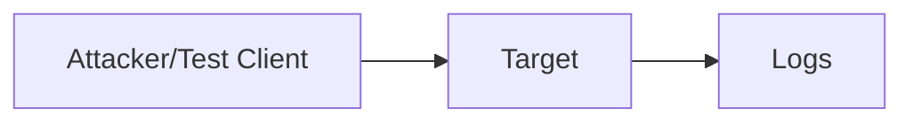

# Security Lab Report Template

## 1. Scope

- Repository:
- Lab:
- Date:
- Operator:
- Authorized targets:
- Explicitly excluded targets:

## 2. Architecture



## 3. Assets

| Asset | Classification | Owner | Why it matters |
|---|---|---|---|
| | | | |

## 4. Trust Boundaries

| Boundary | From | To | Expected access |
|---|---|---|---|
| | | | |

## 5. Baseline

### Interfaces

```text
```

### Routes

```text
```

### Open Ports

```text
```

### Expected HTTP Behavior

| Request | Expected |
|---|---|
| GET / | 200 |
| GET /admin.txt | denied after hardening |

## 6. Finding

### Title

### Description

### Evidence

```text
command:
output:
```

### Security Impact

### Root Cause

### Remediation

## 7. Detection Evidence

### Server Logs

```text
```

### Packet Evidence

```text
```

## 8. Re-test

| Test | Before | Expected After | Actual After | Pass |
|---|---|---|---|---|
| | | | | |

## 9. Residual Risk

- Remaining exposure:
- Remaining assumptions:
- Future improvements:

## 10. Automation Opportunities

- [ ] Terraform validation
- [ ] terraform test
- [ ] CI security scan
- [ ] NetworkPolicy
- [ ] RBAC check
- [ ] container hardening
- [ ] alert rule

## 11. Incident Timeline

| Time | Event | Evidence |
|---|---|---|
| | | |

## 12. Lessons Learned

1.
2.
3.

## 13. Final Conclusion

Summarize:

```text
What was exposed?
How was it proven?
How was it fixed?
How was the fix re-tested?
What remains?
```
