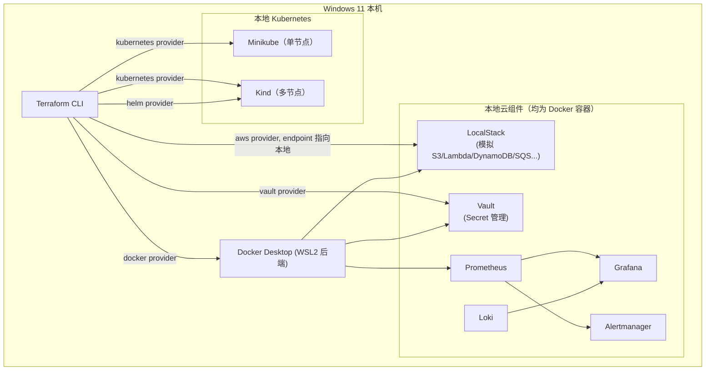

# Terraform Local Cloud Learning Lab

> 一个完全在本地运行、不依赖任何真实收费云（AWS / Azure / GCP / OCI）的
> **Terraform + Kubernetes + Docker + DevOps 中文实践课程**。

---

## 1. 项目介绍

这个仓库不是一堆零散 Demo 的合集，而是一套**分阶段、可运行、可销毁、可重来**的系统化学习实验室。

它围绕 **Terraform** 这一核心 IaC（Infrastructure as Code，基础设施即代码）工具展开，
逐步把你带到：

- 用 Terraform 管理 Docker 容器、网络、卷
- 用 Terraform 管理本地 Kubernetes（Minikube / Kind）里的 Namespace、Deployment、Service、Ingress……
- 用 Terraform 管理 Helm Release（Ingress Controller、Prometheus、Grafana）
- 用 Terraform 管理 LocalStack 模拟出的 AWS 资源（S3、Lambda、DynamoDB、SQS、API Gateway……）
- 用 Terraform 管理本地 HashiCorp Vault 的 Secret 引擎和策略
- 理解 Terraform State、Module、Workspace、依赖图、生命周期这些"内功"

**每一章都会详细解释三件事**：

1. 这段 Terraform 代码字面上做了什么；
2. Terraform 内部到底发生了什么（依赖图、State diff、Provider 调用）；
3. 这在真实云环境（AWS / Azure / GCP / OCI）里对应什么概念——这样你现在学到的
   本地知识，将来才能直接迁移到真实云上的 EKS / AKS / OKE 等场景。

## 2. 适合谁学习

- 想系统学习 Terraform，但苦于没有真实云账号（或不想为学习产生云账单）的人；
- 已经会写一点 Terraform，但对 State、Module、依赖图这些"为什么"始终模糊的人；
- 想理解 Kubernetes 核心对象（Pod / Service / Ingress / RBAC……）但没有集群可用的人；
- 想知道 LocalStack、Vault、Prometheus/Grafana 这些工具到底是怎么和 IaC 结合工作的人；
- 想要一份可以边读边动手、每一步都能验证、每一步都能销毁重来的中文教程。

**不要求**你已经会 Terraform 或 Kubernetes——第一章就是从零开始的。
但假定你熟悉基本的命令行操作和 Git。

## 3. 核心原则

| 原则 | 说明 |
|---|---|
| 全部本地运行 | 只依赖 Docker Desktop / Minikube / Kind，不需要注册任何真实云账号 |
| 零真实云账单 | 用 LocalStack 模拟 AWS，而不是连接真实 AWS |
| 每章可独立运行 | 你可以只做第 7 章而不用先跑通第 3-6 章 |
| 每章可销毁重来 | 每章都有对应的 `terraform destroy`，环境是一次性、可复现的 |
| 详细中文讲解 | 不是"贴代码"，而是解释代码背后的原理和真实云对应关系 |
| Windows 优先 | 默认在 Windows 11 + PowerShell 上运行；少数高级实验放进 `optional/` |

## 4. 软件安装（环境准备）

完整的安装步骤、版本建议、验证命令见 [docs/01-environment-setup.md](docs/01-environment-setup.md)。

概览所需软件：

| 软件 | 用途 | 是否必须 |
|---|---|---|
| [Terraform](https://developer.hashicorp.com/terraform/downloads) | 整个项目的核心 IaC 工具 | 必须 |
| [Docker Desktop](https://www.docker.com/products/docker-desktop/)（含 WSL2 后端） | 运行容器、Kind、LocalStack、Vault 等一切本地服务的基础 | 必须 |
| [Git](https://git-scm.com/) | 版本控制 | 必须 |
| [VS Code](https://code.visualstudio.com/) + HashiCorp Terraform 插件 | 编辑器与语法高亮/校验 | 强烈建议 |
| [kubectl](https://kubernetes.io/docs/tasks/tools/#kubectl) | 与 Kubernetes 集群交互、验证 Terraform 的结果 | 第 3 章起需要 |
| [Minikube](https://minikube.sigs.k8s.io/docs/start/) | 单节点本地 Kubernetes 集群 | 第 3 章需要 |
| [Kind](https://kind.sigs.k8s.io/) | 基于 Docker 的多节点本地 Kubernetes 集群 | 第 4 章起需要 |
| [Helm](https://helm.sh/docs/intro/install/) | Kubernetes 包管理器，配合 Terraform Helm Provider | 第 6 章需要 |

## 5. 环境验证

安装完成后，在 PowerShell 里依次运行，确认版本号都能正常输出：

```powershell
terraform -version
docker version
git --version
kubectl version --client
minikube version
kind version
helm version
```

如果某条命令报错，先看 [docs/05-debugging-guide.md](docs/05-debugging-guide.md)。

## 6. 目录说明

```text
terraform-local-cloud-learning-lab/
│
├── README.md                  <- 你现在在看的文件：总入口
├── docs/                      <- 与具体章节无关的通用文档
│   ├── 00-learning-roadmap.md     学习路线总览
│   ├── 01-environment-setup.md    环境搭建详细步骤
│   ├── 02-terraform-fundamentals.md  Terraform 核心概念详解
│   ├── 03-terraform-state.md      State 专题
│   ├── 04-terraform-modules.md    Module 专题
│   ├── 05-debugging-guide.md      常见报错排查手册
│   ├── 06-kubernetes-basics.md    Kubernetes 核心概念详解
│   ├── 07-localstack-basics.md    LocalStack 原理与边界
│   ├── 08-monitoring-basics.md    可观测性（Metrics/Logs/Alerts）概念
│   ├── 09-vault-basics.md         Secret 管理概念
│   ├── 10-private-cloud.md        私有云 / 虚拟化概念（对应 optional/）
│   ├── glossary.md                中英双语术语词典
│   └── terraform-cheatsheet.md    命令速查表
│
├── 01-terraform-basics/       <- Stage 1：Terraform 核心概念与基本工作流
├── 02-docker/                 <- Stage 2：Terraform 管理 Docker 容器/网络/卷
├── 03-minikube/               <- Stage 3：Terraform + Minikube 单节点 K8s
├── 04-kind/                   <- Stage 4：Terraform + Kind 多节点 K8s
├── 05-kubernetes/             <- Stage 5：Kubernetes 对象逐一精讲（13 个子实验）
├── 06-helm/                   <- Stage 6：Terraform Helm Provider
├── 07-localstack/             <- Stage 7：Terraform + LocalStack 模拟 AWS
├── 08-monitoring/             <- Stage 8：Prometheus / Grafana / Loki / Alertmanager
├── 09-vault/                  <- Stage 9：Terraform + HashiCorp Vault
├── 10-networking/             <- 网络专题：Docker/K8s 网络模型
├── 11-modules/                <- Stage 10：Terraform Module 设计与复用
├── 12-state-management/       <- Stage 11：State 高阶操作（import/mv/moved/workspace）
├── 13-testing/                <- Terraform 测试（fmt/validate/plan 与 `terraform test`）
├── 14-full-local-cloud/       <- Stage 12：毕业设计，统一编排所有组件
└── optional/                  <- 可选高阶实验，不保证在所有 Windows 机器上直接运行
    ├── proxmox/                    Terraform 管理虚拟机（Private Cloud 入门）
    └── libvirt/                    Terraform 管理本地 KVM 虚拟机
```

每个章节目录下都有独立的 `README.md`，遵循统一的 14 段式结构
（目标 / 架构图 / 前置知识 / 核心概念 / 文件结构 / 代码讲解 / 执行步骤 /
验证方法 / State 变化 / Destroy / 常见错误 / 思考题 / 动手练习 / 进阶挑战）。

## 7. 学习顺序（Learning Roadmap）

详见 [docs/00-learning-roadmap.md](docs/00-learning-roadmap.md)，概览如下：

```text
Stage 1   Terraform Fundamentals        01-terraform-basics/
Stage 2   Terraform + Docker            02-docker/
Stage 3   Terraform + Minikube          03-minikube/
Stage 4   Terraform + Kind              04-kind/
Stage 5   Kubernetes 深入               05-kubernetes/
Stage 6   Terraform + Helm              06-helm/
Stage 7   Terraform + LocalStack (AWS)  07-localstack/
Stage 8   本地监控系统                   08-monitoring/
Stage 9   Terraform + Vault             09-vault/
Stage 10  Terraform Module              11-modules/
Stage 11  State 管理进阶                 12-state-management/
Stage 12  Full Local Cloud（毕业实验）    14-full-local-cloud/

穿插专题：10-networking/（网络）、13-testing/（测试）、optional/（私有云/虚拟化）
```

## 8. 架构总览



## 9. 常用命令

完整版见 [docs/terraform-cheatsheet.md](docs/terraform-cheatsheet.md)。最常用的一组：

```bash
terraform init        # 初始化：下载 Provider、初始化 Backend
terraform fmt          # 格式化代码
terraform validate     # 语法与内部一致性校验（不连接任何 Provider）
terraform plan         # 计算并展示"现状 -> 期望状态"的差异（不做任何改动）
terraform apply        # 执行 plan 中的改动，创建/更新/删除真实资源
terraform show         # 以人类可读格式展示当前 State 或某个 plan 文件
terraform output       # 显示 root module 的 output 值
terraform destroy      # 销毁本次配置管理的所有资源
```

## 10. 学习进度表

在自己的本地副本里，把完成的章节打勾（这个表格不会被自动更新，纯手工记录用）：

| Chapter | Topic | Status |
|---|---|---|
| 01 | Terraform Basics | ⬜ |
| 02 | Docker | ⬜ |
| 03 | Minikube | ⬜ |
| 04 | Kind | ⬜ |
| 05 | Kubernetes 深入 | ⬜ |
| 06 | Helm | ⬜ |
| 07 | LocalStack (AWS) | ⬜ |
| 08 | Monitoring | ⬜ |
| 09 | Vault | ⬜ |
| 10 | Networking | ⬜ |
| 11 | Modules | ⬜ |
| 12 | State Management | ⬜ |
| 13 | Testing | ⬜ |
| 14 | Full Local Cloud | ⬜ |
| optional | Proxmox / libvirt | ⬜ |

## 11. 常见问题

先查 [docs/05-debugging-guide.md](docs/05-debugging-guide.md)——里面按"现象 / 原因 / 检查命令 / 解决方法"整理了
Provider 初始化失败、Docker daemon 不可用、Minikube 无法连接、kubectl context 错误、
端口冲突、State 被锁、PowerShell 执行策略、WSL2 相关等高频问题。

## 12. 安全声明

本仓库所有密码、Token、API Key 均为教学占位符（如 `demo-password`、`example-token`），
**仅用于本地教学环境**，请勿在真实系统中重复使用这些值。仓库通过 `.gitignore` 排除了
`*.tfstate`、`*.tfvars`（示例文件除外）等可能包含运行时敏感信息的文件——原因见该文件内注释。

## 13. 项目状态

全部 14 个 Stage + `optional/` 均已实现并配有完整 README。除
`optional/proxmox`、`optional/libvirt`（明确不要求在普通 Windows
环境下直接运行，属于概念性参考代码）外，**每一章的 Terraform 代码
都在本机实际跑通过完整的 init → plan → apply → 验证 → destroy 流程**，
过程中真实遇到并修复的坑（Kind 默认 CNI 不支持 NetworkPolicy、
PVC 的 WaitForFirstConsumer 死锁、Windows 上 `localhost` 的
IPv6/IPv4 解析问题、Docker capability 名称前缀、Kubernetes `command`
与 `args` 的语义差异、Grafana 探针超时等）都已经写进对应章节的
代码注释和"常见错误"小节，而不是靠猜测编写。
