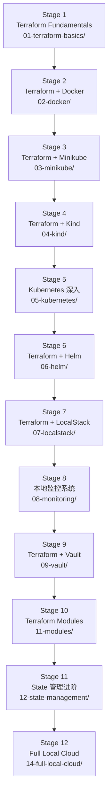

# 00 - 学习路线总览（Learning Roadmap）

本文档回答一个问题：**"我应该按什么顺序学，每个阶段要达到什么程度才能进入下一阶段？"**

## 路线图



穿插专题（不阻塞主线，随时可以插入学习）：

- `10-networking/` —— 建议在 Stage 4（Kind）之后阅读，此时你已经见过 Docker 网络和
  Kubernetes Service，网络专题会帮你把两者串起来理解。
- `13-testing/` —— 建议在 Stage 10（Modules）之后阅读，因为测试的对象通常是 Module。
- `optional/proxmox`、`optional/libvirt` —— 任何时候都可以看，但不强制运行。

## 每个 Stage 的"毕业标准"

| Stage | 你应该能做到 |
|---|---|
| 1. Terraform Fundamentals | 独立完成 init → plan → apply → destroy 全流程；能解释 Provider / Resource / State 是什么；能说出 `count` 和 `for_each` 的区别 |
| 2. Docker | 用 Terraform 创建一个 network + 多个 container，并让它们互相通信；能画出资源依赖图 |
| 3. Minikube | 用 Terraform Kubernetes Provider 部署一个 Deployment + Service + Ingress，浏览器能访问 |
| 4. Kind | 理解单节点与多节点的区别；能用 nodeSelector 把 Pod 调度到指定节点 |
| 5. Kubernetes 深入 | 能独立解释 05-kubernetes/ 下 13 个子实验涉及的每个对象的作用 |
| 6. Helm | 理解 Helm Release 与裸 Kubernetes manifest 的区别；用 Terraform 部署 ingress-nginx + kube-prometheus-stack |
| 7. LocalStack | 理解 LocalStack 与真实 AWS 的异同边界；跑通一个 API Gateway → Lambda → DynamoDB → SQS 的完整链路 |
| 8. Monitoring | 能用 Terraform 管理 Grafana 的 Data Source / Dashboard / Alert；理解 Metrics vs Logs vs Alerts |
| 9. Vault | 理解为什么 `sensitive = true` 不能保护 State；能用 Terraform 管理 Vault Policy 和 Mount |
| 10. Modules | 能设计一个多次复用的 Module，理解 Module 的 input/output/依赖 |
| 11. State 管理 | 能完成一次"先手工建资源、再 import 进 Terraform"的实验；理解 `moved` block |
| 12. Full Local Cloud | 能用 Terraform 统一编排 Kind + LocalStack + Vault + Monitoring，并完整 destroy |

## 如果你时间有限

最小可行学习路径（能建立正确心智模型，但不追求覆盖全部细节）：

```text
01-terraform-basics → 02-docker → 03-minikube → 05-kubernetes(挑 4-5 个子实验)
→ 07-localstack → 11-modules
```

## 如何使用每一章

1. 先读该章 `README.md` 的"本章目标"和"架构图"，建立整体印象；
2. 读"核心概念"部分——**不要跳过**，这是本课程和"抄命令"式教程的核心区别；
3. 打开 `.tf` 文件，对照 README 里的"代码讲解"逐段理解，而不是从头看到尾；
4. 按"执行步骤"动手跑一遍；
5. 按"验证方法"确认结果符合预期；
6. 修改一个变量、重新 `plan`，观察 Terraform 如何计算 diff；
7. 回答"思考题"，做"动手练习"；
8. `terraform destroy`，确认环境完全清理干净；
9. 有余力再挑战"进阶挑战"。
