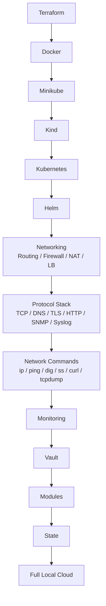

# 00 - 学习路线总览（Learning Roadmap）

本路线把真实本地基础设施、协议栈与网络命令一起放进主线。

## 主线



## 三个网络专题分别解决什么

| 专题 | 回答的问题 |
|---|---|
| `10-networking/` | 网络怎么搭、怎么路由、怎么隔离 |
| `15-protocol-stack/` | 数据以什么协议格式通信 |
| `16-network-commands/` | 怎么观察、配置、验证、排障 |

## Network Command Toolbox 建议顺序

```text
16-network-commands/
01 Interface / IP
02 Routing / Neighbor
03 Connectivity / Path
04 DNS
05 Port / Socket
06 HTTP / TLS
07 Packet Capture
08 Firewall / NAT
09 Wi-Fi
10 Performance
11 Cheatsheet
```

## 网络命令与协议的关系

不是所有命令都直接对应一个协议。

### 协议客户端/测试工具

```text
ping              -> ICMP
dig / nslookup    -> DNS
curl              -> HTTP/HTTPS
openssl s_client  -> TLS
snmpget/snmpwalk  -> SNMP
```

### OS 网络栈状态/配置工具

```text
ip addr
ip link
ip route
ip neigh
ss
nft
Get-NetAdapter
Get-NetRoute
Get-NetTCPConnection
netsh wlan
```

### 抓包/证据工具

```text
tcpdump
tshark
Wireshark
pktmon
```

## 毕业标准

完成网络方向后，你应该能够：

- 看到 `ipconfig` / `ip addr` 判断接口和地址是否正常。
- 看到 `route print` / `ip route` 判断下一跳。
- 用 `arp -a` / `ip neigh` 理解二层邻居。
- 用 `ping`、`traceroute`、`Test-NetConnection` 区分可达性与端口问题。
- 用 `dig` / `Resolve-DnsName` 定位 DNS。
- 用 `ss` / `Get-NetTCPConnection` 找监听端口与连接状态。
- 用 `curl -v` 区分 TCP、TLS、HTTP 阶段。
- 用 `openssl s_client` 分析证书与 TLS。
- 用 `tcpdump` / Wireshark 找到 packet evidence。
- 用 `nft` / Windows Firewall 命令定位 policy 问题。
- 用 `iperf3` 区分局域网性能与互联网性能。

## 推荐学习方法

每遇到一个网络问题，不要一次运行几十个命令。

按：

```text
状态
 -> 路径
 -> 协议
 -> 应用
 -> 抓包证据
```

逐层缩小范围。
