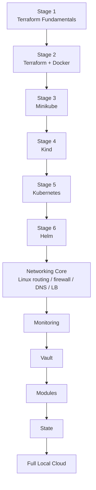

# 00 - 学习路线总览（Learning Roadmap）

本路线把“真实本地基础设施能力”放在主线，把 LocalStack 调整为可选 AWS API 模拟专题。

## 主线



## 可选专题

- `07-localstack/`：AWS API 模拟。适合学习 AWS Provider/S3/Lambda/DynamoDB/SQS 等调用方式；不再是主线前置条件。
- `10-networking/07-containerlab-frr/`：高级动态路由实验。
- `13-testing/`：Terraform 测试。
- `optional/proxmox`、`optional/libvirt`：虚拟机/私有云方向。

## 毕业标准

| Stage | 你应该能做到 |
|---|---|
| Terraform | 独立完成 init → plan → apply → destroy，并理解 State/Provider/依赖图 |
| Docker | 创建网络、容器、卷并解释隔离边界 |
| Kubernetes | 理解 Pod/Service/Ingress/PVC/RBAC/NetworkPolicy |
| Networking | 能解释 CIDR、Gateway、Route、NAT、Firewall、DNS、LB、VPN，并用 Linux 命令定位网络故障 |
| Monitoring | 理解 Metrics / Logs / Alerts，并能部署本地观测组件 |
| Vault | 理解 Secret source of truth 与 Terraform State 风险 |
| Modules/State | 能设计可复用 Module，完成 import/moved/workspace 等操作 |
| Full Local Cloud | 用 Terraform 统一编排 Kubernetes + Vault，并能从网络到应用完成验证与销毁 |

## 网络专题的建议顺序

```text
10-networking/
01 docker isolation
02 CoreDNS
03 Linux namespace routing
04 firewall/NAT
05 load balancer
06 VPN
08 troubleshooting
07 Containerlab + FRRouting (advanced)
```

## 时间有限时

```text
01-terraform-basics
 -> 02-docker
 -> 04-kind
 -> 05-kubernetes (Service / Ingress / NetworkPolicy)
 -> 10-networking/03-linux-routing
 -> 10-networking/04-firewall-nat
 -> 11-modules
 -> 14-full-local-cloud
```

LocalStack 不再是最小路径的必修项。

## 每章学习方法

1. 先画架构与数据流。
2. 再读 Terraform/配置代码。
3. apply 后用独立命令验证，不只相信 Terraform 输出。
4. 主动制造一个故障。
5. 按 Link → IP → Route → Firewall → DNS → Port → Application 排查。
6. destroy 后确认资源完全清理。
