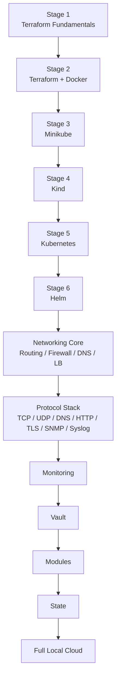

# 00 - 学习路线总览（Learning Roadmap）

本路线把“真实本地基础设施能力”放在主线，把 LocalStack 调整为可选 AWS API 模拟专题，并新增 Protocol Stack 主线。

## 主线



## 为什么 Networking 与 Protocol Stack 要分开

`10-networking/` 回答：

> 网络拓扑怎么搭？路由、防火墙、NAT、LB、VPN 怎么工作？

`15-protocol-stack/` 回答：

> 真正传输的数据是什么？ARP/IP/TCP/TLS/HTTP/SNMP/Syslog 在链路中的哪一步出现？

两条线合起来才是完整的网络基础。

## Protocol Stack 建议顺序

```text
15-protocol-stack/
01 OSI vs TCP/IP
02 Ethernet / ARP
03 IP / ICMP
04 TCP
05 UDP
06 DNS
07 HTTP
08 TLS / HTTPS
09 SNMP
10 Syslog
11 HTTP2 / gRPC / WebSocket / QUIC
12 Packet Analysis
13 Protocol Troubleshooting
```

## 毕业标准

| Stage | 你应该能做到 |
|---|---|
| Terraform | 独立完成 init → plan → apply → destroy，并理解 State/Provider/依赖图 |
| Docker | 创建网络、容器、卷并解释隔离边界 |
| Kubernetes | 理解 Pod/Service/Ingress/PVC/RBAC/NetworkPolicy |
| Networking | 能解释 CIDR、Gateway、Route、NAT、Firewall、DNS、LB、VPN，并用 Linux 命令定位网络故障 |
| Protocol Stack | 能从 Ethernet/ARP 一直解释到 TCP/UDP、DNS、TLS、HTTP，并能识别 SNMP Trap/Syslog 常见流量 |
| Packet Analysis | 能用 tcpdump/Wireshark 根据 host/port/protocol 缩小范围并找到证据 |
| Monitoring | 理解 Metrics / Logs / Alerts，并能部署本地观测组件 |
| Vault | 理解 Secret source of truth 与 Terraform State 风险 |
| Modules/State | 能设计可复用 Module，完成 import/moved/workspace 等操作 |
| Full Local Cloud | 用 Terraform 统一编排 Kubernetes + Vault，并能从网络到应用完成验证与销毁 |

## 网络 + 协议的推荐组合练习

每学一个协议，都尽量映射到真实网络实验：

```text
ARP      -> 10-networking/03-linux-routing
IP/ICMP  -> Linux router namespaces
TCP/UDP  -> nc / python http.server
DNS      -> CoreDNS / dig
HTTP     -> nginx / backend
TLS      -> openssl / curl
SNMP     -> snmptrapd / tcpdump
Syslog   -> nc / rsyslog
BGP/OSPF -> Containerlab + FRRouting
```

## 时间有限时

```text
01-terraform-basics
 -> 02-docker
 -> 04-kind
 -> 05-kubernetes (Service / Ingress / NetworkPolicy)
 -> 10-networking/03-linux-routing
 -> 15-protocol-stack/04-tcp
 -> 15-protocol-stack/06-dns
 -> 15-protocol-stack/08-tls-https
 -> 15-protocol-stack/12-packet-analysis
 -> 11-modules
 -> 14-full-local-cloud
```

LocalStack 不再是最小路径的必修项。

## 每章学习方法

1. 先画架构与数据流。
2. 确认当前关注的是哪一层。
3. 执行真实命令。
4. 抓包或查看 socket/route/firewall 状态。
5. 主动制造一个故障。
6. 按 Link → IP → Route → ARP → Firewall → DNS → TCP/UDP → TLS → Application 排查。
7. 写下 packet evidence，而不是只写“修好了”。
