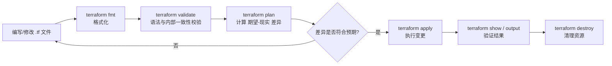

# 02 - Terraform 核心概念详解

这是全项目最重要的一篇文档。后面所有章节的 README 都会假设你已经理解这里的概念，
只在有新知识点时才补充讲解。建议**读完这篇文档、并跑完 01-terraform-basics 之后**再继续。

---

## 1. Terraform 是什么

Terraform 是 HashiCorp 开发的一个 **IaC（Infrastructure as Code，基础设施即代码）工具**。

传统方式管理基础设施：登录云控制台，点鼠标创建一台虚拟机、一个数据库、一条网络规则。
问题是：这个过程不可复制、不可版本控制、没有审计记录、无法在另一个环境重现。

IaC 的思路是：**把"我想要什么样的基础设施"写成代码文件**，然后用工具去
"读取代码 → 对比现状 → 计算差异 → 执行变更"，把创建/修改/删除基础设施的过程
变成像编译代码一样可重复、可版本控制、可 Code Review 的工程活动。

Terraform 的特别之处在于它是 **Provider 无关** 的——同一套语言（HCL）和工作流
（init/plan/apply/destroy）可以用来管理 AWS、Azure、GCP、Docker、Kubernetes、
Vault、甚至 Datadog 告警规则，只要有对应的 Provider 插件。这也是为什么本项目能
用 Terraform 统一管理 Docker、Kubernetes、LocalStack（模拟 AWS）、Vault、Grafana——
它们背后其实是不同的 Provider，但你使用的语法和心智模型完全一致。

## 2. 声明式 vs 命令式（Declarative vs Imperative）

- **命令式（Imperative）**：你告诉计算机"怎么做"，一步一步下命令。
  例如写一个 shell 脚本：`docker network create xxx`，然后 `docker run ...`。
  如果脚本运行到一半失败、或者你重复运行两次，很容易出现"资源已存在"之类的错误。

- **声明式（Declarative）**：你告诉计算机"我要什么结果"（Desired State，期望状态），
  工具自己去算怎么达到这个结果。Terraform 就是声明式的——你写"我要一个名叫
  `app_network` 的 Docker 网络"，不管这个网络现在存在还是不存在，Terraform 都会
  自己判断该创建、该跳过、还是该修改。

## 3. Desired State（期望状态）与 Idempotency（幂等性）

**期望状态**指的是你在 `.tf` 文件里描述的"世界应该长什么样"。Terraform 的核心工作
循环是：

```text
读取 .tf 文件（期望状态）
        ↓
读取 State 文件（上次已知的现实状态）
        ↓
（可选）向 Provider 查询资源的最新真实状态（refresh）
        ↓
计算 期望状态 与 现实状态 的差异（diff）
        ↓
生成一个变更计划（plan）：哪些资源要 create / update / destroy / no-op
        ↓
（用户确认后）apply：调用 Provider API 执行这些变更
```

**幂等性（Idempotency）**指的是：无论你执行多少次 `terraform apply`，只要
`.tf` 文件没变、现实世界也没被别人动过手脚，结果都应该是"什么都不用改"
（no-op）。这是声明式工具的核心承诺，也是它比"裸脚本"可靠的根本原因——
裸脚本重复执行经常会报"资源已存在"错误，而 Terraform 天然支持重复执行。

## 4. Provider（提供者）

Provider 是 Terraform 用来对接某一类具体系统的插件。它把 HCL 里的 `resource` /
`data` block 翻译成对目标系统的实际 API 调用。例如：

- `hashicorp/docker` Provider 把 `resource "docker_container"` 翻译成 Docker Engine API 调用；
- `hashicorp/kubernetes` Provider 把 `resource "kubernetes_deployment"` 翻译成
  Kubernetes API Server 的 REST 调用；
- `hashicorp/aws` Provider 把 `resource "aws_s3_bucket"` 翻译成 AWS API 调用
  （在本项目里，我们会把这个 Provider 的 `endpoints` 参数指向本地 LocalStack，
  而不是真实 AWS——这样"学的是同一个 Provider、同一种语法"，只是后端换成了免费的本地模拟）。

一个 `.tf` 文件里典型的 Provider 声明：

```hcl
terraform {
  required_providers {
    docker = {
      source  = "kreuzwerker/docker"   # Provider 的"注册表地址"
      version = "~> 3.0"               # 版本约束，"3.x 但不到 4.0"
    }
  }
}

provider "docker" {
  # Provider 级别的配置，比如连接哪个 Docker daemon
}
```

## 5. Resource（资源）

`resource` block 是 Terraform 配置的核心——它声明"我要一个什么类型、
叫什么名字的资源"，以及它的具体参数。

```hcl
resource "docker_network" "app_network" {
  #        ^类型              ^本地名称（只在 Terraform 配置内部使用，
  #        由 Provider 定义    不是真实资源的名字）
  name = "terraform-learning-network"   # 这才是传给 Docker 的真实网络名
}
```

- **类型**（这里是 `docker_network`）决定了这个资源支持哪些参数、映射到
  Provider 的哪个 API；
- **本地名称**（这里是 `app_network`）是你在这份配置内部引用它的"变量名"，
  例如 `docker_network.app_network.id`；
- 两者合起来 `docker_network.app_network` 叫做 **resource address（资源地址）**，
  它在整个 State 里必须唯一，`terraform state show docker_network.app_network`
  就是用这个地址去查询 State。

## 6. Data Source（数据源）

`data` block 用来**读取**一个已经存在、但不由本次 Terraform 配置管理的资源信息，
只读不写。例如查询一个已经存在的 Docker 镜像信息、或者查询 AWS 上一个已有的 VPC。

```hcl
data "docker_network" "existing" {
  name = "bridge"   # 查询 Docker 自带的默认 bridge 网络，而不是创建它
}
```

`resource` 和 `data` 的核心区别：`resource` 是"我要拥有并管理这个东西的生命周期"，
`data` 是"我只是想知道这个东西现在长什么样，它的生死不归我管"。

## 7. State（状态）

State 是 Terraform 用来记录"上一次 apply 之后，各个资源的真实情况"的文件
（默认是本地的 `terraform.tfstate`，一个 JSON 文件）。

**为什么需要 State？** HCL 配置本身只描述"期望状态"，不包含"现实世界里这个资源
的 ID 是多少、当前有哪些属性"。如果没有 State，Terraform 每次都得重新去问一遍
Provider"现在都有什么资源"，这在资源多、Provider 不支持批量查询时几乎不可行；
State 让 Terraform 可以维护一份自己的"账本"，快速做 diff。

State 里大致存了什么：

```json
{
  "resources": [
    {
      "type": "docker_network",
      "name": "app_network",
      "instances": [
        {
          "attributes": {
            "id": "a1b2c3...",
            "name": "terraform-learning-network",
            "driver": "bridge"
          }
        }
      ]
    }
  ]
}
```

State 相关的完整专题见 [03-terraform-state.md](03-terraform-state.md) 和
[12-state-management](../12-state-management/README.md)。

## 8. Dependency Graph（依赖图）与 DAG

Terraform 在 `plan` / `apply` 前，会先把所有 `resource` / `data` / `module`
之间的引用关系构建成一个 **有向无环图（DAG，Directed Acyclic Graph）**。

例如：

```text
docker_network.app_network
        ↓
docker_container.app  (network_name 引用了 app_network.name)
        ↓
docker_container.nginx (depends_on 显式声明依赖 app 容器)
```

Terraform 按照这个图的拓扑顺序执行操作：**没有依赖关系的资源会被并发处理**，
这也是 Terraform 比手写线性脚本快的原因之一。依赖关系有两种来源：

1. **隐式依赖（推荐）**：在资源 A 的参数里引用了资源 B 的属性
   （比如 `network_name = docker_network.app_network.name`），
   Terraform 自动推断"A 依赖 B"，无需手写声明；
2. **显式依赖 `depends_on`**：当两个资源之间没有参数引用关系，
   但业务上确实要求先后顺序时使用（详见
   [10-networking](../10-networking/README.md) 里的依赖图实验）。

可以用下面的命令导出依赖图（生成 DOT 格式，需要 Graphviz 才能渲染成图片）：

```bash
terraform graph
```

## 9. Plan / Apply / Destroy 工作流



- `plan` **绝对不会**改动任何真实资源，它只是"预演"；
- `apply` 默认会重新跑一次 plan 并要求你手动输入 `yes` 确认（除非加 `-auto-approve`）；
- `destroy` 本质上是"目标状态清空"后的一次特殊 apply——把所有由本配置管理的资源都删除。

## 10. HCL 语言基础

Terraform 配置语言叫 **HCL（HashiCorp Configuration Language）**。一份 `.tf` 文件
由若干"块"（block）组成，常见的顶层块：

```hcl
terraform {
  # Terraform 自身的元配置：版本约束、需要哪些 Provider、Backend 配置
}

provider "docker" {
  # 配置某个具体 Provider（可以配置多个同类型 Provider，用 alias 区分）
}

resource "docker_container" "web" {
  # 声明一个要被创建和管理的资源
}

data "docker_network" "existing" {
  # 只读查询一个已存在的资源
}

variable "container_count" {
  # 声明一个输入变量，供本模块内部引用
}

locals {
  # 声明模块内部的"计算中间量"，不对外暴露、不能被外部赋值
}

output "container_ip" {
  # 把某个值暴露给上层模块或命令行（terraform output）
}

module "network" {
  # 调用一个子模块，复用别人（或自己）写好的一组资源
}
```

每个 block 的详细讲解、真实用法见 [01-terraform-basics](../01-terraform-basics/README.md)
里逐段注释的示例代码。

### 10.1 基础数据类型

| 类型 | 示例 | 说明 |
|---|---|---|
| `string` | `"hello"` | 字符串 |
| `number` | `3`、`3.14` | 数字（整数与浮点数不区分类型） |
| `bool` | `true` / `false` | 布尔值 |
| `list(type)` | `["a", "b", "c"]` | 有序、可重复的序列，用索引访问 |
| `set(type)` | `toset(["a", "b"])` | 无序、不可重复的集合，常用于 `for_each` |
| `map(type)` | `{ a = 1, b = 2 }` | 键值对集合，用 key 访问 |
| `object({...})` | `object({ name = string, age = number })` | 固定字段结构（类似结构体） |
| `tuple([...])` | `tuple([string, number, bool])` | 固定长度、每个位置类型可以不同的序列 |

### 10.2 `count` vs `for_each`

两者都用来"用一份资源代码创建多份实例"，但语义不同：

```hcl
# 用 count：按数字索引创建
resource "docker_container" "worker" {
  count = 3
  name  = "worker-${count.index}"   # worker-0, worker-1, worker-2
}

# 用 for_each：按集合的 key 创建
resource "docker_container" "service" {
  for_each = toset(["frontend", "backend", "database"])
  name     = each.value              # frontend, backend, database
}
```

**为什么真实项目通常更推荐 `for_each` 而不是 `count`？**

核心原因是 **资源在 State 里如何被"寻址"**：

- `count` 用**数字索引**寻址，State 里是 `docker_container.worker[0]`、`[1]`、`[2]`。
  如果你把列表中间一项删掉（比如从 `["a","b","c"]` 变成 `["a","c"]`），Terraform
  只看得到"索引 1 的值从 b 变成了 c"，于是它会**销毁**索引 1 原来的资源（对应 b）
  再**重新创建**索引 1（对应 c）——即使 c 这个资源本来就该一直存在！
- `for_each` 用**字符串 key** 寻址，State 里是 `docker_container.service["frontend"]`。
  删除集合中的某一项，Terraform 精确知道"只删这一个 key"，不会牵连其他资源。

结论：**当创建的多份资源本质上是"有名字、有身份"的东西（不同的服务、不同的用户）**，
用 `for_each`；**当资源确实是完全同质、只关心数量的"编号副本"**（比如纯粹的
压测负载容器），`count` 也可以接受。

### 10.3 `for` 表达式

`for` 表达式用来对一个集合做转换（类似其他语言的 map/filter）：

```hcl
# 把列表转成大写
locals {
  upper_names = [for name in var.names : upper(name)]

  # 转成 map，并加一个过滤条件
  long_names_only = {
    for name in var.names : name => length(name)
    if length(name) > 5
  }
}
```

### 10.4 条件表达式

```hcl
locals {
  # 三元表达式：condition ? true_val : false_val
  replica_count = var.environment == "prod" ? 3 : 1
}
```

### 10.5 `dynamic` block

当一个资源内部的**嵌套 block**（不是顶层 block，而是 resource 内部的子块，
比如端口映射、环境变量列表）数量需要根据变量动态变化时，用 `dynamic` 生成：

```hcl
resource "docker_container" "web" {
  name  = "web"
  image = "nginx:latest"

  dynamic "ports" {
    for_each = var.port_mappings
    content {
      internal = ports.value.internal
      external = ports.value.external
    }
  }
}
```

## 11. Resource Address（资源地址）

资源地址是 Terraform 在 State、命令行、`depends_on`、`terraform state` 系列命令里
唯一标识一个资源实例的字符串，语法是：

```text
[module 路径.]资源类型.本地名称[key]

示例：
docker_container.web                          # root module 里的资源
module.network.docker_network.app_network      # 子模块里的资源
docker_container.service["frontend"]           # for_each 创建的某个实例
docker_container.worker[0]                     # count 创建的某个实例
```

理解资源地址是后面 `terraform state mv`、`terraform import`、`moved` block 的基础。

## 12. Lifecycle（生命周期）

`lifecycle` 是资源内部的一个元参数 block，用来微调 Terraform 默认的"先删后建"
或"先建后删"等行为。详见 [01-terraform-basics/README.md](../01-terraform-basics/README.md)
中的专门小节，这里列出三个最常用的：

```hcl
resource "docker_container" "web" {
  # ...

  lifecycle {
    create_before_destroy = true
    # 默认 Terraform 替换资源时是"先销毁旧的，再创建新的"。
    # 对于不能有片刻中断的资源（比如对外提供服务的容器），
    # 这样做会导致服务短暂下线。开启此项后顺序反过来：
    # 先创建新资源，确认成功后再销毁旧资源。

    prevent_destroy = true
    # 给这个资源加一把"锁"：只要配置里还有这个资源，
    # 任何试图 destroy 它的操作都会被 Terraform 主动拒绝并报错。
    # 常用于生产环境里的数据库这类"绝对不能被误删"的资源。

    ignore_changes = [tags]
    # 告诉 Terraform："即使发现某些字段的现实值和配置不一致，
    # 也不要在 plan 里体现出来、更不要去修正它。"
    # 常用于字段会被外部系统（比如某个 Web 控制台）自动修改的场景，
    # 避免 Terraform 和外部系统"打架"、来回覆盖对方的修改。
  }
}
```

## 13. 变量与优先级

Terraform 中给变量赋值的方式有多种，存在明确的**优先级顺序**（后面的覆盖前面的）：

```text
1. variables.tf 里的 default（最低优先级）
2. terraform.tfvars 文件
3. *.auto.tfvars 文件（按文件名字母顺序）
4. -var-file=xxx.tfvars 命令行参数
5. -var="key=value" 命令行参数
6. TF_VAR_xxx 环境变量（最高优先级）
```

详见 [01-terraform-basics/README.md](../01-terraform-basics/README.md) 里的变量专题实验。

## 14. Module（模块）

Module 是"可复用的一组 Terraform 资源"，专题见
[04-terraform-modules.md](04-terraform-modules.md) 和
[11-modules](../11-modules/README.md)。

## 15. 这些概念对应真实云环境里的什么

| 本地实验里的东西 | 真实云环境里的对应物 |
|---|---|
| `docker network` | AWS VPC / Azure VNet 的简化版 |
| `docker container` | 一台极简的"计算实例"（更接近 ECS Task 而非 EC2） |
| Kubernetes Namespace | 多租户隔离边界，云托管 K8s（EKS/AKS/GKE）里概念完全一致 |
| Kubernetes Service / Ingress | AWS ALB/NLB + Target Group 的抽象版本 |
| LocalStack 的 S3/Lambda/DynamoDB | 就是真实 AWS 的这些服务，API 高度兼容 |
| Vault KV Secret Engine | AWS Secrets Manager / Azure Key Vault |
| Terraform State 远程 Backend（本项目未强制使用） | 生产环境常用 S3 + DynamoDB Lock，或 Terraform Cloud |

理解了本地这一套，你去看 AWS/Azure/GCP 官方 Provider 文档时，会发现语法结构
（resource/data/variable/output/module）完全一致，只是资源类型名字和参数变了。
