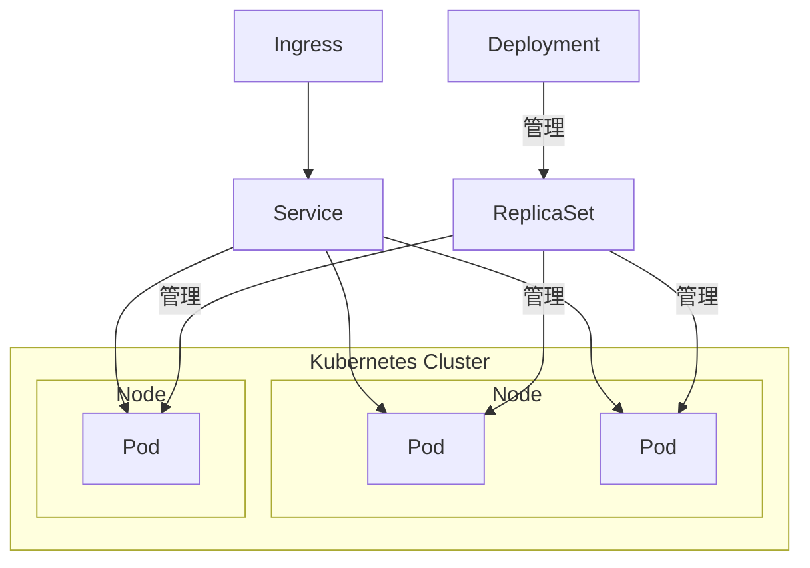
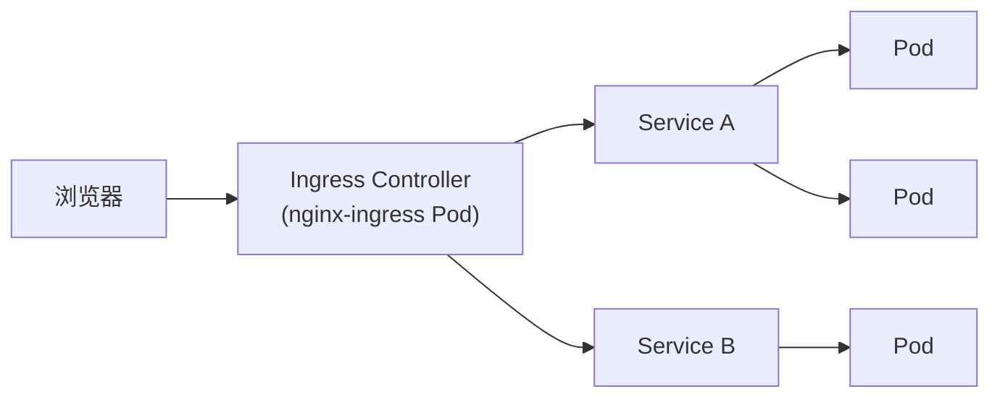

# 06 - Kubernetes 核心概念详解

动手实验分布在 [03-minikube](../03-minikube/README.md)、[04-kind](../04-kind/README.md)、
[05-kubernetes](../05-kubernetes/README.md)。本文建立整体概念地图。

## 1. 为什么需要 Kubernetes

Docker 让你能"运行一个容器"，但真实系统往往需要几十上百个容器、分布在多台机器上、
还要处理"容器挂了自动重启""流量怎么分发到健康的容器""如何滚动升级不中断服务"
这些问题。Kubernetes（简称 K8s）就是解决"大规模容器编排"的系统：你描述"期望状态"
（比如"我要 3 个副本的这个应用"），Kubernetes 持续观察现实状态并自动调整
（这正是 Terraform 声明式思想的"运行时版本"——Kubernetes 本身就是一个
运行中的、持续调谐的控制循环）。

## 2. 核心对象总览

| 对象 | 一句话解释 |
|---|---|
| **Cluster** | 一组 Node 组成的整体，由 Control Plane（API Server、Scheduler、Controller Manager、etcd）统一管理 |
| **Node** | 一台运行容器的机器（物理机/虚拟机/本例中是 Docker 容器伪装的节点） |
| **Pod** | Kubernetes 最小调度单位，包含一个或多个共享网络/存储的容器 |
| **ReplicaSet** | 保证某个 Pod 模板始终有指定数量的副本在运行 |
| **Deployment** | 管理 ReplicaSet 的上层对象，支持滚动升级、回滚 |
| **Service** | 给一组 Pod 提供稳定的访问入口（Pod 的 IP 会变，Service 的入口不变） |
| **Ingress** | 把集群外部 HTTP(S) 流量按域名/路径路由到不同 Service 的"七层路由规则" |
| **Namespace** | 集群内的逻辑隔离边界，用于多租户/多环境划分 |
| **Label / Selector** | Label 是打在对象上的键值对标签，Selector 用标签筛选一组对象——Service 靠 Selector 找到它要转发的 Pod |

## 3. Pod 如何被调度到 Node

1. 你创建一个 Deployment（描述 Pod 模板 + 副本数）；
2. Deployment Controller 创建/更新对应的 ReplicaSet；
3. ReplicaSet Controller 发现"现有 Pod 数 < 期望副本数"，向 API Server 创建新 Pod
   （此时 Pod 处于 `Pending`，还没有分配 Node）；
4. **Scheduler** 观察到未调度的 Pod，根据资源请求（CPU/Memory）、
   `nodeSelector`/亲和性规则、污点容忍等条件，选出一个合适的 Node，
   把"这个 Pod 应该跑在这个 Node 上"这一决定写回 API Server；
5. 目标 Node 上的 **kubelet** 观察到有新 Pod 被分配给自己，
   调用容器运行时（containerd）真正拉起容器。

`nodeSelector` / `affinity` 的动手实验见
[04-kind/README.md](../04-kind/README.md)。

## 4. Namespace

Namespace 把一个物理集群划分成多个逻辑上互相隔离的"虚拟集群"。同名资源
（比如两个都叫 `web` 的 Deployment）只要在不同 Namespace 就不冲突。
资源配额（ResourceQuota）、网络策略（NetworkPolicy）、RBAC 权限
通常都以 Namespace 为边界配置。动手实验见
[05-kubernetes/01-namespace](../05-kubernetes/01-namespace/README.md)。

## 5. Deployment / ReplicaSet / Pod 三层关系

**为什么要三层，而不是直接管理 Pod？**

- 直接创建 Pod：Pod 挂了不会自动恢复，也没有"多副本"的概念；
- ReplicaSet：保证副本数，但**不支持滚动升级**——改了 Pod 模板的镜像版本，
  ReplicaSet 不知道该怎么平滑替换旧 Pod；
- Deployment：在 ReplicaSet 之上加了**版本管理**——每次修改 Pod 模板，
  Deployment 会创建一个新的 ReplicaSet（新版本），并按策略（比如
  `RollingUpdate`）逐步把流量从旧 ReplicaSet 迁移到新 ReplicaSet，
  同时保留旧 ReplicaSet 的记录用于快速回滚。

## 6. Service 与 Ingress

**Service 解决的问题**：Pod 是"随时可能销毁重建"的，每次重建 IP 都会变。
如果调用方直接记住某个 Pod 的 IP，Pod 一重启调用就断了。Service 提供一个
**稳定不变的虚拟 IP（ClusterIP）+ DNS 名称**，请求打到 Service 后由
kube-proxy（通常基于 iptables 或 IPVS）转发到 Service Selector 匹配到的、
当前健康的某个 Pod。

**Ingress 解决的问题**：Service 默认只在集群内部可达（ClusterIP），或者
每个 Service 各自独占一个宿主机端口（NodePort），当你有十几个 Service
都要从外部按域名区分访问时，NodePort 方式既浪费端口又不支持基于域名/路径
的路由。Ingress 提供**一个统一的七层入口**（背后通常是一个 Ingress
Controller，比如 nginx-ingress，本身也是跑在集群里的 Pod），按照 Ingress
规则把 `a.example.com` 转发到 Service A、`b.example.com` 转发到 Service B。

访问链路：

## 7. 详细对象清单（对应 05-kubernetes 各子实验）

| 对象 | 子实验目录 |
|---|---|
| Namespace | [01-namespace](../05-kubernetes/01-namespace/README.md) |
| Deployment / ReplicaSet | [02-deployment](../05-kubernetes/02-deployment/README.md) |
| Service | [03-service](../05-kubernetes/03-service/README.md) |
| ConfigMap | [04-configmap](../05-kubernetes/04-configmap/README.md) |
| Secret | [05-secret](../05-kubernetes/05-secret/README.md) |
| PersistentVolumeClaim | [06-pvc](../05-kubernetes/06-pvc/README.md) |
| StatefulSet | [07-statefulset](../05-kubernetes/07-statefulset/README.md) |
| DaemonSet | [08-daemonset](../05-kubernetes/08-daemonset/README.md) |
| Job / CronJob | [09-job-cronjob](../05-kubernetes/09-job-cronjob/README.md) |
| Ingress | [10-ingress](../05-kubernetes/10-ingress/README.md) |
| ServiceAccount / Role / RoleBinding / ClusterRole / ClusterRoleBinding | [11-rbac](../05-kubernetes/11-rbac/README.md) |
| NetworkPolicy | [12-networkpolicy](../05-kubernetes/12-networkpolicy/README.md) |
| Resource Request/Limit、Liveness/Readiness/Startup Probe | [13-probes-resources](../05-kubernetes/13-probes-resources/README.md) |

## 8. Minikube vs Kind

| | Minikube | Kind |
|---|---|---|
| 本质 | 在一个虚拟机/容器里跑一个"看起来像完整集群"的单节点 K8s | 每个"节点"就是一个 Docker 容器，可以轻松拉起多节点 |
| 节点数 | 默认单节点（可配置多节点，但不如 Kind 原生） | 天然支持多节点（1 Control Plane + N Worker） |
| 典型用途 | 快速体验、单节点场景学习 | 学习多节点调度、CI 环境里跑集成测试 |
| 本项目安排 | [03-minikube](../03-minikube/README.md)：单节点入门 | [04-kind](../04-kind/README.md)：多节点、调度专题 |

## 9. 对应真实云环境

本地 Minikube/Kind 学到的 Kubernetes 对象模型（Deployment/Service/Ingress……）
和真实云托管 Kubernetes（AWS EKS、Azure AKS、Oracle OKE、Google GKE）
**完全一致**——这是 Kubernetes 作为"跨云标准"的核心价值。真正不同的地方在于：

- Node 的来源：本地是 Docker 容器伪装的节点，云上是真实的虚拟机（EC2/VM）；
- Service 类型 `LoadBalancer` 在本地不会真正创建负载均衡器（需要额外工具
  比如 MetalLB 模拟），云上会自动创建一个真实的 ALB/NLB；
- 存储：本地 PVC 用 hostPath 或本地存储类，云上对接 EBS/Azure Disk/持久化磁盘；
- 身份和权限：云上 RBAC 经常和云 IAM 打通（比如 EKS 的 IRSA），本地只有
  Kubernetes 原生 RBAC。
