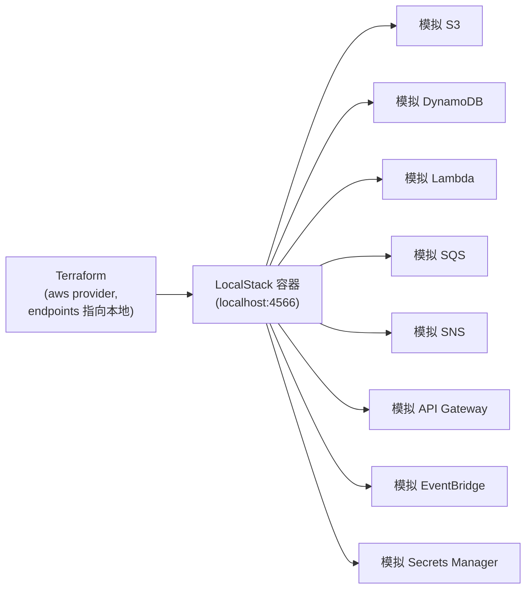
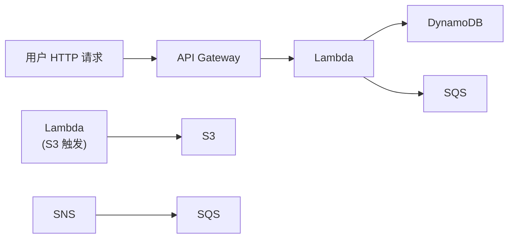

# 07 - LocalStack 基础

动手实验见 [07-localstack/README.md](../07-localstack/README.md)。

## 1. LocalStack 是什么

[LocalStack](https://www.localstack.cloud/) 是一个在本地用 Docker 运行的"AWS
云模拟器"——它在本机监听一个端口（默认 `4566`），对外暴露和真实 AWS 高度兼容的
API。你原本用来连接真实 AWS 的 SDK、CLI、**Terraform AWS Provider**，
只需要把 `endpoint`（服务地址）指向 `http://localhost:4566`，
其他代码/配置几乎不用改，就能"以为自己在操作真实 AWS"。

## 2. 为什么用它来学习

- **零费用**：真实 AWS 即使在免费层内，某些操作、超额用量、忘记清理的资源
  都可能产生账单；LocalStack 完全本地运行，没有任何费用；
- **学的是同一个 Provider**：不需要学一套"本地专用"的模拟工具语法，
  Terraform 代码里 `resource "aws_s3_bucket"` 这些资源类型和真实 AWS
  完全一样，将来切换到真实 AWS 只需要改 `provider` 里的 `endpoints` 配置；
- **可以随意破坏性实验**：删错一个资源、搞乱一个 IAM 权限，`docker compose down`
  重来就是了，不会有任何真实后果。

## 3. 架构

## 4. 与真实 AWS 的相同点

- API 请求/响应结构基本一致（同一个 AWS SDK 能直接用）；
- Terraform AWS Provider 的资源类型、参数完全一致；
- 核心交互模式一致：S3 的 bucket/object、Lambda 的 handler/trigger、
  DynamoDB 的 table/item、SQS 的 queue/message，这些心智模型可以直接迁移。

## 5. 与真实 AWS 的不同点（必须了解的边界）

> **LocalStack 适合学习，但不能完全替代真实 AWS。**

- **不是所有服务、所有 API 都被完整实现**——尤其是较新的服务或某些边缘参数，
  社区版可能缺失或行为不完全一致；
- **没有真实的高可用、多可用区、真实网络延迟**——性能特征和真实环境不同，
  不能用来做性能测试或容量规划；
- **没有真实的计费、配额、IAM 强制校验**（社区版的权限校验较宽松，
  不能依赖它来验证"这个 IAM 策略在真实 AWS 里到底能不能通过"）；
- **持久化行为不同**：容器重启后数据默认可能丢失（除非配置持久化目录），
  真实 AWS 的数据持久性有服务级别的保证；
- **版本滞后**：LocalStack 对新发布的 AWS 功能支持通常有滞后。

**结论**：LocalStack 非常适合用来学习"Terraform 怎么声明这些资源、
资源之间如何组合成一个应用架构、IAM 权限大致怎么写"，但**上线前必须在
真实 AWS（或至少官方提供的 sandbox/free tier）里验证一遍**，不能假设
LocalStack 测试通过 = 真实环境一定没问题。

## 6. 本项目会覆盖的服务

| 服务 | 说明 |
|---|---|
| S3 | 对象存储 |
| DynamoDB | NoSQL 数据库 |
| SQS | 消息队列 |
| SNS | 发布/订阅消息 |
| Lambda | 无服务器函数 |
| API Gateway | HTTP 入口，触发 Lambda |
| EventBridge | 事件总线，规则驱动 |
| Secrets Manager | 密钥管理 |

## 7. Serverless 架构示例（本项目会实现）

