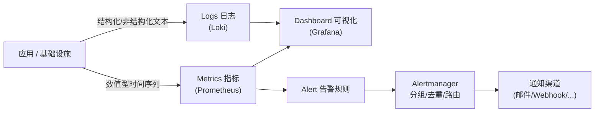

# 08 - 可观测性（Observability）基础

动手实验见 [08-monitoring/README.md](../08-monitoring/README.md)。

## 1. Observability 的三大支柱



- **Metrics（指标）**：数值型、按时间采样的数据，比如"过去 1 分钟 CPU 使用率""
  每秒请求数"。适合看趋势、做告警阈值判断，存储和查询效率高。本项目用
  **Prometheus** 采集和存储。
- **Logs（日志）**：某个时间点发生的具体事件的文本记录，比如一条报错堆栈。
  适合"定位某一次具体请求到底发生了什么"。本项目用 **Loki**（Grafana 生态里
  "像 Prometheus 一样但存日志"的系统）。
- **Alerts（告警）**：基于 Metrics（有时也基于日志规则）定义"什么情况算异常"，
  触发后通知人。本项目用 Prometheus 的告警规则 + **Alertmanager** 做分组/去重/路由。
- **Dashboard（仪表盘）**：把 Metrics 和 Logs 用图表方式呈现，本项目用 **Grafana**。

## 2. Prometheus 的核心模型：Pull（拉取）

Prometheus 和很多监控系统不同，它主动去"拉"（scrape）目标暴露的指标端点
（通常是 `/metrics`，一个纯文本格式的 HTTP 接口），而不是等目标"推送"过来。

```text
Prometheus ---(每隔 N 秒 GET)---> http://target:port/metrics
```

好处：Prometheus 可以清楚知道"这个目标现在是不是挂了"（scrape 失败即可判断），
配置集中在 Prometheus 侧，被监控的应用只需要"暴露一个 /metrics 端点"这一件事。
**Node Exporter** 就是一个"帮你把机器的 CPU/内存/磁盘等指标转换成
`/metrics` 格式"的标准组件。

## 3. Grafana 的核心概念

| 概念 | 说明 |
|---|---|
| Data Source | Grafana 要去哪里查数据（本项目会配置 Prometheus 和 Loki 两个 Data Source） |
| Dashboard | 一组图表面板（Panel）的集合 |
| Folder | Dashboard 的分组/目录 |
| Alert Rule | 基于查询结果定义的告警条件 |
| Contact Point | 告警要通知给谁、通过什么渠道 |

**本项目的关键设计**：这些 Data Source / Folder / Dashboard / Alert Rule /
Contact Point 都会用 **Terraform Grafana Provider** 来创建，而不是在 Grafana
网页 UI 里手工点击配置。**这也是 Infrastructure as Code**——只不过管理的对象
从"一台虚拟机"变成了"一个仪表盘定义"。好处同样是可版本控制、可复现、
可以在销毁重建整个监控栈后一键恢复所有仪表盘，而不用凭记忆重新手工画一遍图表。

## 4. Alertmanager 解决什么问题

如果 Prometheus 直接发通知，同一个故障往往会触发几十条几乎相同的告警
（比如一个服务的 10 个副本同时因为同一个根因报警）。Alertmanager 负责：

- **分组（Grouping）**：把相关的告警合并成一条通知；
- **去重（Deduplication）**：同一个告警持续触发时不重复骚扰；
- **静默（Silencing）**：计划内维护时段主动屏蔽已知告警；
- **路由（Routing）**：不同类型/严重程度的告警发给不同的人/渠道。

## 5. 对应真实云环境

| 本地组件 | 云上/商业对应物 |
|---|---|
| Prometheus + Node Exporter | AWS CloudWatch Metrics、Azure Monitor Metrics |
| Loki | AWS CloudWatch Logs、Azure Log Analytics |
| Grafana | 云厂商各自的 Dashboard（或直接用 Grafana Cloud 托管版） |
| Alertmanager | AWS CloudWatch Alarms + SNS、Azure Monitor Alerts |

理解了"用 Terraform 声明式地管理监控配置"这件事本身，你会发现云厂商的
CloudWatch Alarm、Dashboard 同样可以用对应的 Terraform Provider
（`aws_cloudwatch_dashboard`、`aws_cloudwatch_metric_alarm`）以完全一样的
思路去管理。
