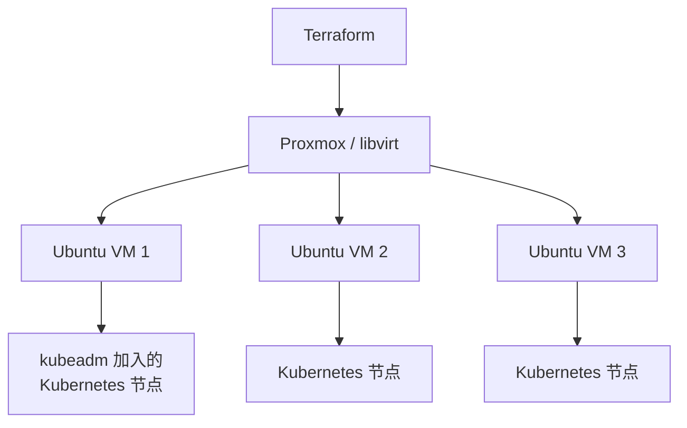

# 10 - 私有云 / 虚拟化基础（对应 optional/）

动手实验（不保证在所有 Windows 机器上直接运行）见
[optional/proxmox](../optional/proxmox/README.md) 和
[optional/libvirt](../optional/libvirt/README.md)。

## 1. 从"容器"到"私有云"

本项目前面所有章节管理的都是**容器**（Docker / Kubernetes Pod）——
容器共享宿主机的操作系统内核，启动快、开销小，但隔离性弱于虚拟机。
`optional/` 里的实验更进一步，用 Terraform 管理**虚拟机（VM）**，
这是"私有云（Private Cloud）"的核心构件——你在自己的硬件上，
用软件（Hypervisor）模拟出多台独立的"电脑"，每台都有自己的虚拟 CPU、
内存、磁盘、网络接口，这一层抽象和公有云 EC2/Azure VM 背后的原理完全一致，
只是公有云的 Hypervisor 跑在厂商的数据中心，私有云跑在你自己的机器上。

## 2. Proxmox VE

[Proxmox VE](https://www.proxmox.com/) 是一个开源的虚拟化管理平台，
本身需要安装在一台独立的机器（或专门划出的硬件分区）上作为 Hypervisor 宿主，
**不适合直接安装在你日常使用的 Windows 电脑上**——这也是为什么这部分被
放进 `optional/`，明确要求"有额外硬件或愿意搭建虚拟化环境"的学习者再尝试。

Terraform 通过 `bpg/proxmox` 或 `Telmate/proxmox` 等社区 Provider 管理：

```text
Terraform
    ↓
Proxmox API
    ↓
虚拟机（CPU/内存/磁盘/网络配置 + cloud-init 初始化脚本）
```

## 3. libvirt / KVM

[libvirt](https://libvirt.org/) 是 Linux 上管理虚拟化（KVM/QEMU）的标准 API，
在 Windows 上可以通过 WSL2 + 嵌套虚拟化，或者一台独立的 Linux 主机来使用。
Terraform 通过 `dmacvicar/libvirt` Provider 管理虚拟机，思路和 Proxmox 类似但更贴近
"裸金属 KVM"层面。

## 4. Cloud-init

无论 Proxmox 还是 libvirt，创建虚拟机后都需要一种方式在**首次启动时**
自动完成基础配置（设置主机名、创建用户、写入 SSH 公钥、执行初始化脚本）——
这就是 **cloud-init** 的作用，它是几乎所有云厂商镜像和主流 Linux 发行版
都支持的标准机制。Terraform 创建虚拟机资源时，通常会附带一段
cloud-init 配置（YAML），这一层学会了，你会发现它和 AWS EC2 的
`user_data`、Azure VM 的 Custom Data 本质上是同一件事。

## 5. 概念上离真正的"私有云"有多近



当你能用 Terraform 批量创建虚拟机、用 cloud-init 自动装好依赖、
再用 `kubeadm`（或 Terraform 的 provisioner/null_resource + 远程执行）
把这些虚拟机组成一个真正的多节点 Kubernetes 集群时——你已经掌握了
"私有云"的核心工作流程：这正是很多企业自建 Kubernetes 平台
（On-Premise Kubernetes）的实际做法，也是理解 EKS/AKS/OKE
这类"云厂商帮你把这一层全部自动化了"的托管服务到底替你做了什么的最好方式。
