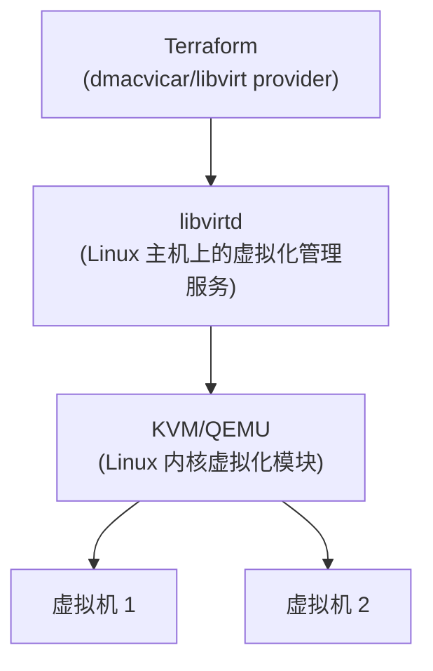

# Optional - Terraform + libvirt (KVM)

> ⚠️ **运行条件**：需要一个支持 KVM 硬件虚拟化的 Linux 环境
> （原生 Linux 主机，或 Windows 上启用了嵌套虚拟化的 WSL2/Linux
> 虚拟机）。Windows 本身不能直接运行 libvirt/KVM——它们是 Linux
> 内核提供的虚拟化能力。**这里的代码不保证能在没有 libvirt
> 环境的情况下直接运行**，目的同样是理解概念，而不是强制在
> Windows 上跑通。

## 本节目标

理解 libvirt——Linux 上管理虚拟化（KVM/QEMU）的标准 API——
以及它和 Proxmox 的关系：Proxmox 本质上就是在 libvirt/KVM
基础上包装出的一整套带 Web UI、集群管理能力的发行版；
libvirt 则是更"裸"的一层，直接对接 Linux 内核的 KVM 模块。

## 架构图



## 前置条件

- 一台 Linux 主机（或原生支持嵌套虚拟化的 WSL2 发行版），
  已安装 `libvirtd`、`qemu-kvm`；
- 当前用户已加入 `libvirt` 用户组；
- 已下载好一份云镜像（qcow2 格式），例如
  `https://cloud-images.ubuntu.com/...-amd64.img`。

## 示例代码

```hcl
# ============================================================
# versions.tf
# ============================================================
terraform {
  required_providers {
    libvirt = {
      source  = "dmacvicar/libvirt"
      version = "~> 0.8"
    }
  }
}

provider "libvirt" {
  uri = "qemu:///system"
  # qemu:///system 是本地 libvirtd 的标准连接地址；
  # 如果 libvirtd 跑在另一台机器上，可以用 SSH 隧道形式的 URI。
}
```

```hcl
# ============================================================
# main.tf
# ============================================================

# 基础镜像作为一个"卷"导入 libvirt 的存储池
resource "libvirt_volume" "ubuntu_base" {
  name   = "ubuntu-base.qcow2"
  source = var.cloud_image_path
  pool   = "default"
}

# 每台虚拟机各自基于基础镜像创建一个"写时复制"卷，
# 避免每台虚拟机都占用一份完整镜像的磁盘空间。
resource "libvirt_volume" "vm_disk" {
  count          = 2
  name           = "vm-disk-${count.index}.qcow2"
  base_volume_id = libvirt_volume.ubuntu_base.id
  pool           = "default"
}

# cloud-init 配置：和 Proxmox 章节的 initialization block
# 解决的是同一个问题，只是 libvirt Provider 需要你自己先生成一份
# cloud-init 的 ISO（cidata），再挂载给虚拟机。
resource "libvirt_cloudinit_disk" "init" {
  count     = 2
  name      = "cloudinit-${count.index}.iso"
  user_data = templatefile("${path.module}/cloud-init.yaml.tftpl", {
    hostname = "libvirt-vm-${count.index}"
  })
}

resource "libvirt_domain" "vm" {
  count  = 2
  name   = "libvirt-vm-${count.index}"
  memory = 2048
  vcpu   = 2

  disk {
    volume_id = libvirt_volume.vm_disk[count.index].id
  }

  cloudinit = libvirt_cloudinit_disk.init[count.index].id

  network_interface {
    network_name = "default"
  }
}
```

```hcl
# ============================================================
# cloud-init.yaml.tftpl
# ============================================================
#cloud-config
hostname: ${hostname}
users:
  - name: ubuntu
    sudo: ALL=(ALL) NOPASSWD:ALL
    ssh_authorized_keys:
      - ${file("~/.ssh/id_rsa.pub")}
```

## 和 Proxmox 章节的对比

| | Proxmox | libvirt |
|---|---|---|
| 抽象层次 | 更高层（自带 Web UI、集群、存储管理） | 更底层（直接对接 KVM） |
| 典型使用场景 | 独立机房/多机 Proxmox 集群 | 单机开发测试、更细粒度的自动化控制 |
| Terraform Provider | `bpg/proxmox` | `dmacvicar/libvirt` |

## 思考题

1. 为什么 `libvirt_volume` 要区分"基础镜像卷"和"每台虚拟机的
   写时复制卷"，而不是直接让每台虚拟机各自持有一份完整镜像？
2. cloud-init 配置在 Proxmox 和 libvirt 两种 Provider 下，
   底层机制（ISO 挂载 vs 平台原生支持）有什么不同，
   但对外呈现的效果为什么是一致的？

## 延伸阅读

- [dmacvicar/libvirt Terraform Provider 官方文档](https://registry.terraform.io/providers/dmacvicar/libvirt/latest/docs)
- [cloud-init 官方文档](https://cloudinit.readthedocs.io/)
