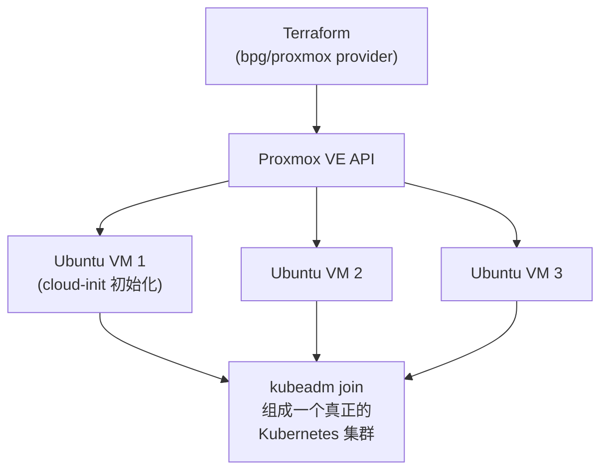

# Optional - Terraform + Proxmox VE

> ⚠️ **运行条件**：需要一台独立的 Proxmox VE 宿主机（不能是你正在
> 用来学习本课程的 Windows 11 电脑本身——Proxmox 是一个完整的
> Linux 虚拟化操作系统，需要独立安装在专门的硬件或至少一个
> 允许嵌套虚拟化的虚拟机里）。**这里的代码不保证能在没有 Proxmox
> 环境的情况下直接运行**，本节的目的是让你理解 Terraform 如何
> 管理虚拟机这一层，即使暂时没有环境可以实际跑一遍。

## 本节目标

理解 Terraform 如何通过 Proxmox API 批量创建虚拟机，
以及这一层和前面章节"容器编排"在抽象层次上的区别。
概念背景见 [docs/10-private-cloud.md](../../docs/10-private-cloud.md)。

## 架构图



## 前置条件

- 一台已经安装好 Proxmox VE 的宿主机，能通过网络访问其 API
  （默认端口 8006）；
- 一个具备足够权限的 Proxmox API Token；
- 宿主机上已经上传了一份支持 cloud-init 的虚拟机镜像
  （通常是各发行版官方提供的 "cloud image"，例如 Ubuntu 的
  `ubuntu-22.04-server-cloudimg-amd64.img`）。

## 示例代码

```hcl
# ============================================================
# versions.tf
# ============================================================
terraform {
  required_providers {
    proxmox = {
      source  = "bpg/proxmox"
      version = "~> 0.66"
    }
  }
}

provider "proxmox" {
  endpoint  = var.proxmox_api_url    # 例如 "https://pve.local:8006/"
  api_token = var.proxmox_api_token  # 教学占位符变量名，真实值请用环境变量注入
  insecure  = true                   # 本地自签证书场景下常见配置
}
```

```hcl
# ============================================================
# main.tf —— 用 count 批量创建 3 台虚拟机
# ============================================================
resource "proxmox_virtual_environment_vm" "k8s_node" {
  count     = 3
  name      = "k8s-node-${count.index}"
  node_name = var.proxmox_node

  cpu {
    cores = 2
  }
  memory {
    dedicated = 4096 # MB
  }

  disk {
    datastore_id = "local-lvm"
    size         = 20 # GB
    interface    = "scsi0"
  }

  # --------------------------------------------------------------
  # cloud-init：虚拟机首次启动时自动执行的初始化配置——
  # 设置主机名、创建用户、写入 SSH 公钥，这是几乎所有云厂商镜像
  # 和主流 Linux 发行版都支持的标准机制，效果上等价于 AWS EC2 的
  # user_data、Azure VM 的 Custom Data。
  # --------------------------------------------------------------
  initialization {
    user_account {
      username = "ubuntu"
      keys     = [var.ssh_public_key]
    }
    ip_config {
      ipv4 {
        address = "dhcp"
      }
    }
  }

  network_device {
    bridge = "vmbr0"
  }
}
```

```hcl
# ============================================================
# outputs.tf
# ============================================================
output "vm_names" {
  value = [for vm in proxmox_virtual_environment_vm.k8s_node : vm.name]
}
```

## 和前面章节的核心区别

| | 容器（Docker/Kubernetes Pod） | 虚拟机（Proxmox VM） |
|---|---|---|
| 隔离粒度 | 共享宿主机内核 | 独立的虚拟硬件 + 独立内核 |
| 启动速度 | 秒级 | 分钟级（需要走完整个操作系统启动流程） |
| 典型用途 | 无状态应用、微服务 | 需要强隔离、或需要跑不同内核/操作系统的场景 |
| Terraform 管理的对象 | 进程级别的容器 | 整台虚拟"电脑"（CPU/内存/磁盘/网卡） |

## 思考题

1. 为什么 `initialization` block（cloud-init）比"创建完虚拟机后
   手工登录进去配置"更符合 IaC 的理念？
2. 如果要把这 3 台虚拟机组成一个真正的 Kubernetes 集群，
   在 Terraform apply 完成之后，还需要做哪些手工/自动化步骤
   （提示：搜索 `kubeadm init` / `kubeadm join`）？

## 延伸阅读

- [bpg/proxmox Terraform Provider 官方文档](https://registry.terraform.io/providers/bpg/proxmox/latest/docs)
- [Proxmox VE 官方文档：Cloud-Init 支持](https://pve.proxmox.com/wiki/Cloud-Init_Support)
